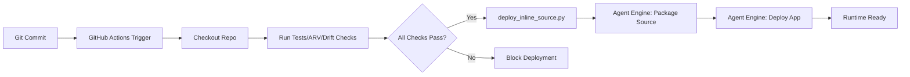

# 6775-DR-STND-inline-source-deployment-for-vertex-agent-engine

**Status**: Canonical Standard (INLINE1 Phase)
**Author**: department-adk-iam
**Created**: 2025-11-21
**Last Updated**: 2025-11-21

---

## Purpose

This document defines the **inline source deployment pattern** as the canonical, required method for deploying ADK agents to Vertex AI Agent Engine in the bobs-brain repository and all derivative projects.

Inline source deployment replaces older serialized/pickled object patterns and provides a robust, version-controlled, CI/CD-friendly deployment model.

---

## Why Inline Source Deployment?

### Problems with Serialized/Pickled Agents

**Legacy approach** (no longer used):
- Serialize Python agent objects (pickle/cloudpickle)
- Upload serialized blob to Agent Engine
- **Issues**:
  - Version control problems (binary blobs, no diffs)
  - Dependency management complexity (requirements frozen in pickle)
  - Debugging difficulty (opaque runtime state)
  - CI/CD friction (can't easily inspect what's deployed)
  - Security concerns (arbitrary code execution from pickles)

### Benefits of Inline Source Deployment

**New standard** (required going forward):
- Deploy source code directly from Git repository
- Agent Engine packages and executes Python modules on-demand
- **Advantages**:
  - ✅ **Version control**: Source code diffs, PR reviews, Git history
  - ✅ **Dependency transparency**: `requirements.txt` explicitly versioned
  - ✅ **Debuggability**: Runtime matches source exactly
  - ✅ **CI/CD native**: GitHub Actions → source push → Agent Engine deploy
  - ✅ **Security**: No arbitrary deserialization, code review required
  - ✅ **Reproducibility**: Exact commit → exact runtime behavior

---

## Essential Elements of Inline Source Deployment

### 1. Source Packages

**What**: Python packages containing agent code, tools, and dependencies.

**In bobs-brain**:
```python
source_packages = [
    "agents",           # All agent modules (bob, iam-*, etc.)
    "deployment",       # Deployment utilities (if applicable)
    # Add other packages as needed
]
```

**Structure**:
```
agents/
├── bob/
│   ├── __init__.py
│   ├── agent.py           # Contains `app` (ADK App object)
│   └── tools/
├── iam_senior_adk_devops_lead/
│   ├── agent.py
│   └── ...
└── shared_contracts.py
```

### 2. Entrypoint Module

**What**: Python module path that Agent Engine will import to access the agent.

**Format**: `package.subpackage.module` (no `.py` extension)

**Example**:
```python
entrypoint_module = "agents.bob.agent"  # Points to agents/bob/agent.py
```

**Requirements**:
- Module must be importable from the source packages root
- Module must define the entrypoint object (see below)

### 3. Entrypoint Object

**What**: The name of the ADK `App` object within the entrypoint module.

**Format**: Variable name (string)

**Example**:
```python
entrypoint_object = "app"  # agents/bob/agent.py must have `app = ...`
```

**In bobs-brain agents**:
- All agents follow the **lazy-loading App pattern** (see 6774-DR-STND-adk-lazy-loading-app-pattern.md)
- Each `agent.py` exports a module-level `app` variable:
  ```python
  # agents/bob/agent.py
  from google.genai.adk import App

  def create_agent():
      # Agent construction logic
      pass

  def create_app() -> App:
      agent = create_agent()
      return App(agent=agent)

  app = create_app()  # ← This is the entrypoint_object
  ```

### 4. Class Methods (Skills)

**What**: HTTP-accessible methods that downstream clients (Slack, gateways, etc.) can invoke.

**Format**: List of method names defined on the agent

**Example**:
```python
class_methods = ["query", "analyze_repo", "orchestrate_pipeline"]
```

**In bobs-brain**:
- Methods depend on agent type (orchestrator vs. specialist)
- Foreman agents: Broad orchestration methods
- Specialist agents: Task-specific methods matching AgentCard skills

**Mapping to A2A**:
- Each class method can be called via Agent Engine's HTTP API
- AgentCard `skills` should correspond to available class methods
- Clients (Slack, Cloud Run gateways) use skill names to route requests

### 5. Requirements Management

**What**: `requirements.txt` defining Python dependencies for the agent runtime.

**Location**: Root of repository or in agent-specific directory

**Example** (`requirements.txt`):
```
google-genai-adk>=0.2.0
google-cloud-aiplatform>=1.50.0
pydantic>=2.0.0
# ... other deps
```

**Agent Engine behavior**:
- Reads `requirements.txt` from source packages
- Installs dependencies in isolated runtime environment
- Versions locked to Git commit (reproducible builds)

**Best practices**:
- Pin major/minor versions for stability
- Use `>=` for patch-level flexibility
- Document any GCP-specific dependencies (ADK, Vertex AI, etc.)

---

## CI/CD Integration Story

### Flow: Git Commit → GitHub Actions → Inline Source Deploy



### GitHub Actions Workflow Pattern

**File**: `.github/workflows/agent-engine-inline-deploy.yml`

**Key steps**:
1. **Checkout**: Clone repository at specific commit
2. **Validate**: Run linting, tests, ARV gates, drift detection
3. **Deploy**: Execute `deploy_inline_source.py` with environment config
4. **Verify**: Optional smoke test against deployed agent

**Environment gating**:
- `dev`: Auto-deploy on push to `main` (or feature branches for testing)
- `staging`: Manual approval or tag-based trigger
- `prod`: Strict manual approval, tag required, full ARV

### Deployment Script Requirements

**Script**: `agents/agent_engine/deploy_inline_source.py`

**Responsibilities**:
- Accept CLI args or env vars for:
  - `PROJECT_ID`: GCP project
  - `LOCATION`: us-central1 (or other region)
  - `AGENT_DISPLAY_NAME`: Human-readable name
  - `ENV`: dev/staging/prod
- Construct inline source config:
  - `source_packages`, `entrypoint_module`, `entrypoint_object`, `class_methods`
- Call Vertex AI Agent Engine API to deploy agent
- Return deployment status (success/failure, agent ID, endpoint URL)

**Idempotency**:
- Script should support re-deploy (update existing agent if already exists)
- Use agent display name or ID as idempotency key

---

## Migration from Legacy Patterns

### If You Have Serialized/Pickled Agents

**Old pattern** (deprecated):
```python
# DON'T DO THIS
import cloudpickle
agent_blob = cloudpickle.dumps(agent)
# Upload blob to Agent Engine
```

**New pattern** (required):
```python
# Use inline source deployment script instead
# No pickling, just source code + entrypoint config
```

**Migration steps**:
1. Ensure agent code is in source packages (not standalone scripts)
2. Define `app` variable in agent module (lazy-loading App pattern)
3. Update CI/CD to call `deploy_inline_source.py`
4. Remove any pickle/cloudpickle deployment logic

### If You Have ADK Deploy CLI

**Old pattern** (may work but not preferred):
```bash
adk deploy --agent-path agents/bob/
```

**New pattern** (bobs-brain standard):
```bash
python -m agents.agent_engine.deploy_inline_source \
  --project $PROJECT_ID \
  --location us-central1 \
  --env dev
```

**Why custom script?**
- Repo-specific config (source packages, entrypoint paths)
- Integration with bobs-brain CI/CD (ARV, drift checks, feature flags)
- Consistent with multi-agent department deployment patterns

---

## Deployment Checklist

Before deploying an agent with inline source:

- [ ] Agent follows **lazy-loading App pattern** (6774 standard)
  - `agent.py` has `create_agent()`, `create_app()`, and module-level `app`
- [ ] Agent is in source packages directory (`agents/`)
- [ ] `requirements.txt` is up-to-date and tested
- [ ] AgentCard (`.well-known/agent-card.json`) aligns with class methods
- [ ] System prompt follows **contract-first design** (6767-115 standard)
- [ ] All ARV gates pass (R1-R8 compliance, minimum requirements)
- [ ] Drift detection checks pass (no forbidden patterns)
- [ ] Tests pass (unit tests, AgentCard validation, integration tests)
- [ ] Deployment script tested in dev environment first

**After deployment**:
- [ ] Smoke test: Invoke agent via HTTP API
- [ ] Verify logs in Cloud Logging (SPIFFE ID propagation, no errors)
- [ ] Test A2A interactions (if agent is part of department)
- [ ] Update deployment docs/runbooks with new agent endpoint

---

## CI Integration (Phase 3)

Phase 3 introduces **dry-run validation** for inline source deployment, ensuring safe CI/CD integration without executing real deployments.

### Entry Points

**Deploy Script**: `agents/agent_engine/deploy_inline_source.py`
- Supports multiple agents: bob, iam-senior-adk-devops-lead, iam-adk
- **Default behavior**: Dry-run validation (safe)
- **Opt-in deployment**: Use `--execute` flag

**Makefile Targets**:
- `make deploy-inline-dry-run` - Validates config without deploying (DEFAULT, safe)
- `make deploy-inline-dev-execute` - Manual execution for dev (with 5-second warning)
- `make deploy-inline-staging-execute` - Manual execution for staging

**CI Workflow**: `.github/workflows/agent-engine-inline-dryrun.yml`
- Runs on: workflow_dispatch, pull_request
- Validates: Config, source packages, entrypoint imports
- **Does NOT**: Execute real deployments

### Validation Logic

The dry-run mode validates:

1. **Agent Configuration**:
   - Agent name exists in AGENT_CONFIGS
   - Entrypoint module path exists
   - Entrypoint object is defined

2. **Source Packages**:
   - All source_packages directories exist
   - Paths are under repo root

3. **Imports** (optional):
   - Entrypoint module can be imported
   - Entrypoint object exists and is correct type
   - Gracefully handles missing dependencies

### Safe Defaults

**Script Behavior**:
```bash
# DEFAULT: Dry-run (safe, no deployment)
python -m agents.agent_engine.deploy_inline_source --agent-name bob

# Explicit execution (opt-in)
python -m agents.agent_engine.deploy_inline_source --agent-name bob --execute
```

**Makefile Behavior**:
- Dry-run targets: No confirmation, run immediately
- Execute targets: 5-second warning + Ctrl+C option
- Color-coded output (blue=info, yellow=warning, red=danger)

### Phase 3 Scope

Phase 3 is **validation only**:
- ✅ Validates inline deploy configuration
- ✅ Ensures entrypoints are correct
- ✅ Verifies source packages exist
- ❌ Does NOT execute real deployments
- ❌ Does NOT wire into production CI/CD yet

**Next Phases**:
- ~~**Phase 4**: ARV-style quality gates~~ ✅ **COMPLETE**
- **Phase 5**: Real-but-safe dev deploy path (partial - manual workflow added)
- **Phase 6**: Staging/prod deploy workflows

---

## ARV Gate + Dev Deploy (Phase 4)

Phase 4 adds **Agent Readiness Verification (ARV)** checks and a manual dev deployment workflow with safety gates.

### ARV Check Script

**Location**: `scripts/check_inline_deploy_ready.py`

**Purpose**: Validates readiness for inline source deployment before any execution.

**Checks Performed**:

1. **Environment Variables**:
   - `GCP_PROJECT_ID` or `PROJECT_ID` is set
   - `GCP_LOCATION` or `LOCATION` is set
   - Placeholder projects only allowed in dev environment

2. **Source Packages**:
   - All source packages exist (`agents/`)
   - Packages are directories under repo root

3. **Agent Entrypoint**:
   - Agent name exists in configuration
   - Entrypoint module file exists
   - Entrypoint object can be imported (graceful fallback for missing deps)

4. **Environment Safety Rules**:
   - **dev**: Least restrictive, allows placeholder project
   - **staging**: Requires real project ID
   - **prod**: Highest restrictions, requires approval

**Exit Codes**:
- `0` - All checks passed, ready for deployment
- `1` - Configuration error or missing requirements
- `2` - Safety violation

**Usage**:
```bash
# Check Bob for dev deployment
python scripts/check_inline_deploy_ready.py --agent-name bob --env dev

# Via Makefile
make check-inline-deploy-ready

# With environment variables
export AGENT_NAME=bob
export ENV=dev
export GCP_PROJECT_ID=my-project
export GCP_LOCATION=us-central1
python scripts/check_inline_deploy_ready.py
```

### Makefile Integration

**Updated Targets** (Phase 4):

```makefile
# ARV check target (new)
check-inline-deploy-ready:
    # Runs ARV validation
    # Exit codes: 0 (OK), 1 (misconfig), 2 (safety violation)

# Execute targets now include ARV check as prerequisite
deploy-inline-dev-execute: check-inline-deploy-ready
    # ARV check must pass before deployment can proceed
    # 5-second warning with Ctrl+C option
    # Executes with --execute flag

deploy-inline-staging-execute: check-inline-deploy-ready
    # ARV check enforced for staging deployments
```

**ARV Integration**:
- All `*-execute` targets now depend on `check-inline-deploy-ready`
- If ARV check fails, deployment is blocked immediately
- No deployment command is executed if ARV returns non-zero exit code

### CI Workflow Updates

**Dry-Run Workflow** (`.github/workflows/agent-engine-inline-dryrun.yml`):
- Added ARV check step before dry-run validation
- Runs on: `workflow_dispatch`, `pull_request`
- Validates configuration without deploying
- **NEW**: ARV gate ensures only valid configurations are tested

**Manual Dev Deploy Workflow** (`.github/workflows/agent-engine-inline-dev-deploy.yml`):
- **NEW in Phase 4**: Manual deployment to dev environment
- Trigger: `workflow_dispatch` only (requires manual approval)
- Steps:
  1. **ARV checks** - Must pass before proceeding
  2. **Dry-run validation** - Pre-flight check
  3. **Real deployment** - Executes with `--execute` flag
- Uses Workload Identity Federation for GCP authentication
- Only deploys to **dev** environment (not staging/prod)

**Workflow Inputs**:
```yaml
agent_name:
  description: 'Agent to deploy (bob, iam-senior-adk-devops-lead, iam-adk)'
  type: choice
  required: true

gcp_project_id:
  description: 'GCP Project ID for deployment'
  type: string
  required: true

gcp_location:
  description: 'GCP region for deployment'
  default: 'us-central1'
```

### Environment Safety Model

| Environment | Placeholder Project | Manual Approval | Description |
|-------------|---------------------|-----------------|-------------|
| **dev** | ✅ Allowed | ❌ Not required | Least restrictive, for experimentation |
| **staging** | ❌ Forbidden | ❌ Not required | Real project required, testing ground |
| **prod** | ❌ Forbidden | ✅ Required | Highest restrictions, manual workflow_dispatch only |

### Phase 4 Deliverables

Phase 4 adds safety rails without blocking development:

- ✅ **ARV Check Script**: Comprehensive validation before deployment
- ✅ **Makefile Integration**: ARV as prerequisite for execute targets
- ✅ **CI ARV Gate**: Dry-run workflow includes ARV check
- ✅ **Manual Dev Deploy**: Safe manual deployment workflow for dev
- ❌ **Staging/Prod Deploy**: Not in scope (Phase 6)
- ❌ **Automatic Dev Deploy**: Not in scope (requires additional guards)

**What Changed**:
- All deployment paths now gated by ARV checks
- Manual dev deployment available via GitHub Actions
- Dry-run workflow validates ARV compliance
- Makefile targets enforce ARV before execution

**What's Next** (Phase 5+):
- ~~Staging deployment workflow with stricter gates~~ (Phase 6)
- ~~Production deployment workflow with approval requirements~~ (Phase 6)
- ~~Automatic dev deploy on merge (with comprehensive ARV)~~ (Phase 6)
- ~~Integration with Agent Engine deployment status checks~~ ✅ **Phase 5 - Smoke Test**

---

## First Dev Deploy + Smoke Test (Phase 5)

Phase 5 establishes the **smoke test validation** for deployed Agent Engine instances and prepares for the first real dev deployment.

### Smoke Test Script

**Location**: `scripts/smoke_test_bob_agent_engine_dev.py`

**Purpose**: Validates that the inline-deployed Bob agent on Vertex AI Agent Engine is responding correctly to basic health check queries.

**Requirements**:
- Run AFTER a successful dev deployment via inline source
- Requires `BOB_AGENT_ENGINE_NAME_DEV` environment variable set to full Agent Engine resource name
- Uses Vertex AI Agent Engine SDK for connectivity

**Environment Variables**:
```bash
export GCP_PROJECT_ID=your-project-id
export GCP_LOCATION=us-central1  # Optional, defaults to us-central1
export BOB_AGENT_ENGINE_NAME_DEV=projects/YOUR_PROJECT/locations/us-central1/reasoningEngines/YOUR_AGENT_ID
```

**Smoke Test Flow**:
1. **Connect** to Agent Engine instance using resource name
2. **Send** simple health check query:
   ```
   Health check: respond with a short JSON object {"status":"ok","agent":"bob"}.
   ```
3. **Validate** response contains expected markers ("status", "ok")
4. **Report** PASS or FAIL with troubleshooting hints

**Exit Codes**:
- `0` - Smoke test passed (agent responding correctly)
- `1` - Smoke test failed (connection error, unexpected response, or exception)

**Usage**:
```bash
# Direct execution
python scripts/smoke_test_bob_agent_engine_dev.py

# Via Makefile (recommended)
make smoke-bob-agent-engine-dev
```

**Expected Output** (Success):
```
[SMOKE] Starting Bob Agent Engine dev smoke test...
[SMOKE] Configuration:
[SMOKE]   Project: your-project-id
[SMOKE]   Location: us-central1
[SMOKE]   Agent: projects/.../reasoningEngines/...
[SMOKE] Connecting to Agent Engine instance...
[SMOKE] Sending test query...
[SMOKE] Response received:
[SMOKE]   {"status":"ok","agent":"bob"}...
[SMOKE] ✅ Health check markers found in response
[SMOKE] RESULT: PASS
```

### Dev Deployment Flow

**Two Options for Dev Deployment**:

#### Option A: GitHub Actions (Recommended)

**Workflow**: `.github/workflows/agent-engine-inline-dev-deploy.yml`

**Trigger**: Manual `workflow_dispatch`

**Steps**:
1. Navigate to Actions tab in GitHub
2. Select "Agent Engine Inline Deploy - Dev (Manual)" workflow
3. Click "Run workflow"
4. Provide inputs:
   - `agent_name`: bob (or other agent)
   - `gcp_project_id`: Your GCP project ID (e.g., `205354194989`)
   - `gcp_location`: us-central1 (default)
5. Monitor workflow execution
6. Copy Agent Engine resource name from workflow output
7. Set `BOB_AGENT_ENGINE_NAME_DEV` environment variable
8. Run smoke test: `make smoke-bob-agent-engine-dev`

**Workflow Guards**:
- ARV check runs first (must pass)
- Dry-run validation as pre-flight check
- Uses Workload Identity Federation for authentication
- Dev environment only (not staging/prod)

#### Option B: Local Execution

**Prerequisites**:
- GCP credentials configured (`gcloud auth application-default login`)
- Environment variables set (GCP_PROJECT_ID, GCP_LOCATION)
- Full Python dependencies installed (`pip install -r requirements.txt`)

**Commands**:
```bash
# Run ARV check first
make check-inline-deploy-ready

# Run dry-run validation
make deploy-inline-dry-run

# Execute dev deployment (5-second warning)
make deploy-inline-dev-execute
```

**After Deployment**:
1. Copy Agent Engine resource name from deployment output
2. Set environment variable:
   ```bash
   export BOB_AGENT_ENGINE_NAME_DEV=projects/.../locations/.../reasoningEngines/...
   ```
3. Run smoke test:
   ```bash
   make smoke-bob-agent-engine-dev
   ```

### Post-Deployment Validation

**Checklist**:
- [ ] Deployment succeeded (Agent Engine resource created)
- [ ] Agent resource name captured
- [ ] `BOB_AGENT_ENGINE_NAME_DEV` environment variable set
- [ ] Smoke test executed: `make smoke-bob-agent-engine-dev`
- [ ] Smoke test result: PASS
- [ ] Agent Engine console shows agent as active
- [ ] Logs in Cloud Logging show no errors

**Google Cloud Console Verification**:
1. Navigate to Vertex AI Agent Engine:
   ```
   https://console.cloud.google.com/vertex-ai/agent-engine
   ```
2. Verify Bob agent appears in list
3. Check agent status is "Active"
4. Review recent logs for errors

### Troubleshooting

**Smoke Test Failures**:

1. **"Missing required environment variable: BOB_AGENT_ENGINE_NAME_DEV"**
   - Cause: Environment variable not set
   - Fix: Export variable with full Agent Engine resource name

2. **"Failed to connect to agent"**
   - Cause: Invalid resource name or agent not deployed
   - Fix: Verify agent exists in Agent Engine console, check resource name format

3. **"Expected markers not found in response"**
   - Cause: Agent deployed but not responding correctly
   - Fix: Check agent logs, verify entrypoint configuration, test with simpler prompt

4. **"Permission denied"**
   - Cause: GCP credentials missing or insufficient permissions
   - Fix: Run `gcloud auth application-default login`, verify IAM roles

### Phase 5 Deliverables

Phase 5 adds smoke test validation and dev deployment documentation:

- ✅ **Smoke Test Script**: Validates deployed Agent Engine instances
- ✅ **Makefile Integration**: `smoke-bob-agent-engine-dev` target
- ✅ **Dev Deployment Docs**: Two-path deployment guide (GitHub Actions + local)
- ✅ **Post-Deployment Checklist**: Validation steps after deployment
- ✅ **Troubleshooting Guide**: Common issues and fixes

**What Changed**:
- Smoke test available for post-deployment validation
- Clear documentation for both deployment paths
- Integration with existing ARV and dry-run workflows

**What's Next** (Phase 6):
- Execute first real dev deployment
- Run smoke test and validate
- Complete AAR with actual deployment results
- Prepare for merge to main

### References

**Scripts**:
- Smoke Test: `scripts/smoke_test_bob_agent_engine_dev.py`
- Deploy: `agents/agent_engine/deploy_inline_source.py`
- ARV Check: `scripts/check_inline_deploy_ready.py`

**Workflows**:
- Manual Dev Deploy: `.github/workflows/agent-engine-inline-dev-deploy.yml`
- Dry-Run Validation: `.github/workflows/agent-engine-inline-dryrun.yml`

**External References**:
- Tutorial: `000-docs/001-usermanual/tutorial_get_started_with_agent_engine_terraform_deployment.ipynb`
- Discussion: https://discuss.google.dev/t/deploying-agents-with-inline-source-on-vertex-ai-agent-engine/288935
- Vertex AI Agent Engine Docs: https://cloud.google.com/vertex-ai/docs/agent-engine

---

## Security Considerations

### Source Code Review

**Requirement**: All code deployed via inline source must pass PR review.

**Rationale**:
- Inline source = arbitrary Python code execution in Agent Engine
- Malicious or buggy code can access GCP resources, secrets, data
- PR review ensures two-person rule for production changes

**Process**:
1. Developer creates feature branch
2. Submit PR with agent changes
3. Reviewer validates:
   - Code quality (linting, tests)
   - Security (no hardcoded secrets, proper IAM usage)
   - Compliance (R1-R8 rules, 6767 standards)
4. PR approved → merge → CI/CD auto-deploys to dev
5. Manual approval required for staging/prod

### Secrets Management

**Rule**: NO secrets in source code, ever.

**Correct patterns**:
- **Environment variables**: Injected by Agent Engine runtime
- **GCP Secret Manager**: Fetch secrets at runtime via ADC (Application Default Credentials)
- **Workload Identity**: Service account bindings for GCP resource access

**Example** (fetching secret):
```python
from google.cloud import secretmanager

def get_secret(project_id: str, secret_id: str) -> str:
    client = secretmanager.SecretManagerServiceClient()
    name = f"projects/{project_id}/secrets/{secret_id}/versions/latest"
    response = client.access_secret_version(request={"name": name})
    return response.payload.data.decode("UTF-8")
```

### IAM Permissions

**Agent Engine runtime service account** needs:
- `aiplatform.agents.read/write` (for self-management)
- `secretmanager.secretAccessor` (if accessing Secret Manager)
- Minimal additional permissions per agent needs (least privilege)

**Audit**:
- Regularly review IAM bindings for agent SAs
- Use GCP Policy Analyzer to check for over-permissions
- Document required permissions in agent README

---

## References / Sources

- **Inline Source Deployment Discussion** (Google Discuss):
  https://discuss.google.dev/t/deploying-agents-with-inline-source-on-vertex-ai-agent-engine/288935

- **Tutorial Notebook** (this repo):
  `000-docs/001-usermanual/tutorial_get_started_with_agent_engine_terraform_deployment.ipynb`

- **Vertex AI Agent Engine Documentation** (inline source section):
  https://cloud.google.com/vertex-ai/docs/agent-engine (inline deployment guides)

- **Related bobs-brain standards**:
  - `6767-LAZY-DR-STND-adk-lazy-loading-app-pattern.md` - Lazy-loading App pattern
  - `6767-115-DR-STND-prompt-design-and-a2a-contracts-for-department-adk-iam.md` - Prompt design
  - `6767-DR-STND-adk-agent-engine-spec-and-hardmode-rules.md` - Hard Mode rules (R1-R8)

---

**Maintained by**: department-adk-iam
**Last Review**: 2025-11-21
**Next Review**: When Vertex AI Agent Engine introduces breaking changes to inline source API
