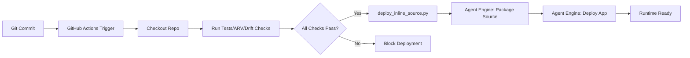

# 6775-DR-STND-inline-source-deployment-for-vertex-agent-engine

**Status**: Canonical Standard (INLINE1 Phase)
**Author**: department-adk-iam
**Created**: 2025-11-21
**Last Updated**: 2025-11-21

---

## Purpose

This document defines the **inline source deployment pattern** as the canonical, required method for deploying ADK agents to Vertex AI Agent Engine in the bobs-brain repository and all derivative projects.

Inline source deployment replaces older serialized/pickled object patterns and provides a robust, version-controlled, CI/CD-friendly deployment model.

---

## Why Inline Source Deployment?

### Problems with Serialized/Pickled Agents

**Legacy approach** (no longer used):
- Serialize Python agent objects (pickle/cloudpickle)
- Upload serialized blob to Agent Engine
- **Issues**:
  - Version control problems (binary blobs, no diffs)
  - Dependency management complexity (requirements frozen in pickle)
  - Debugging difficulty (opaque runtime state)
  - CI/CD friction (can't easily inspect what's deployed)
  - Security concerns (arbitrary code execution from pickles)

### Benefits of Inline Source Deployment

**New standard** (required going forward):
- Deploy source code directly from Git repository
- Agent Engine packages and executes Python modules on-demand
- **Advantages**:
  - ✅ **Version control**: Source code diffs, PR reviews, Git history
  - ✅ **Dependency transparency**: `requirements.txt` explicitly versioned
  - ✅ **Debuggability**: Runtime matches source exactly
  - ✅ **CI/CD native**: GitHub Actions → source push → Agent Engine deploy
  - ✅ **Security**: No arbitrary deserialization, code review required
  - ✅ **Reproducibility**: Exact commit → exact runtime behavior

---

## Essential Elements of Inline Source Deployment

### 1. Source Packages

**What**: Python packages containing agent code, tools, and dependencies.

**In bobs-brain**:
```python
source_packages = [
    "agents",           # All agent modules (bob, iam-*, etc.)
    "deployment",       # Deployment utilities (if applicable)
    # Add other packages as needed
]
```

**Structure**:
```
agents/
├── bob/
│   ├── __init__.py
│   ├── agent.py           # Contains `app` (ADK App object)
│   └── tools/
├── iam_senior_adk_devops_lead/
│   ├── agent.py
│   └── ...
└── shared_contracts.py
```

### 2. Entrypoint Module

**What**: Python module path that Agent Engine will import to access the agent.

**Format**: `package.subpackage.module` (no `.py` extension)

**Example**:
```python
entrypoint_module = "agents.bob.agent"  # Points to agents/bob/agent.py
```

**Requirements**:
- Module must be importable from the source packages root
- Module must define the entrypoint object (see below)

### 3. Entrypoint Object

**What**: The name of the ADK `App` object within the entrypoint module.

**Format**: Variable name (string)

**Example**:
```python
entrypoint_object = "app"  # agents/bob/agent.py must have `app = ...`
```

**In bobs-brain agents**:
- All agents follow the **lazy-loading App pattern** (see 6774-DR-STND-adk-lazy-loading-app-pattern.md)
- Each `agent.py` exports a module-level `app` variable:
  ```python
  # agents/bob/agent.py
  from google.genai.adk import App

  def create_agent():
      # Agent construction logic
      pass

  def create_app() -> App:
      agent = create_agent()
      return App(agent=agent)

  app = create_app()  # ← This is the entrypoint_object
  ```

### 4. Class Methods (Skills)

**What**: HTTP-accessible methods that downstream clients (Slack, gateways, etc.) can invoke.

**Format**: List of method names defined on the agent

**Example**:
```python
class_methods = ["query", "analyze_repo", "orchestrate_pipeline"]
```

**In bobs-brain**:
- Methods depend on agent type (orchestrator vs. specialist)
- Foreman agents: Broad orchestration methods
- Specialist agents: Task-specific methods matching AgentCard skills

**Mapping to A2A**:
- Each class method can be called via Agent Engine's HTTP API
- AgentCard `skills` should correspond to available class methods
- Clients (Slack, Cloud Run gateways) use skill names to route requests

### 5. Requirements Management

**What**: `requirements.txt` defining Python dependencies for the agent runtime.

**Location**: Root of repository or in agent-specific directory

**Example** (`requirements.txt`):
```
google-genai-adk>=0.2.0
google-cloud-aiplatform>=1.50.0
pydantic>=2.0.0
# ... other deps
```

**Agent Engine behavior**:
- Reads `requirements.txt` from source packages
- Installs dependencies in isolated runtime environment
- Versions locked to Git commit (reproducible builds)

**Best practices**:
- Pin major/minor versions for stability
- Use `>=` for patch-level flexibility
- Document any GCP-specific dependencies (ADK, Vertex AI, etc.)

---

## CI/CD Integration Story

### Flow: Git Commit → GitHub Actions → Inline Source Deploy



### GitHub Actions Workflow Pattern

**File**: `.github/workflows/agent-engine-inline-deploy.yml`

**Key steps**:
1. **Checkout**: Clone repository at specific commit
2. **Validate**: Run linting, tests, ARV gates, drift detection
3. **Deploy**: Execute `deploy_inline_source.py` with environment config
4. **Verify**: Optional smoke test against deployed agent

**Environment gating**:
- `dev`: Auto-deploy on push to `main` (or feature branches for testing)
- `staging`: Manual approval or tag-based trigger
- `prod`: Strict manual approval, tag required, full ARV

### Deployment Script Requirements

**Script**: `agents/agent_engine/deploy_inline_source.py`

**Responsibilities**:
- Accept CLI args or env vars for:
  - `PROJECT_ID`: GCP project
  - `LOCATION`: us-central1 (or other region)
  - `AGENT_DISPLAY_NAME`: Human-readable name
  - `ENV`: dev/staging/prod
- Construct inline source config:
  - `source_packages`, `entrypoint_module`, `entrypoint_object`, `class_methods`
- Call Vertex AI Agent Engine API to deploy agent
- Return deployment status (success/failure, agent ID, endpoint URL)

**Idempotency**:
- Script should support re-deploy (update existing agent if already exists)
- Use agent display name or ID as idempotency key

---

## Migration from Legacy Patterns

### If You Have Serialized/Pickled Agents

**Old pattern** (deprecated):
```python
# DON'T DO THIS
import cloudpickle
agent_blob = cloudpickle.dumps(agent)
# Upload blob to Agent Engine
```

**New pattern** (required):
```python
# Use inline source deployment script instead
# No pickling, just source code + entrypoint config
```

**Migration steps**:
1. Ensure agent code is in source packages (not standalone scripts)
2. Define `app` variable in agent module (lazy-loading App pattern)
3. Update CI/CD to call `deploy_inline_source.py`
4. Remove any pickle/cloudpickle deployment logic

### If You Have ADK Deploy CLI

**Old pattern** (may work but not preferred):
```bash
adk deploy --agent-path agents/bob/
```

**New pattern** (bobs-brain standard):
```bash
python -m agents.agent_engine.deploy_inline_source \
  --project $PROJECT_ID \
  --location us-central1 \
  --env dev
```

**Why custom script?**
- Repo-specific config (source packages, entrypoint paths)
- Integration with bobs-brain CI/CD (ARV, drift checks, feature flags)
- Consistent with multi-agent department deployment patterns

---

## Deployment Checklist

Before deploying an agent with inline source:

- [ ] Agent follows **lazy-loading App pattern** (6774 standard)
  - `agent.py` has `create_agent()`, `create_app()`, and module-level `app`
- [ ] Agent is in source packages directory (`agents/`)
- [ ] `requirements.txt` is up-to-date and tested
- [ ] AgentCard (`.well-known/agent-card.json`) aligns with class methods
- [ ] System prompt follows **contract-first design** (6767-115 standard)
- [ ] All ARV gates pass (R1-R8 compliance, minimum requirements)
- [ ] Drift detection checks pass (no forbidden patterns)
- [ ] Tests pass (unit tests, AgentCard validation, integration tests)
- [ ] Deployment script tested in dev environment first

**After deployment**:
- [ ] Smoke test: Invoke agent via HTTP API
- [ ] Verify logs in Cloud Logging (SPIFFE ID propagation, no errors)
- [ ] Test A2A interactions (if agent is part of department)
- [ ] Update deployment docs/runbooks with new agent endpoint

---

## Security Considerations

### Source Code Review

**Requirement**: All code deployed via inline source must pass PR review.

**Rationale**:
- Inline source = arbitrary Python code execution in Agent Engine
- Malicious or buggy code can access GCP resources, secrets, data
- PR review ensures two-person rule for production changes

**Process**:
1. Developer creates feature branch
2. Submit PR with agent changes
3. Reviewer validates:
   - Code quality (linting, tests)
   - Security (no hardcoded secrets, proper IAM usage)
   - Compliance (R1-R8 rules, 6767 standards)
4. PR approved → merge → CI/CD auto-deploys to dev
5. Manual approval required for staging/prod

### Secrets Management

**Rule**: NO secrets in source code, ever.

**Correct patterns**:
- **Environment variables**: Injected by Agent Engine runtime
- **GCP Secret Manager**: Fetch secrets at runtime via ADC (Application Default Credentials)
- **Workload Identity**: Service account bindings for GCP resource access

**Example** (fetching secret):
```python
from google.cloud import secretmanager

def get_secret(project_id: str, secret_id: str) -> str:
    client = secretmanager.SecretManagerServiceClient()
    name = f"projects/{project_id}/secrets/{secret_id}/versions/latest"
    response = client.access_secret_version(request={"name": name})
    return response.payload.data.decode("UTF-8")
```

### IAM Permissions

**Agent Engine runtime service account** needs:
- `aiplatform.agents.read/write` (for self-management)
- `secretmanager.secretAccessor` (if accessing Secret Manager)
- Minimal additional permissions per agent needs (least privilege)

**Audit**:
- Regularly review IAM bindings for agent SAs
- Use GCP Policy Analyzer to check for over-permissions
- Document required permissions in agent README

---

## References / Sources

- **Inline Source Deployment Discussion** (Google Discuss):
  https://discuss.google.dev/t/deploying-agents-with-inline-source-on-vertex-ai-agent-engine/288935

- **Tutorial Notebook** (this repo):
  `agents/agent_engine/tutorial_deploy_your_first_adk_agent_on_agent_engine.ipynb`

- **Vertex AI Agent Engine Documentation** (inline source section):
  https://cloud.google.com/vertex-ai/docs/agent-engine (inline deployment guides)

- **Related bobs-brain standards**:
  - `6774-DR-STND-adk-lazy-loading-app-pattern.md` - Lazy-loading App pattern
  - `6767-115-DR-STND-prompt-design-and-a2a-contracts-for-department-adk-iam.md` - Prompt design
  - `6767-DR-STND-adk-agent-engine-spec-and-hardmode-rules.md` - Hard Mode rules (R1-R8)

---

**Maintained by**: department-adk-iam
**Last Review**: 2025-11-21
**Next Review**: When Vertex AI Agent Engine introduces breaking changes to inline source API
