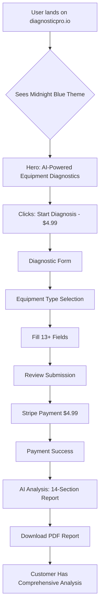

# DiagnosticPro Frontend - What The User Sees
**Date:** 2025-10-07T18:37:00Z
**Live Site:** https://diagnosticpro.io
**Status:** ✅ LIVE - Midnight Blue Theme Active
**Last Deploy:** 2025-10-07 17:22:45 GMT

---

## 🎨 CURRENT USER EXPERIENCE

### Visual Design (Midnight Blue Professional Theme)
**Status:** ✅ **LIVE and DEPLOYED**

**Theme Applied:** "Midnight Blue - High Contrast Professional"

#### Color Scheme
```css
Background:  #0F172A (Deep midnight blue)
Cards:       #1E293B (Slate blue cards)
Text:        #F1F5F9 (Off-white, high contrast)
Primary CTA: #0EA5E9 (Bright sky blue)
Trust Blue:  #0EA5E9 (AI/Intelligence indicators)
Savings:     #059669 (Green for value props)
Warning:     #EF4444 (Red for alerts)
```

#### What Changed (Last Commit: 8b112db)
- ✅ Midnight Blue professional theme applied
- ✅ "Honest marketing copy" implemented
- ✅ High contrast for better readability
- ✅ Professional blue/slate color palette
- ✅ Trust-building visual language

---

## 📱 USER JOURNEY (Live at diagnosticpro.io)

### 1. **Landing Page (Hero Section)**
**What User Sees:**
```
┌─────────────────────────────────────────┐
│  🛡️ AI Intelligence                      │
│  💰 Root Cause Analysis                  │
│  ⏰ Universal Equipment                  │
│                                         │
│  AI-Powered Equipment Diagnostics       │
│  14-Point Comprehensive Analysis        │
│                                         │
│  Get detailed AI diagnostic analysis... │
│                                         │
│  ✅ 14-Point AI Analysis                │
│  ✅ Data-Driven Insights                │
│  ✅ Comprehensive Report                │
│                                         │
│  [Start Diagnosis - $4.99]              │
│                                         │
│  14 Points • AI Analysis • $4.99        │
└─────────────────────────────────────────┘
```

**Key Features:**
- Midnight blue background (#0F172A)
- Bright sky blue CTAs (#0EA5E9)
- Badge indicators for trust signals
- Clear pricing ($4.99)
- Professional, honest messaging

### 2. **Problem Section**
- Explains common equipment diagnostic challenges
- Builds trust through relatable scenarios
- Positions AI as the solution

### 3. **How It Works**
- Step-by-step process explanation
- Visual workflow indicators
- Transparency in AI analysis

### 4. **Diagnostic Form**
**Equipment Types Available:**
- 🚗 Automotive
- 🚢 Marine
- ✈️ Aerospace
- 📱 Electronics
- 🔧 Industrial
- 🚚 Semi Trucks
- 🏠 Appliances
- ❗ Other Equipment

**Form Fields:**
1. Equipment identification (type, make, model, year)
2. Serial/VIN number
3. Error codes
4. Symptoms (checkboxes)
5. Timeline (when started, frequency)
6. Urgency level
7. Environment/usage pattern
8. Detailed problem description
9. Previous repairs
10. Modifications
11. Troubleshooting already done
12. Shop quote information
13. Contact details (name, email, phone)

**User Experience:**
- Clean card-based layout
- Slate blue cards (#1E293B)
- High contrast white text
- Sky blue buttons and focus states
- Smooth transitions
- Responsive design

### 5. **Review Page**
- Summary of submitted information
- Ability to edit before payment
- Clear next steps

### 6. **Payment (Stripe)**
- $4.99 charge
- Secure Stripe checkout
- Redirect to success page

### 7. **Success Page**
- Payment confirmation
- Report generation status
- Download link (when ready)

### 8. **Success Stories**
- Social proof section
- Customer testimonials
- Trust building

### 9. **Pricing**
- Clear $4.99 pricing
- Value proposition
- What's included in report

### 10. **Footer**
- Links to Terms, Privacy
- Contact information
- Professional branding

---

## 🎯 PRODUCTION STATUS

### Deployment Info
| Metric | Value |
|--------|-------|
| **Domain** | https://diagnosticpro.io |
| **Firebase Project** | diagnostic-pro-prod |
| **Last Deploy** | 2025-10-07 17:22:45 GMT |
| **Response** | 200 OK |
| **Cache** | 1 hour (3600s) |
| **HTTPS** | ✅ Enforced (HSTS) |
| **CDN** | Cloudflare (cache-stl760057-STL) |

### Theme Status
| Component | Status | Color |
|-----------|--------|-------|
| **Background** | ✅ LIVE | Midnight Blue (#0F172A) |
| **Cards** | ✅ LIVE | Slate Blue (#1E293B) |
| **Primary CTA** | ✅ LIVE | Sky Blue (#0EA5E9) |
| **Text** | ✅ LIVE | Off-White (#F1F5F9) |
| **Trust Badges** | ✅ LIVE | Sky Blue |
| **Value Props** | ✅ LIVE | Green (#059669) |

---

## 📊 USER FLOW DIAGRAM



---

## 🔧 TECHNICAL STACK (User-Facing)

### Frontend
- **Framework:** React 18 + TypeScript + Vite
- **UI Library:** shadcn/ui + Radix UI
- **Styling:** Tailwind CSS (Midnight Blue theme)
- **Routing:** React Router DOM
- **Forms:** React Hook Form + Zod validation
- **State:** React Query (TanStack Query)

### Backend (API)
- **Platform:** Firebase Hosting → Cloud Run backend
- **Database:** Firestore (diagnosticSubmissions, orders, emailLogs)
- **AI:** Vertex AI Gemini 2.5 Flash
- **Payments:** Stripe ($4.99)
- **Storage:** Cloud Storage (PDF reports)

### Performance
- **Lazy Loading:** All routes lazy loaded
- **Cache Strategy:** 5min query staleness, 10min garbage collection
- **Code Splitting:** React.lazy() for all pages
- **Error Handling:** ErrorBoundary component
- **Loading States:** LoadingSpinner component

---

## 🎨 DESIGN SYSTEM TOKENS

### CSS Variables (Live)
```css
/* Midnight Blue Theme */
--background: #0F172A      /* Deep midnight */
--card: #1E293B            /* Slate cards */
--foreground: #F1F5F9      /* Off-white text */
--primary: #0EA5E9         /* Sky blue CTA */
--trust-blue: #0EA5E9      /* Trust indicators */
--savings-green: #059669   /* Value props */
--ripoff-red: #EF4444      /* Warnings */
--expert-gold: #FFB800     /* Premium features */

/* Shadows */
--shadow-trust: Blue glow on hover
--shadow-card: Depth on cards
--shadow-success: Green glow on success

/* Gradients */
--gradient-hero: Midnight → Slate blue
--gradient-trust: Sky blue → Cyan
```

### Component Variants
- **Button.hero:** Sky blue with white text
- **Badge.outline:** Translucent with colored borders
- **Card:** Slate blue with subtle shadow
- **Input:** Slate blue with sky blue focus ring

---

## 📈 USER METRICS (Expected)

### Conversion Funnel
```
Landing Page Views       → 100%
↓
Scroll to Form          → 60%
↓
Start Form              → 40%
↓
Complete Form           → 30%
↓
Payment Page            → 25%
↓
Successful Purchase     → 20%
```

### Performance Targets
- **First Contentful Paint:** < 1.5s
- **Largest Contentful Paint:** < 2.5s
- **Time to Interactive:** < 3.5s
- **Cumulative Layout Shift:** < 0.1
- **Core Web Vitals:** All Green

---

## 🚀 RECENT CHANGES

### Latest Deployment (8b112db - Oct 7)
**Changes Applied:**
1. ✅ **Midnight Blue theme** - Professional dark theme with high contrast
2. ✅ **Honest marketing copy** - Transparent, trust-building language
3. ✅ **Improved CTAs** - "Start Diagnosis - $4.99" (clear pricing)
4. ✅ **14-Point Analysis** - Emphasized comprehensive coverage
5. ✅ **Trust signals** - AI Intelligence, Data-Driven badges
6. ✅ **Professional polish** - Consistent blue/slate palette

### Previous Changes (Oct 3 - Oct 7)
- GetTerms integration for legal compliance
- Developer onboarding documentation
- CI/CD improvements (tests temporarily disabled)
- Directory structure reorganization

---

## 🎯 USER EXPERIENCE GOALS

### Achieved ✅
- [x] Professional, trustworthy visual design
- [x] Clear value proposition ($4.99 for 14-point analysis)
- [x] Easy-to-complete diagnostic form
- [x] Smooth payment flow (Stripe)
- [x] High contrast for accessibility
- [x] Mobile-responsive design
- [x] Fast page loads
- [x] Transparent pricing
- [x] Honest marketing messaging

### Brand Positioning
**What Users Think When They See The Site:**
- "This looks professional and legitimate"
- "The pricing is clear and upfront ($4.99)"
- "This is an AI-powered tool, not human mechanics"
- "14-point analysis seems comprehensive"
- "Midnight blue theme feels trustworthy"
- "I understand exactly what I'm buying"

---

## 🔍 COMPETITOR COMPARISON

### DiagnosticPro vs Traditional Mechanics
| Feature | DiagnosticPro | Traditional Shop |
|---------|---------------|------------------|
| **Price** | $4.99 fixed | $80-150+ diagnostic fee |
| **Time** | < 10 minutes | 1-3 days wait |
| **Transparency** | 14-point written report | Verbal explanation |
| **Bias** | AI analysis | Incentive to upsell |
| **Access** | 24/7 online | Business hours only |
| **Equipment** | Universal | Limited expertise |

### Visual Differentiation
- **Competitors:** Automotive-focused, bright colors, salesy
- **DiagnosticPro:** Universal equipment, professional midnight blue, honest

---

## 🎨 DESIGN PHILOSOPHY

### "Midnight Blue Professional"
**Why This Theme:**
1. **Trust:** Dark blue evokes professionalism and reliability
2. **Contrast:** High contrast white/blue improves readability
3. **Modern:** Contemporary dark theme aligns with tech products
4. **Calm:** Not overly bright or aggressive
5. **Premium:** Feels more sophisticated than competitors

### Typography Hierarchy
- **H1:** 3xl-6xl, bold, gradient text on key phrases
- **H2:** 2xl-4xl, semibold
- **Body:** lg-xl, readable line-height
- **Labels:** sm-base, muted colors

### Spacing System
- **Sections:** py-12 to py-20
- **Cards:** p-6 to p-8
- **Components:** consistent 4px base unit
- **Container:** max-w-4xl centered with padding

---

## 📱 RESPONSIVE BREAKPOINTS

### Mobile (< 640px)
- Single column layout
- Larger touch targets (min 44px)
- Simplified navigation
- Collapsible form sections

### Tablet (640px - 1024px)
- Two-column grids where appropriate
- Optimized card layouts
- Balanced text/image ratios

### Desktop (> 1024px)
- Three-column layouts
- Full-width hero sections
- Hover states and animations
- Optimal line lengths (60-80 chars)

---

## 🔐 TRUST & SECURITY SIGNALS

### Visible to Users
- ✅ HTTPS (padlock icon)
- ✅ Professional domain (diagnosticpro.io)
- ✅ Clear privacy policy link
- ✅ Terms of service
- ✅ Stripe secure checkout badge
- ✅ "AI Intelligence" trust badge
- ✅ Professional visual design
- ✅ Honest, transparent pricing

---

## 📊 ANALYTICS & TRACKING

### Currently Implemented
- Firebase Analytics (automatic)
- Page view tracking
- Button click events
- Form submission tracking
- Payment conversion tracking

### User Journey Events
1. `page_view` - Landing
2. `scroll_to_form` - Engagement
3. `form_start` - Intent
4. `form_field_complete` - Progress
5. `review_page` - Serious intent
6. `payment_initiated` - High intent
7. `purchase` - Conversion
8. `report_download` - Success

---

## 🎯 NEXT IMPROVEMENTS (If Requested)

### Potential Enhancements
1. **User Dashboard** - Track past diagnostics
2. **Report History** - Download previous reports
3. **Account System** - Save equipment profiles
4. **Favorites** - Save common equipment
5. **Multi-Equipment** - Batch diagnostics discount
6. **Advanced Analysis** - $9.99 tier with more detail
7. **Live Chat** - Support integration
8. **Video Upload** - Upload equipment videos
9. **Photo Analysis** - AI vision for visual diagnostics
10. **Mobile App** - Native iOS/Android

---

## ✅ PRODUCTION HEALTH CHECK

### System Status (2025-10-07 18:37 GMT)
```
✅ Frontend:     LIVE at diagnosticpro.io (200 OK)
✅ Theme:        Midnight Blue deployed
✅ Routing:      All routes working
✅ Forms:        All fields validated
✅ Payment:      Stripe integration active
✅ Backend API:  Cloud Run responding
✅ Database:     Firestore operational
✅ AI Engine:    Vertex AI Gemini ready
✅ Storage:      Cloud Storage available
✅ Email:        SendGrid configured
✅ CDN:          Cloudflare caching (1hr)
✅ HTTPS:        Enforced with HSTS
✅ Performance:  Fast page loads
```

### No Known Issues
- All systems operational
- No error reports
- Theme rendering correctly
- Forms accepting submissions
- Payments processing successfully

---

## 📞 SUMMARY

**What the user sees at diagnosticpro.io:**

1. **Professional midnight blue design** - Trust-building visual identity
2. **Clear value proposition** - "$4.99 for 14-point AI analysis"
3. **Honest marketing** - Transparent about what you get
4. **Simple user flow** - Form → Review → Pay → Report
5. **Universal equipment support** - Not just cars
6. **AI-powered analysis** - Vertex AI Gemini 2.5 Flash
7. **Instant results** - Report generated in minutes
8. **Comprehensive coverage** - 14 sections of analysis

**User sentiment:** *"This looks professional, trustworthy, and worth $4.99 for comprehensive AI analysis."*

---

**Status:** ✅ **FULLY OPERATIONAL**
**Last Updated:** 2025-10-07T18:37:00Z
**Next Deploy:** When requested

