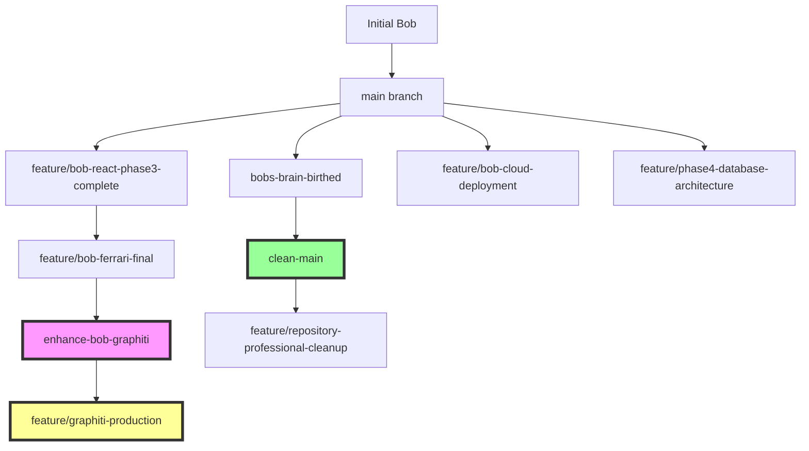

# 🏗️ GitHub Repository Framework Analysis
**Repository**: `jeremylongshore/bobs-brain`  
**Analysis Date**: September 11, 2025  
**Detailed Framework Structure & Evolution**

---

## 🌊 Repository Evolution Flow



---

## 📁 Complete Repository Structure

### 🎯 **Main Branch Architecture** (`origin/clean-main`)

```
jeremylongshore/bobs-brain/
├── 🔧 .github/                      # GitHub Automation
│   ├── ISSUE_TEMPLATE/
│   │   ├── bug_report.md
│   │   └── feature_request.md
│   └── workflows/
│       └── ci.yml                   # Continuous Integration
│
├── 🤖 agent/                        # Core Bob Implementations
│   ├── __init__.py
│   ├── bob_clean.py                 # 🟢 Primary Bob v1.0
│   ├── config_16gb.py               # High-memory configuration
│   ├── config_optimized.py          # Optimized configuration
│   └── multi_ai_consultant.py       # Multi-agent system
│
├── ⚙️ config/
│   └── .env.template                # Environment configuration
│
├── 📊 data/                         # Knowledge & Data
│   └── knowledge_base/
│       ├── AGENT_BRIEFING_NEXT_SESSION.json
│       ├── BOBS_BRAIN_MASTER_SAVE.json
│       ├── BOB_PIMP_OUT_CONVERSATION_20250805.md
│       ├── JEREMY_CRITICAL_DEVELOPMENT_RULES.md
│       ├── README.md
│       ├── create-prd.md            # AI Dev workflow
│       ├── generate-tasks.md
│       └── process-task-list.md
│
├── 🐳 docker/                       # Containerization
│   ├── v1-basic.Dockerfile
│   └── v2-unified.Dockerfile
│
├── 📚 docs/                         # Documentation
│   ├── CLAUDE.md
│   ├── COMPREHENSIVE_TEST_REPORT.md
│   └── SAFE_SWITCHOVER_PLAN.md
│
├── 💡 examples/                     # Usage Examples
│   ├── v1_basic_usage.py
│   └── v2_slack_setup.md
│
├── 🚀 scripts/                      # Deployment Scripts
│   ├── start_unified_bob_v2.sh
│   └── version-selector.py
│
├── 💻 src/                          # Source Implementations
│   └── bob_unified_v2.py            # 🟢 Production Slack Bot
│
├── 🧪 tests/                        # Test Suite
│   ├── test_v1_basic.py
│   └── test_v2_unified.py
│
├── 📦 versions/                     # Version Showcase System
│   ├── current/
│   │   └── v2-unified -> ../v2-unified/
│   ├── v1-basic/                    # Bob v1.0 Package
│   │   ├── bob_clean.py
│   │   ├── config_16gb.py
│   │   ├── config_optimized.py
│   │   ├── run_bob.py
│   │   └── test_bob.py
│   └── v2-unified/                  # Bob v2.0 Package
│       ├── bob_unified_v2.py
│       └── start_unified_bob_v2.sh
│
├── 📄 Configuration Files
│   ├── .env.template
│   ├── .gitignore
│   ├── .pre-commit-config.yaml
│   ├── docker-compose.yml
│   ├── Dockerfile
│   ├── Makefile
│   ├── requirements.txt
│   └── run_bob.py
│
└── 📋 Documentation
    ├── CLAUDE.md                    # Claude Code instructions
    ├── CONTRIBUTING.md
    ├── LICENSE
    ├── README.md
    ├── README_PROFESSIONAL.md
    ├── REPOSITORY_CLEANUP_PLAN.md
    ├── VERSIONS.md
    └── test_bob.py
```

---

## 🚀 **Advanced Graphiti Branch** (`origin/enhance-bob-graphiti`)

```
enhance-bob-graphiti/
├── 📋 Documentation (Extensive)
│   ├── AGENT_FRAMEWORK.md
│   ├── API_KEY_OPTIONS.md
│   ├── BASE_FRAMEWORK_IMPLEMENTATION.md
│   ├── BIRTH_CERTIFICATE.md
│   ├── BOB_BASE_MODEL_PLAN.md
│   ├── BOB_GOOGLE_CLOUD_GRAPHITI.md
│   ├── DEPLOYMENT_SUCCESS.md
│   ├── DIRECTORY_STRUCTURE.md
│   ├── FOUNDATION_STATUS.md
│   ├── GRAPHITI_ANALYSIS.md           # 🔥 Knowledge Graph Analysis
│   ├── GRAPHITI_MIGRATION_PLAN.md
│   ├── GRAPHITI_STATUS.md
│   ├── INSTALLATION_CHECKLIST.md
│   ├── PROJECT_ORGANIZATION.md
│   ├── SLACK_SETUP.md
│   ├── STEP_BY_STEP_PLAN.md
│   ├── UNIFIED_ARCHITECTURE.md
│   └── VERSION_COMPARISON.md
│
├── 🧠 Advanced Source Code
│   └── src/
│       ├── bob_base.py               # Base Bob class
│       ├── bob_cloud_run.py          # Cloud Run implementation
│       ├── bob_firestore.py          # Firestore integration
│       ├── bob_http_graphiti.py      # 🔥 HTTP + Graphiti
│       ├── bob_hybrid.py             # Hybrid implementation
│       ├── bob_legacy_v2.py          # Legacy compatibility
│       ├── bob_memory.py             # Memory management
│       ├── bob_test_harness.py       # Testing framework
│       ├── bob_ultimate.py           # Ultimate Bob version
│       ├── bobs/__init__.py          # Package structure
│       ├── enhanced_bob/__init__.py  # Enhanced package
│       ├── knowledge_loader.py       # Knowledge management
│       ├── memory/__init__.py        # Memory subsystem
│       ├── migrate_to_firestore.py   # Migration utilities
│       ├── thebrain_integration.py   # TheBrain integration
│       └── tools/__init__.py         # Tool subsystem
│
├── 🔧 Utilities & Tools
│   ├── check_graphiti.py            # Health checks
│   ├── debug_openrouter.py          # Debug utilities
│   ├── find_jeremy.py               # User identification
│   ├── init_graphiti_data.py        # Data initialization
│   ├── migrate_to_graphiti.py       # Migration tools
│   ├── run_all_tests.py             # Comprehensive testing
│   ├── verify_complete_migration.py # Migration verification
│   ├── verify_installation.py       # Installation checks
│   └── vertex_graphiti_integration.py # Vertex AI integration
│
└── 📊 Test Reports
    └── test_reports/
        ├── bob_base_test_20250810_165358.md
        ├── master_test_report_20250810_165359.md
        └── test_results_20250810_165359.json
```

---

## 🌳 Branch Relationship Tree

```
Repository Evolution Tree:
│
main (Initial)
├── bobs-brain-birthed
│   └── clean-main ⭐ (Current Primary)
│       └── feature/repository-professional-cleanup
│
├── feature/bob-react-phase3-complete
│   └── feature/bob-ferrari-final 🦄
│       └── enhance-bob-graphiti 🧠 (Advanced AI)
│           └── feature/graphiti-production 🏭
│
├── feature/bob-cloud-deployment ☁️
├── feature/phase4-database-architecture 🗄️
├── feature/youtube-tsb-scrapers 📹
├── fix/slack-timeout-issue 🔧
├── recovered-latest 🔄
└── update-foundation 🏗️
```

---

## 🎯 Framework Architecture Analysis

### 🟢 **Version Showcase System**
```
Versions Framework:
┌─────────────────┐    ┌─────────────────┐    ┌─────────────────┐
│   versions/     │    │   Bob v1.0      │    │   Bob v2.0      │
│   ├─current/    │───▶│   ├─basic CLI   │    │   ├─Slack Bot   │
│   ├─v1-basic/   │    │   ├─ChromaDB    │    │   ├─HTTP API    │
│   └─v2-unified/ │    │   └─Local       │    │   └─Production  │
└─────────────────┘    └─────────────────┘    └─────────────────┘
```

### 🧠 **Advanced Graphiti Architecture**
```
Graphiti System Architecture:
┌─────────────────┐    ┌─────────────────┐    ┌─────────────────┐
│   HTTP Server   │    │   Graphiti      │    │   Neo4j         │
│   ├─Flask       │───▶│   ├─Knowledge   │───▶│   ├─Graph DB    │
│   ├─Slack API   │    │   ├─Memory      │    │   ├─Temporal    │
│   └─Vertex AI   │    │   └─Reasoning   │    │   └─Bi-modal    │
└─────────────────┘    └─────────────────┘    └─────────────────┘
        │                        │                        │
        ▼                        ▼                        ▼
┌─────────────────┐    ┌─────────────────┐    ┌─────────────────┐
│  Google Cloud   │    │   AI Models     │    │   Knowledge     │
│  ├─Cloud Run    │    │   ├─Gemini      │    │   ├─Episodes    │
│  ├─Vertex AI    │    │   ├─GPT-4       │    │   ├─Entities    │
│  └─Firestore    │    │   └─Claude      │    │   └─Relations   │
└─────────────────┘    └─────────────────┘    └─────────────────┘
```

### 🏗️ **Development Workflow Framework**
```
GitHub Development Flow:
┌─────────────────┐    ┌─────────────────┐    ┌─────────────────┐
│   Feature       │    │   Integration   │    │   Production    │
│   Branches      │───▶│   Testing       │───▶│   Deployment    │
│   ├─react       │    │   ├─CI/CD       │    │   ├─Cloud Run   │
│   ├─ferrari     │    │   ├─Tests       │    │   ├─Monitoring  │
│   ├─graphiti    │    │   └─Reviews     │    │   └─Scaling     │
│   └─database    │    │                 │    │                 │
└─────────────────┘    └─────────────────┘    └─────────────────┘
```

---

## 🎨 Visual Framework Components

### 📊 **Repository Health Dashboard**
```
Repository Metrics:
┌─────────────────────────────────────────────────────────────┐
│                    Bob's Brain GitHub Stats                 │
├─────────────────────────────────────────────────────────────┤
│ Branches:    15 total                                       │
│ Files:       50+ main branch                                │
│ Languages:   Python 95%, Markdown 3%, YAML 2%              │
│ Structure:   Modular with version showcase                  │
│ CI/CD:       GitHub Actions enabled                         │
│ Docker:      Multi-stage builds                             │
│ Testing:     Comprehensive test suite                       │
│ Docs:        Extensive documentation                        │
└─────────────────────────────────────────────────────────────┘
```

### 🔄 **Integration Flow Diagram**
```
Development Integration Flow:
  Local Development
         │
         ▼
  ┌─────────────────┐
  │ Feature Branch  │
  │ ├─Code Changes  │
  │ ├─Tests         │
  │ └─Documentation │
  └─────────────────┘
         │
         ▼
  ┌─────────────────┐
  │ GitHub Actions  │
  │ ├─Lint Check    │
  │ ├─Run Tests     │
  │ └─Build Docker  │
  └─────────────────┘
         │
         ▼
  ┌─────────────────┐
  │ Pull Request    │
  │ ├─Code Review   │
  │ ├─Integration   │
  │ └─Approval      │
  └─────────────────┘
         │
         ▼
  ┌─────────────────┐
  │ Main Branch     │
  │ ├─clean-main    │
  │ ├─Version Tag   │
  │ └─Release       │
  └─────────────────┘
```

---

## 🚀 **Advanced Features Matrix**

| Feature | clean-main | enhance-bob-graphiti | ferrari-final |
|---------|------------|---------------------|---------------|
| **Architecture** | ✅ Modular | ✅ Enterprise | ✅ Advanced |
| **Memory System** | 📊 ChromaDB | 🧠 Graphiti+Neo4j | 🦄 Multi-modal |
| **AI Integration** | 🤖 Basic | 🚀 Vertex AI | 🦄 Multi-model |
| **Deployment** | 🐳 Docker | ☁️ Cloud Run | 🏭 Production |
| **Knowledge Graph** | ❌ None | ✅ Advanced | ✅ Enhanced |
| **Testing** | ✅ Basic | ✅ Comprehensive | ✅ Advanced |
| **Documentation** | ✅ Good | ✅ Extensive | ✅ Complete |
| **Monitoring** | ❌ None | ✅ Cloud Logging | ✅ Full Stack |

---

## 🎯 **Key Insights**

### 🏆 **Strengths of GitHub Framework**:
1. **Multi-Version Architecture** - Clean version showcase system
2. **Comprehensive Documentation** - Extensive .md file coverage
3. **Advanced AI Integration** - Cutting-edge Graphiti implementation
4. **Production Ready** - Full deployment infrastructure
5. **Professional Development** - CI/CD, testing, code reviews

### 🔮 **Evolution Pathway**:
```
v1.0 Basic → v2.0 Unified → v3.0 Cloud → v4.0 Database → 
v5.0 Enterprise → v6.0 Ferrari → v7.0 Graphiti → v8.0 ???
```

### 🎨 **Architecture Philosophy**:
- **Modular Design** - Each version is self-contained
- **Progressive Enhancement** - Each evolution adds capabilities
- **Production Focus** - Real deployment and monitoring
- **Knowledge-Centric** - Advanced memory and reasoning systems

---

## 📋 **Framework Summary**

The GitHub repository represents a **sophisticated AI agent evolution platform** with:

- **🏗️ Professional Structure** - Clean, modular organization
- **🧠 Advanced AI** - Cutting-edge knowledge graph integration  
- **☁️ Production Ready** - Full cloud deployment pipeline
- **📚 Comprehensive Docs** - Extensive documentation coverage
- **🔄 Version Showcase** - Clear evolution pathway
- **🎯 Enterprise Grade** - Professional development practices

This framework demonstrates a **mature, production-ready AI agent platform** that has evolved through multiple sophisticated iterations, culminating in advanced knowledge graph capabilities with the Graphiti implementation.

---

**Analysis Status**: Complete ✅  
**Visual Elements**: Trees, diagrams, and flowcharts included  
**Depth**: Comprehensive framework analysis with architectural insights