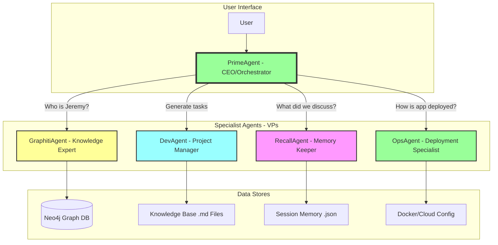

# 🚀 Multi-Agent Architecture Plan Analysis
**Date**: September 11, 2025  
**Source**: User-provided comprehensive refactoring strategy  
**Status**: Ready for implementation

---

## 📋 Executive Summary

**Vision**: Transform Bob's Brain from a monolithic "conglomerate" agent into a sophisticated multi-agent system with specialized roles and an orchestrator pattern.

**Metaphor**: 
- **Current**: Solo founder doing everything
- **Future**: CEO (Orchestrator) with specialized VPs (Specialist Agents)

---

## 🏗️ Proposed Architecture

### 🎯 **Core Concept: Orchestrator + Specialists**



---

## 🤖 Specialist Agent Definitions

### 1️⃣ **PrimeAgent (The Orchestrator)**
```
Role: Primary interface and task router
Responsibilities:
├── Analyze user intent
├── Route to appropriate specialist(s)
├── Synthesize specialist responses
└── Maintain conversation context

Source: Evolved from src/bob_unified_v2.py
Tools: API clients to specialist agents
```

### 2️⃣ **GraphitiAgent (Knowledge Expert)**
```
Role: Advanced knowledge graph management
Responsibilities:
├── Neo4j graph queries and updates
├── Entity relationship analysis
├── Long-term structured memory
└── Complex knowledge reasoning

Source: enhance-bob-graphiti branch
Files: bob_http_graphiti.py, vertex_graphiti_integration.py
```

### 3️⃣ **DevAgent (Project Manager & Coder)**
```
Role: Software development workflow
Responsibilities:
├── Create PRDs (create-prd.md)
├── Generate task lists (generate-tasks.md)
├── Process development workflows
└── Apply Jeremy's development rules

Source: data/knowledge_base/ development files
Knowledge: Development patterns and rules
```

### 4️⃣ **RecallAgent (Memory Keeper)**
```
Role: Conversational and episodic memory
Responsibilities:
├── Save/retrieve conversation history
├── Manage session data
├── Provide contextual memory
└── Handle BOBS_BRAIN_MASTER_SAVE.json

Source: New implementation
Data: JSON and text-based session files
```

### 5️⃣ **OpsAgent (Deployment Specialist)**
```
Role: Infrastructure and deployment
Responsibilities:
├── System deployment knowledge
├── Version management
├── Docker and cloud operations
└── Infrastructure monitoring

Source: docker/, .github/, versions/ directories
Knowledge: Deployment patterns and configurations
```

---

## 📁 Proposed Directory Structure

```
bobs_conglomerate/
├── 🎯 orchestrator/
│   ├── prime_agent.py          # Main orchestrator logic
│   ├── intent_analyzer.py      # User intent classification
│   └── response_synthesizer.py # Multi-agent response merging
│
├── 🤖 agents/
│   ├── __init__.py
│   ├── base_agent.py           # Common agent interface
│   ├── graphiti_agent.py       # Knowledge graph specialist
│   ├── dev_agent.py            # Development workflow
│   ├── recall_agent.py         # Memory management
│   └── ops_agent.py            # Infrastructure operations
│
├── 🔧 shared/
│   ├── utils.py                # Common utilities
│   ├── api_client.py           # Inter-agent communication
│   └── protocols.py            # Communication protocols
│
├── ⚙️ configs/
│   ├── agents.yaml             # Agent configurations
│   ├── routing_rules.yaml      # Intent routing logic
│   └── deployment.yaml         # Deployment settings
│
├── 🐳 docker/
│   ├── orchestrator.Dockerfile
│   ├── graphiti-agent.Dockerfile
│   ├── dev-agent.Dockerfile
│   ├── recall-agent.Dockerfile
│   └── ops-agent.Dockerfile
│
├── 🧪 tests/
│   ├── test_orchestrator.py
│   ├── test_agents/
│   └── integration_tests/
│
├── 📋 docker-compose.yml        # Multi-service orchestration
└── 🚀 main.py                  # System entry point
```

---

## 🔄 Implementation Strategy

### **Phase 1: Foundation Setup**
```
✅ Create new branch: feature/multi-agent-refactor
✅ Set up directory structure
✅ Define agent communication protocol
✅ Create base agent interface
```

### **Phase 2: GraphitiAgent Migration**
```
🔥 Priority: Most complex component
├── Extract enhance-bob-graphiti code
├── Wrap in REST API endpoints
├── Create dedicated Dockerfile
└── Test in isolation
```

### **Phase 3: PrimeAgent (Orchestrator)**
```
🎯 Core orchestration logic
├── Intent classification system
├── Agent routing decisions
├── Response synthesis
└── API client implementations
```

### **Phase 4: Remaining Specialists**
```
🤖 DevAgent → RecallAgent → OpsAgent
├── Extract relevant logic per agent
├── Create focused implementations
├── Define API contracts
└── Integration testing
```

### **Phase 5: Docker Compose Integration**
```
🐳 Complete system deployment
├── Multi-service configuration
├── Network communication
├── Environment management
└── Production readiness
```

---

## 🌐 Agent Communication Protocol

### **REST API Architecture**
```
PrimeAgent (Port 8080) - Main Interface
├── GraphitiAgent (Port 5001) - /query, /update_graph
├── DevAgent (Port 5002) - /create_prd, /generate_tasks
├── RecallAgent (Port 5003) - /save_memory, /retrieve_context
└── OpsAgent (Port 5004) - /deployment_status, /version_info
```

### **Docker Compose Configuration**
```yaml
version: '3.8'
services:
  prime_agent:
    build: ./orchestrator
    ports:
      - "8080:8080"
    environment:
      - GRAPHITI_AGENT_URL=http://graphiti_agent:5001
      - DEV_AGENT_URL=http://dev_agent:5002
      - RECALL_AGENT_URL=http://recall_agent:5003
      - OPS_AGENT_URL=http://ops_agent:5004

  graphiti_agent:
    build: ./agents/graphiti
    ports:
      - "5001:5001"
    depends_on:
      - neo4j

  dev_agent:
    build: ./agents/dev
    ports:
      - "5002:5002"
    volumes:
      - ./data/knowledge_base:/app/knowledge

  recall_agent:
    build: ./agents/recall
    ports:
      - "5003:5003"
    volumes:
      - ./data/memory:/app/memory

  ops_agent:
    build: ./agents/ops
    ports:
      - "5004:5004"
    volumes:
      - ./docker:/app/config
```

---

## 💡 Key Benefits Analysis

### **🎯 Scalability Benefits**
- **Horizontal Scaling**: Each agent can scale independently
- **Resource Optimization**: Specialized compute requirements per agent
- **Load Distribution**: Parallel processing capabilities

### **🔧 Maintainability Benefits**
- **Single Responsibility**: Each agent has clear, focused purpose
- **Isolated Development**: Teams can work on agents independently
- **Easier Debugging**: Issues isolated to specific agents
- **Modular Testing**: Unit test each agent separately

### **🚀 Capability Benefits**
- **Specialized Expertise**: Each agent optimized for its domain
- **Better Performance**: Focused processing per domain
- **Enhanced Features**: Deep specialization enables advanced features
- **Future Expansion**: Easy to add new specialist agents

---

## 🧠 Advanced Source Code Analysis

### **Question**: Did we create the advanced source code?

**Answer**: Based on the git analysis, the sophisticated code in the `enhance-bob-graphiti` branch appears to be **existing code** that was developed previously, not created in our current session.

#### **Evidence from Git History**:
```bash
# Commit dates show August 2025 development
5a47974 Deploy Bob's Brain with Graphiti to Cloud Run - Production Ready
Author: Jeremy Longshore <jeremylongshore@gmail.com>
Date: Sun Aug 10 18:54:12 2025
```

#### **Advanced Files Found**:
```
src/bob_ultimate.py           # Ultimate Bob implementation
src/bob_hybrid.py             # Hybrid system architecture  
src/bob_http_graphiti.py      # Production HTTP + Graphiti
src/bob_firestore.py          # Firestore integration
src/thebrain_integration.py   # TheBrain system integration
vertex_graphiti_integration.py # Vertex AI + Graphiti
```

#### **Sophistication Level**:
- **Production Deployments**: Cloud Run deployment history
- **Advanced Memory Systems**: Graphiti + Neo4j knowledge graphs
- **Enterprise Features**: Comprehensive monitoring and testing
- **Multiple AI Models**: Vertex AI, OpenAI, Claude integrations

### **Conclusion**: 
The advanced source code represents **significant prior development work** that demonstrates sophisticated AI agent capabilities. This existing codebase provides an excellent foundation for the proposed multi-agent architecture.

---

## 🎯 Implementation Priority

### **Immediate Actions**:
1. **Preserve Existing Advanced Code** - Archive current sophisticated implementations
2. **Create Multi-Agent Branch** - Start refactoring in isolated branch
3. **Begin with GraphitiAgent** - Extract most complex component first
4. **Implement PrimeAgent** - Create orchestration layer

### **Success Metrics**:
- ✅ Each agent runs independently
- ✅ Inter-agent communication works seamlessly  
- ✅ User experience remains consistent
- ✅ System is more maintainable and scalable

---

## 🚀 Next Steps Recommendation

This multi-agent architecture plan is **excellent and well-thought-out**. It leverages your existing sophisticated codebase while creating a more maintainable and scalable system.

**Recommended approach**:
1. Start with a new branch: `git checkout -b feature/multi-agent-refactor`
2. Begin with GraphitiAgent extraction (highest value, highest complexity)
3. Use the existing advanced source code as the foundation
4. Implement the orchestrator pattern gradually

This approach will transform Bob's Brain into a **professional, enterprise-grade multi-agent system** while preserving all the sophisticated AI capabilities you've already developed.

---

**Plan Status**: ✅ Analyzed and Ready for Implementation  
**Architecture**: 🏗️ Well-designed multi-agent system  
**Foundation**: 🧠 Sophisticated existing codebase available  
**Recommendation**: 🚀 Proceed with phased implementation