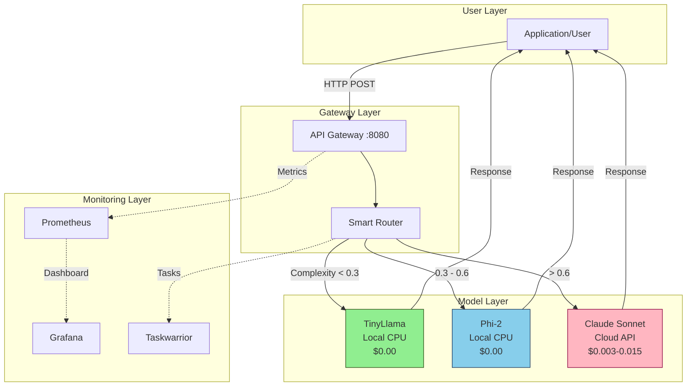
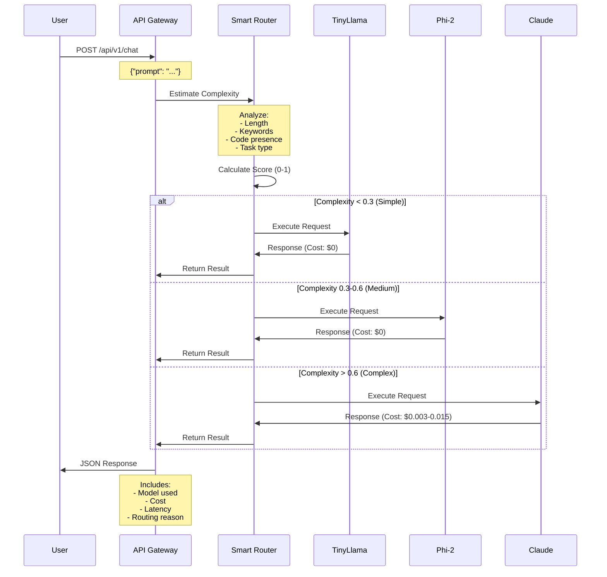
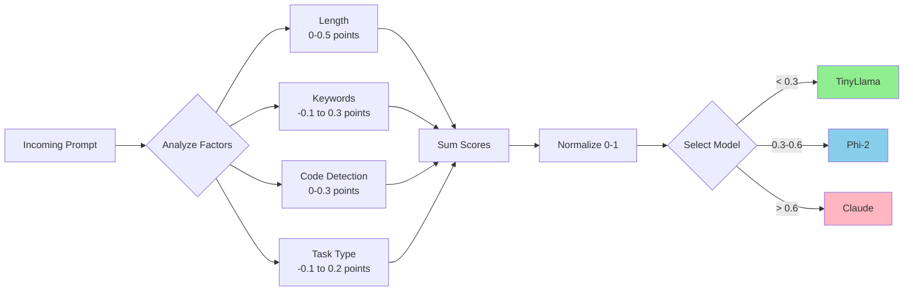
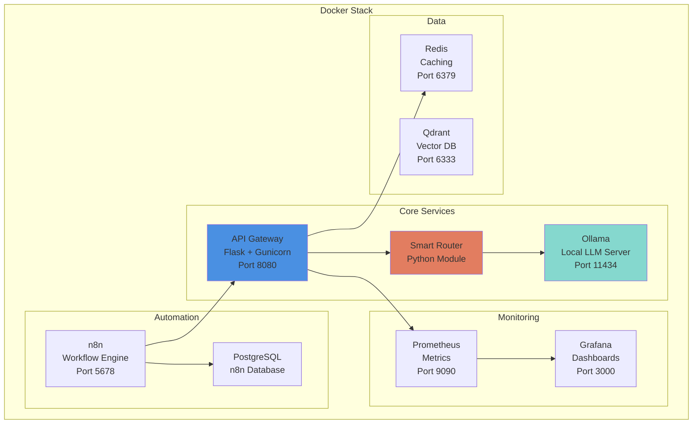
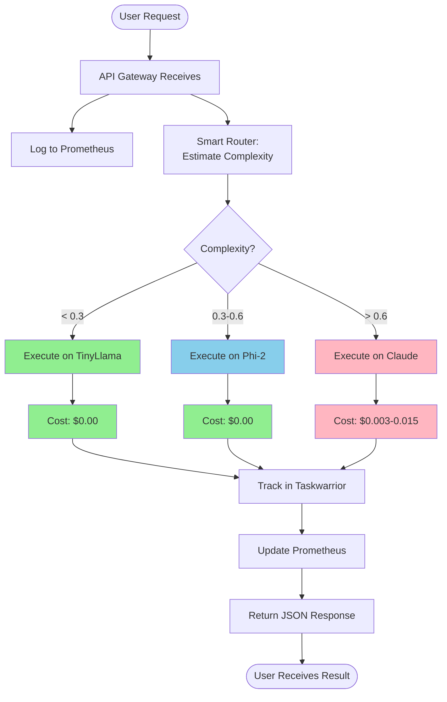
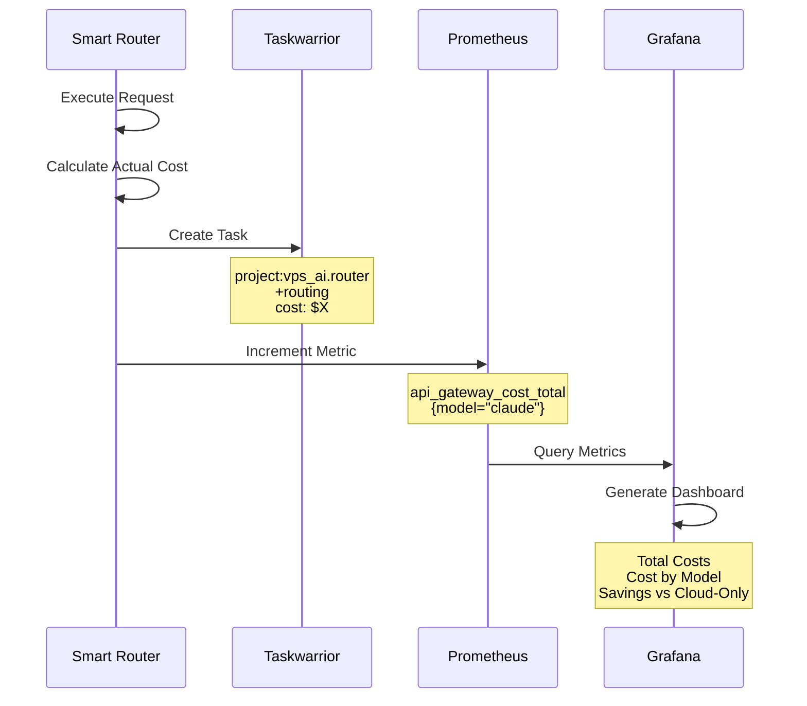
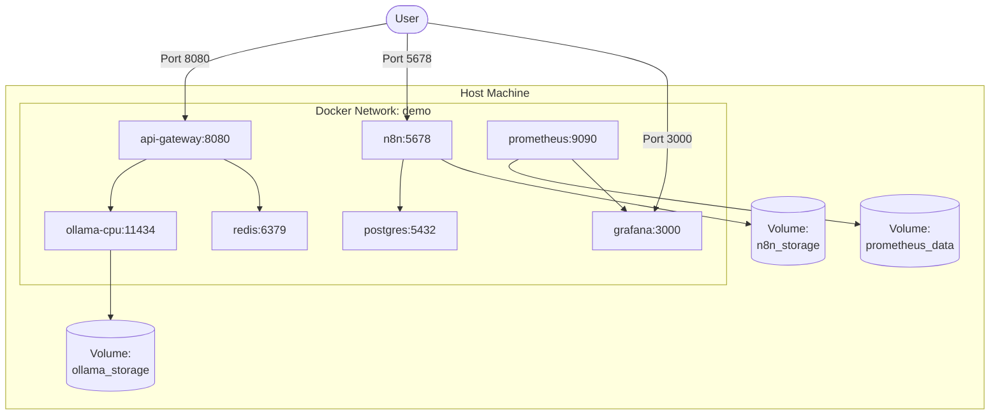
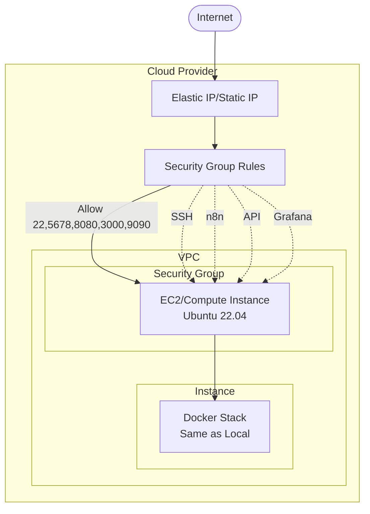

# 🏗️ System Architecture

> **Navigation**: [← Back to Docs Hub](./README.md) | [Next: Smart Router →](./SMART-ROUTER.md)

<details>
<summary><b>📋 TL;DR</b> - Click to expand</summary>

**System in 3 bullet points:**
- API Gateway receives requests and estimates complexity
- Smart Router sends simple tasks to local models (free), complex to cloud (paid)
- Result: 60-80% cost savings vs cloud-only

**Key Insight:** Most AI requests are simple - answer them locally!

</details>

---

## Table of Contents
- [High-Level Overview](#high-level-overview)
- [Request Flow](#request-flow)
- [Component Architecture](#component-architecture)
- [Data Flow](#data-flow)
- [Deployment Architecture](#deployment-architecture)
- [Technology Stack](#technology-stack)

## High-Level Overview

The Hybrid AI Stack is designed around one core principle: **route requests to the cheapest model that can handle them**.



## Request Flow

### 1. Request Reception & Complexity Estimation



### 2. Complexity Estimation Algorithm

The Smart Router evaluates multiple factors:



**Scoring Factors:**

| Factor | Weight | Examples |
|--------|--------|----------|
| **Length** | 0-0.5 | <100 chars = 0.1, 100-500 = 0.3, >500 = 0.5 |
| **Complex Keywords** | 0-0.3 | "analyze", "design", "implement", "refactor" |
| **Simple Keywords** | -0.1 | "what is", "list", "summarize" |
| **Code Presence** | 0-0.3 | Code blocks, function definitions |
| **Task Type** | -0.1 to 0.2 | Questions = -0.1, Creative = 0.2 |

## Component Architecture



### Component Responsibilities

#### API Gateway (`gateway/app.py`)
- **Purpose**: Main HTTP entry point
- **Responsibilities**:
  - Accept HTTP requests
  - Call Smart Router
  - Return JSON responses
  - Export Prometheus metrics
  - Health checks
- **Technology**: Flask, Gunicorn
- **Endpoints**:
  - `POST /api/v1/chat` - Main chat endpoint
  - `POST /api/v1/complexity` - Complexity estimation only
  - `GET /api/v1/stats` - Routing statistics
  - `GET /health` - Health check
  - `GET /metrics` - Prometheus metrics

#### Smart Router (`scripts/smart_router.py`)
- **Purpose**: Intelligent request routing
- **Responsibilities**:
  - Estimate prompt complexity
  - Select optimal model
  - Execute requests
  - Track costs
  - Log to Taskwarrior
- **Logic**:
  ```python
  def select_model(complexity):
      if complexity < 0.3:
          return 'tinyllama'  # Free, fast
      elif complexity < 0.6:
          return 'phi2'       # Free, good quality
      else:
          return 'claude-sonnet'  # Paid, best quality
  ```

#### Ollama Server
- **Purpose**: Local model inference
- **Models**: TinyLlama (1.1B), Phi-2 (2.7B), Mistral-7B (optional)
- **API**: HTTP REST at `localhost:11434`
- **Resource Usage**:
  - TinyLlama: ~700MB RAM
  - Phi-2: ~1.6GB RAM
  - Mistral-7B: ~4GB RAM

#### n8n Workflows
- **Purpose**: Automation and orchestration
- **Workflows**:
  1. Smart Routing Workflow
  2. Cost Monitoring
  3. Performance Tracking
  4. Orchestrator Pipeline

#### Monitoring Stack
- **Prometheus**: Scrapes metrics from API Gateway
- **Grafana**: Visualizes metrics and costs
- **Metrics Tracked**:
  - `api_gateway_requests_total{model, backend, status}`
  - `api_gateway_request_duration_seconds{model, backend}`
  - `api_gateway_cost_total{model}`

## Data Flow

### Request Processing



### Cost Tracking Flow



## Deployment Architecture

### Docker Deployment



### Cloud Deployment (AWS/GCP)



## Technology Stack

### Backend
- **Python 3.11+**: Core language
- **Flask 3.1**: Web framework
- **Gunicorn**: WSGI server
- **Anthropic SDK**: Claude API client
- **Requests**: HTTP client

### Infrastructure
- **Docker**: Containerization
- **Docker Compose**: Orchestration
- **Ollama**: Local LLM server
- **Redis**: Caching layer
- **PostgreSQL**: n8n database

### Monitoring
- **Prometheus**: Metrics collection
- **Grafana**: Visualization
- **Taskwarrior**: Task tracking

### Automation
- **n8n**: Workflow engine
- **Terraform**: Infrastructure as Code
- **Ansible**: Configuration management

### Models
- **TinyLlama 1.1B**: Ultra-lightweight (700MB)
- **Phi-2 2.7B**: Quality lightweight (1.6GB)
- **Mistral 7B**: High-quality (4GB, optional)
- **Claude Sonnet 4**: Cloud (via API)

## Design Principles

### 1. Cost Optimization First
Every decision prioritizes reducing API costs:
- Local models for simple tasks
- Smart complexity estimation
- Automatic routing
- Cost tracking built-in

### 2. Production-Grade Reliability
- Proper error handling
- Health checks
- Graceful degradation
- Comprehensive logging

### 3. Observable by Default
- Prometheus metrics
- Grafana dashboards
- Taskwarrior integration
- Request tracing

### 4. Easy to Deploy
- One-command installation
- Docker-based deployment
- Infrastructure as Code
- Minimal configuration

### 5. Extensible Architecture
- Modular components
- Clear interfaces
- Easy to add new models
- Workflow automation ready

## Performance Characteristics

### Latency

| Model | Typical Latency | Use Case |
|-------|----------------|----------|
| **TinyLlama** | 0.5-2s | Simple Q&A, classifications |
| **Phi-2** | 1-3s | Explanations, summaries |
| **Claude Sonnet** | 2-5s | Code gen, complex analysis |

### Throughput

| Component | Max RPS | Bottleneck |
|-----------|---------|------------|
| **API Gateway** | 100+ | CPU-bound |
| **Ollama (CPU)** | 10-20 | Model inference |
| **Claude API** | 50+ | Rate limits |

### Resource Usage (Tier 2)

| Service | RAM | CPU | Disk |
|---------|-----|-----|------|
| **Ollama** | ~2GB | 1-2 cores | 5GB models |
| **API Gateway** | ~200MB | 0.5 cores | Minimal |
| **n8n** | ~300MB | 0.25 cores | 1GB |
| **Monitoring** | ~500MB | 0.25 cores | 2GB |
| **Total** | ~3GB | ~2 cores | ~8GB |

---

**Related Documentation:**
- [Smart Router Details](./SMART-ROUTER.md)
- [VPS Tier Selection](./VPS-TIERS.md)
- [Deployment Guide](./DEPLOYMENT.md)
- [Cost Optimization](./COST-OPTIMIZATION.md)

[⬆ Back to Top](#️-system-architecture)
