# 🎯 VPS Tier Selection Guide

> **Navigation**: [← Back to Docs Hub](./README.md) | [Next: Deployment →](./DEPLOYMENT.md)

<details>
<summary><b>📋 TL;DR</b> - Click to expand</summary>

**Quick Recommendations:**
- **Hobby/Learning**: Tier 1 ($26/mo) - TinyLlama only
- **Production (Most Users)**: Tier 2 ($52/mo) - TinyLlama + Phi-2
- **⚡ Ternary-Optimized**: Tier 2.5 ($48/mo) - 6x faster, 7B models on 8GB ⭐ NEW
- **High Performance**: Tier 3 ($120/mo) - Add Mistral-7B
- **Maximum Power**: Tier 4 ($310/mo) - GPU acceleration

**Rule of thumb:** Start with Tier 2.5 for ternary optimization, or Tier 2 for standard setup.

</details>

---

## Table of Contents
- [Tier Overview](#tier-overview)
- [Detailed Tier Comparison](#detailed-tier-comparison)
- [Model Compatibility](#model-compatibility)
- [Cost-Benefit Analysis](#cost-benefit-analysis)
- [Tier Selection Decision Tree](#tier-selection-decision-tree)
- [Migration Between Tiers](#migration-between-tiers)

## Tier Overview

```mermaid
graph LR
    T1[Tier 1<br/>Budget<br/>$26/mo] --> T2[Tier 2<br/>Standard<br/>$52/mo]
    T2 --> T2_5[Tier 2.5<br/>⚡ Ternary<br/>$48/mo]
    T2_5 --> T3[Tier 3<br/>Performance<br/>$120/mo]
    T3 --> T4[Tier 4<br/>GPU Power<br/>$310/mo]

    T1 -.->|TinyLlama| M1[1.1B params<br/>700MB RAM]
    T2 -.->|+ Phi-2| M2[2.7B params<br/>1.6GB RAM]
    T2_5 -.->|Ternary 7B| M2_5[7B params<br/>2.5GB RAM<br/>6x faster]
    T3 -.->|+ Mistral-7B| M3[7B params<br/>4GB RAM]
    T4 -.->|GPU Accel| M4[All models<br/>10x faster]

    style T1 fill:#FFE5B4
    style T2 fill:#90EE90
    style T2_5 fill:#FFD700
    style T3 fill:#87CEEB
    style T4 fill:#DDA0DD
```



## Detailed Tier Comparison

### Tier 1: Budget (Learning/Testing)

**Hardware Specifications:**
- **RAM**: 2GB
- **CPU**: 1 core
- **Disk**: 25GB SSD
- **Network**: 1TB transfer

**Monthly Cost:**
- AWS: $26/mo (t3.small spot ~$8 + transfer)
- GCP: $26/mo (e2-small + transfer)
- DigitalOcean: $18/mo (Basic Droplet)
- **Recommended**: DigitalOcean or Hetzner

**Supported Models:**
- ✅ TinyLlama 1.1B (700MB RAM)
- ❌ Phi-2 (insufficient RAM)
- ❌ Mistral-7B

**Use Cases:**
- Learning the system
- Testing routing logic
- Development environment
- Very low request volume (<100/day)
- Personal projects

**Performance:**
- TinyLlama inference: 2-4 seconds
- Max concurrent requests: 2-3
- Typical latency: 3-5s

**Cost Savings:**
- vs Cloud-Only: 30-40% (limited by simple queries only)
- Monthly API costs avoided: ~$20-40

**Limitations:**
- ⚠️ Cannot run Phi-2 or larger models
- ⚠️ Limited concurrent requests
- ⚠️ Slow response times
- ⚠️ May need swap space

---

### Tier 2: Standard (Production Ready) ⭐ RECOMMENDED

**Hardware Specifications:**
- **RAM**: 4GB
- **CPU**: 2 cores
- **Disk**: 50GB SSD
- **Network**: 2TB transfer

**Monthly Cost:**
- AWS: $52/mo (t3.medium on-demand)
- GCP: $48/mo (e2-medium)
- DigitalOcean: $48/mo (Performance Droplet)
- Hetzner: $30/mo (CX21)
- **Recommended**: Hetzner Cloud (best value)

**Supported Models:**
- ✅ TinyLlama 1.1B (700MB RAM)
- ✅ Phi-2 2.7B (1.6GB RAM)
- ❌ Mistral-7B (needs 4GB+ free RAM)

**Use Cases:**
- Production applications
- Customer-facing services
- Medium request volume (1K-10K/day)
- Small business deployments
- MVP products

**Performance:**
- TinyLlama inference: 1-2 seconds
- Phi-2 inference: 2-4 seconds
- Max concurrent requests: 5-8
- Typical latency: 2-3s

**Cost Savings:**
- vs Cloud-Only: 60-70% (handles most queries locally)
- Monthly API costs avoided: $200-500
- ROI: Pays for itself at 50+ requests/day

**Why This Tier?**
- ✅ Runs both lightweight models
- ✅ Handles 70%+ queries locally
- ✅ Affordable for most businesses
- ✅ Room for monitoring stack
- ✅ Comfortable performance

**Architecture:**


---

### Tier 2.5: Ternary-Optimized (RECOMMENDED FOR PRODUCTION) ⭐⭐⭐

**Hardware Specifications:**
- **RAM**: 8GB
- **CPU**: 2-4 cores
- **Disk**: 50GB SSD
- **Network**: 2TB transfer

**Monthly Cost:**
- Hetzner: $48/mo (CX22 - 8GB/2CPU)
- DigitalOcean: $72/mo (8GB/2CPU)
- Vultr: $48/mo (8GB/2CPU)
- **Recommended**: Hetzner Cloud or Vultr

**Technology: Ternary Quantization (BitNet)**
- **Weight precision**: 1.58-bit (-1, 0, +1)
- **Activation precision**: 8-bit
- **Memory reduction**: 16x smaller than FP16
- **Speed improvement**: 6x faster than standard quantization
- **Energy savings**: 82% reduction

**Supported Models:**
| Model | RAM Usage | Speed (tok/s) | Quality | Cost |
|-------|-----------|---------------|---------|------|
| Mistral-7B-ternary | 2.5GB | 120 | Excellent | $0 |
| Llama-3.2-8B-ternary | 3GB | 100 | Excellent | $0 |
| Falcon3-7B-ternary | 2.8GB | 110 | Very Good | $0 |
| Qwen2.5-7B-ternary | 3.2GB | 95 | Very Good | $0 |

**Use Cases:**
- Production applications requiring high quality
- Cost-sensitive deployments
- Energy-efficient AI (battery-powered, edge devices)
- High-volume services (1K-50K requests/day)
- Complex reasoning at local costs

**Performance:**
- Mistral-7B-ternary inference: **0.5-1 second** (vs 3-5s standard)
- Max concurrent requests: 12-15
- Typical latency: 0.8-1.5s
- Energy consumption: 82% lower than standard models

**Cost Savings:**
- vs Cloud-Only: **75-85%** (handles complex queries locally)
- Monthly API costs avoided: $500-1500
- vs Tier 3 standard: Same quality, $72/mo cheaper
- ROI: Pays for itself at 100+ requests/day

**Why This Tier?**
- ✅ Run 7B models on 8GB RAM (normally needs 28GB)
- ✅ 6x faster inference than standard quantization
- ✅ 82% energy savings (critical for edge/mobile)
- ✅ Better quality than Phi-2, cheaper than Tier 3
- ✅ Handles 85% of requests locally (vs 70% on Tier 2)
- ✅ Production-ready with Microsoft's BitNet.cpp

**Architecture:**


**Performance vs Standard:**

| Metric | Standard 7B (Tier 3) | Ternary 7B (Tier 2.5) | Improvement |
|--------|---------------------|----------------------|-------------|
| RAM Usage | 14-28GB | 2.5GB | **16x smaller** |
| Inference Speed | 3-5s | 0.5-1s | **6x faster** |
| Energy/Token | 11.3 J | 2.0 J | **82% reduction** |
| Monthly Cost | $120 | $48 | **60% cheaper** |
| Quality (MMLU) | 55% | 53% | **-2% (minimal)** |

**Technical Details:**
- Uses Microsoft BitNet.cpp inference framework
- Models: Falcon3-1.58bit, HF1BitLLM/Llama3-8B-1.58-100B-tokens
- Weights stored as ternary {-1, 0, +1} (1.58 bits)
- Replaces FP16 multiplication with integer addition
- 71.4x reduction in arithmetic energy consumption
- Supports I2_S (lossless), TL1, and TL2 quantization kernels

**Limitations:**
- Requires BitNet.cpp (not compatible with standard Ollama)
- Models must be trained from scratch (can't convert existing)
- Limited to 4096 token context window
- Smaller ecosystem than standard models (fewer variants)
- 2-3% quality degradation vs FP16 on some benchmarks

**When to Choose This Tier:**
- ✅ Need 7B-quality responses at 2B-tier costs
- ✅ High request volume (>500/day)
- ✅ Energy efficiency is critical
- ✅ Willing to use BitNet.cpp instead of Ollama
- ❌ Need maximum accuracy (use Tier 3 + Claude)
- ❌ Require >4K context windows (use Tier 3)

---

### Tier 3: Performance (High Volume)

**Hardware Specifications:**
- **RAM**: 8GB
- **CPU**: 4 cores
- **Disk**: 100GB SSD
- **Network**: 4TB transfer

**Monthly Cost:**
- AWS: $120/mo (t3.large)
- GCP: $112/mo (e2-standard-4)
- DigitalOcean: $96/mo
- Hetzner: $60/mo (CX31)
- **Recommended**: Hetzner Cloud

**Supported Models:**
- ✅ TinyLlama 1.1B (700MB RAM)
- ✅ Phi-2 2.7B (1.6GB RAM)
- ✅ Mistral-7B (4GB RAM)

**Use Cases:**
- High-volume production
- Enterprise applications
- 10K-100K requests/day
- Multiple concurrent users
- Advanced AI workflows

**Performance:**
- TinyLlama inference: 0.5-1 second
- Phi-2 inference: 1-2 seconds
- Mistral-7B inference: 3-5 seconds
- Max concurrent requests: 15-20
- Typical latency: 1-2s

**Cost Savings:**
- vs Cloud-Only: 75-85% (handles complex queries locally)
- Monthly API costs avoided: $800-2000
- ROI: Pays for itself at 200+ requests/day

**Why Upgrade to This Tier?**
- ✅ Run Mistral-7B (better quality than Phi-2)
- ✅ Higher request volume capacity
- ✅ More concurrent users
- ✅ Faster response times
- ✅ Room for additional services

---

### Tier 4: GPU Power (Maximum Performance)

**Hardware Specifications:**
- **RAM**: 16GB
- **CPU**: 8 cores
- **GPU**: NVIDIA T4 or equivalent
- **Disk**: 200GB SSD
- **Network**: 5TB transfer

**Monthly Cost:**
- AWS: $310/mo (g5.xlarge with T4 GPU)
- GCP: $285/mo (n1-standard-4 + T4 GPU)
- Lambda Labs: $220/mo (GPU cloud)
- **Recommended**: Lambda Labs or RunPod

**Supported Models:**
- ✅ All models with GPU acceleration
- ✅ Mistral-7B: 10x faster inference
- ✅ Optional: Llama 3 8B, CodeLlama 7B

**Use Cases:**
- Ultra-high volume (100K+ requests/day)
- Real-time applications
- Code generation at scale
- Image/video processing
- Research and development

**Performance:**
- TinyLlama inference: <0.2 seconds
- Phi-2 inference: <0.5 seconds
- Mistral-7B inference: 0.5-1 second
- Max concurrent requests: 50+
- Typical latency: <1s

**Cost Savings:**
- vs Cloud-Only: 85-95% (handles nearly everything locally)
- Monthly API costs avoided: $3000-10000
- ROI: Pays for itself at 1000+ requests/day

**When to Use This Tier:**
- You have consistent high volume
- You need sub-second responses
- You're running advanced models
- You have GPU-accelerated workloads

---

## Model Compatibility

| Model | Size | Tier 1 | Tier 2 | Tier 3 | Tier 4 |
|-------|------|--------|--------|--------|--------|
| **TinyLlama 1.1B** | 700MB | ✅ | ✅ | ✅ | ✅ |
| **Phi-2 2.7B** | 1.6GB | ❌ | ✅ | ✅ | ✅ |
| **Mistral-7B** | 4GB | ❌ | ❌ | ✅ | ✅ |
| **Llama 3 8B** | 4.7GB | ❌ | ❌ | ⚠️ | ✅ |
| **CodeLlama 7B** | 3.8GB | ❌ | ❌ | ✅ | ✅ |

**Legend:**
- ✅ Supported and recommended
- ⚠️ Supported but may be slow
- ❌ Not supported (insufficient RAM)

---

## Cost-Benefit Analysis

### Tier 1 vs Cloud-Only
**Scenario**: 1000 requests/month, 80% simple queries

| Cost Category | Cloud-Only | Tier 1 Hybrid | Savings |
|---------------|------------|---------------|---------|
| VPS Cost | $0 | $26 | -$26 |
| API Costs (200 complex) | $60 | $60 | $0 |
| API Costs (800 simple) | $24 | $0 | +$24 |
| **Total** | **$84** | **$86** | **-$2** ❌ |

**Verdict**: Not cost-effective at low volume

---

### Tier 2 vs Cloud-Only ⭐ SWEET SPOT
**Scenario**: 10,000 requests/month, 70% simple/medium queries

| Cost Category | Cloud-Only | Tier 2 Hybrid | Savings |
|---------------|------------|---------------|---------|
| VPS Cost | $0 | $52 | -$52 |
| API Costs (3000 complex) | $450 | $450 | $0 |
| API Costs (7000 simple/med) | $210 | $0 | +$210 |
| **Total** | **$660** | **$502** | **$158** ✅ |

**Savings: 24%** | **ROI: 3.0x VPS cost**

---

### Tier 3 vs Cloud-Only
**Scenario**: 50,000 requests/month, 60% can use local (including some complex)

| Cost Category | Cloud-Only | Tier 3 Hybrid | Savings |
|---------------|------------|---------------|---------|
| VPS Cost | $0 | $120 | -$120 |
| API Costs (20,000 complex) | $3,000 | $3,000 | $0 |
| API Costs (30,000 local) | $900 | $0 | +$900 |
| **Total** | **$3,900** | **$3,120** | **$780** ✅ |

**Savings: 20%** | **ROI: 6.5x VPS cost**

---

### Tier 4 vs Cloud-Only
**Scenario**: 200,000 requests/month, 80% can use GPU-accelerated local

| Cost Category | Cloud-Only | Tier 4 Hybrid | Savings |
|---------------|------------|---------------|---------|
| VPS Cost | $0 | $310 | -$310 |
| API Costs (40,000 complex) | $6,000 | $6,000 | $0 |
| API Costs (160,000 local) | $4,800 | $0 | +$4,800 |
| **Total** | **$10,800** | **$6,310** | **$4,490** ✅ |

**Savings: 42%** | **ROI: 14.5x VPS cost**

---

## Tier Selection Decision Tree

```mermaid
graph TD
    Start{How many<br/>requests/day?}

    Start -->|< 50| Q1{Just learning?}
    Start -->|50-500| Tier2[Tier 2<br/>Standard]
    Start -->|500-5000| Tier3[Tier 3<br/>Performance]
    Start -->|> 5000| Tier4[Tier 4<br/>GPU]

    Q1 -->|Yes| Tier1[Tier 1<br/>Budget]
    Q1 -->|No, production| Tier2

    Tier2 --> Q2{Need better<br/>quality answers?}
    Q2 -->|Yes| Tier3
    Q2 -->|No| Done2[✅ Start with<br/>Tier 2]

    Tier3 --> Q3{Sub-second<br/>response needed?}
    Q3 -->|Yes| Tier4
    Q3 -->|No| Done3[✅ Use<br/>Tier 3]

    Tier4 --> Done4[✅ Use<br/>Tier 4]
    Tier1 --> Done1[✅ Use<br/>Tier 1]

    style Tier2 fill:#90EE90
    style Done2 fill:#90EE90
```



## Migration Between Tiers

### Upgrading Tiers

**From Tier 1 → Tier 2:**
```bash
# 1. Take snapshot/backup
./scripts/backup.sh

# 2. Resize VPS (provider-specific)
# AWS: Modify instance type
# DigitalOcean: Resize droplet
# Hetzner: Upgrade server

# 3. Pull Phi-2 model
docker exec ollama ollama pull phi

# 4. Restart services
docker-compose restart

# 5. Verify
curl http://localhost:8080/health
```

**From Tier 2 → Tier 3:**
```bash
# 1. Backup
./scripts/backup.sh

# 2. Resize VPS to 8GB RAM

# 3. Pull Mistral-7B
docker exec ollama ollama pull mistral

# 4. Update router config
# Edit scripts/smart_router.py to enable mistral

# 5. Restart
docker-compose restart
```

**From Tier 3 → Tier 4:**
```bash
# 1. Backup
./scripts/backup.sh

# 2. Create new GPU instance
# (Cannot resize to GPU, must recreate)

# 3. Deploy with GPU profile
./deploy-all.sh aws 4  # or gcp 4

# 4. Restore data
./scripts/restore.sh

# 5. Switch DNS to new instance
```

### Downgrading Tiers

**Caution**: Downgrading may reduce quality and capacity

**From Tier 2 → Tier 1:**
```bash
# 1. Stop Phi-2 dependent workflows
# 2. Remove Phi-2 model
docker exec ollama ollama rm phi

# 3. Backup data
./scripts/backup.sh

# 4. Resize VPS down to 2GB
# 5. Verify TinyLlama still works
```

---

## Provider Comparison

### Budget-Focused (Tier 1-2)

| Provider | Tier 1 | Tier 2 | Notes |
|----------|--------|--------|-------|
| **Hetzner** | €4.15 (~$5) | €5.83 (~$6) | Best value, EU only |
| **DigitalOcean** | $18 | $48 | Simple UI, good docs |
| **Vultr** | $12 | $48 | More regions |
| **AWS Spot** | ~$8 | ~$26 | Can be terminated |
| **GCP** | $26 | $48 | Good for GCP ecosystem |

### Performance (Tier 3-4)

| Provider | Tier 3 | Tier 4 GPU | Notes |
|----------|--------|-----------|-------|
| **Hetzner** | $60 | N/A | No GPU options |
| **AWS** | $120 | $310 | Most regions |
| **GCP** | $112 | $285 | Better GPU availability |
| **Lambda Labs** | N/A | $220 | GPU specialists |
| **RunPod** | N/A | $180+ | Flexible GPU pricing |

---

## Recommendations by Use Case

### Personal Projects / Learning
- **Tier**: 1 (Budget)
- **Provider**: Hetzner or DigitalOcean
- **Why**: Cheapest way to learn the system

### Startup MVP
- **Tier**: 2 (Standard)
- **Provider**: Hetzner or DigitalOcean
- **Why**: Production-ready, affordable, room to grow

### Small Business Production
- **Tier**: 2 (Standard)
- **Provider**: AWS or GCP (for ecosystem integration)
- **Why**: Reliable, integrates with other services

### High-Volume SaaS
- **Tier**: 3 (Performance)
- **Provider**: AWS or GCP
- **Why**: Better quality, higher capacity, enterprise support

### Enterprise / Real-time AI
- **Tier**: 4 (GPU)
- **Provider**: GCP or Lambda Labs
- **Why**: Maximum performance, sub-second responses

---

## Cost Optimization Tips

### Start Small, Scale Up
1. Begin with Tier 2
2. Monitor request patterns for 2 weeks
3. Upgrade only if you see:
   - Consistent high volume (>500 req/day)
   - Slow response times (>3s average)
   - High cloud API costs (>$200/month)

### Use Spot Instances (Non-Production)
- AWS Spot: Save 70% on compute
- Good for: Development, testing, batch processing
- **Not for**: Production APIs (can be terminated)

### Reserved Instances (Production)
- AWS/GCP: 1-year commit saves 30-40%
- Use for: Established production workloads
- Calculate ROI after 3 months of stable usage

### Mix and Match
- **API Gateway**: Tier 2 VPS ($52)
- **Ollama Models**: Separate Tier 3 VPS ($120)
- **Monitoring**: Tier 1 VPS ($26)
- **Total**: $198/mo but isolated components

---

**Related Documentation:**
- [Architecture Overview](./ARCHITECTURE.md)
- [Deployment Guide](./DEPLOYMENT.md)
- [Cost Optimization](./COST-OPTIMIZATION.md)
- [Quick Start](./QUICKSTART.md)

[⬆ Back to Top](#-vps-tier-selection-guide)
