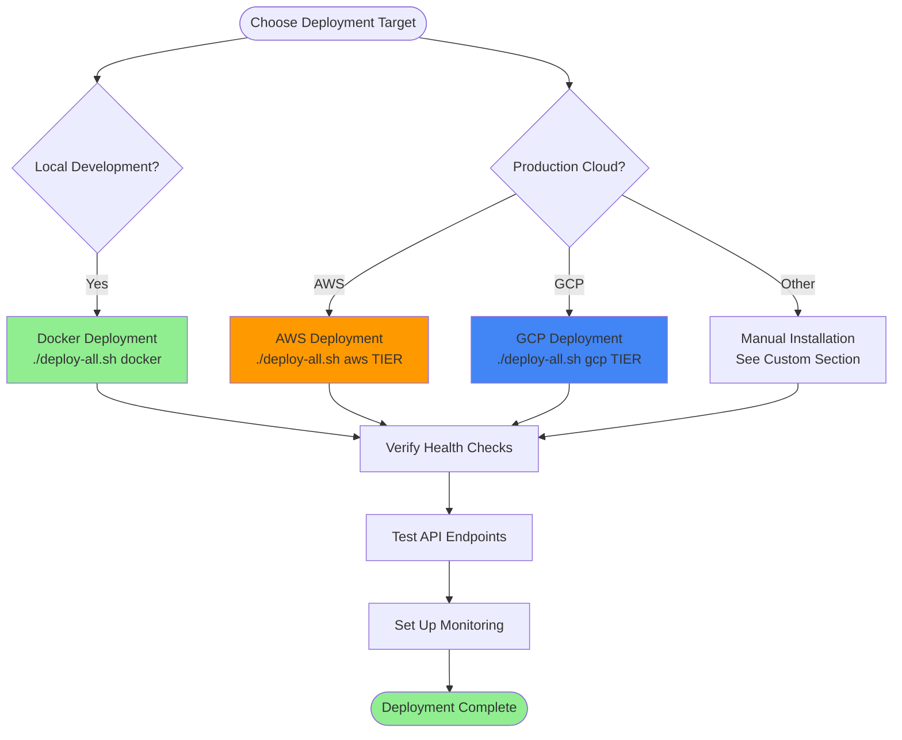
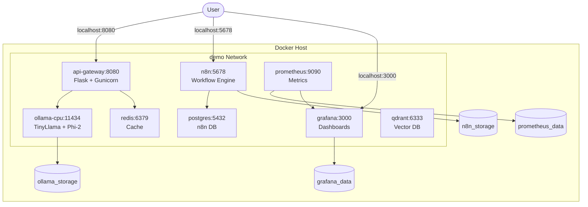
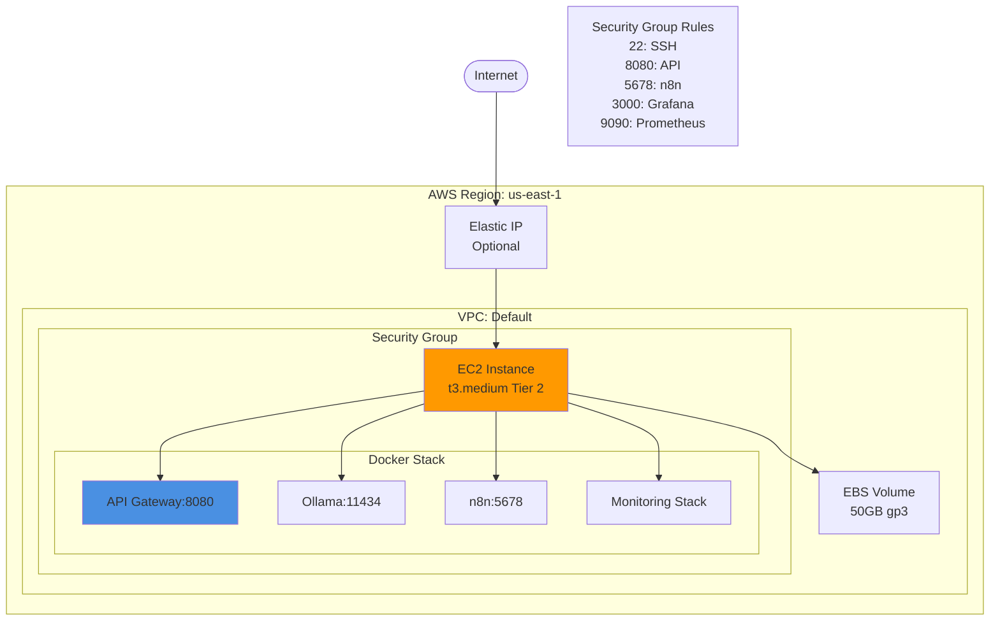
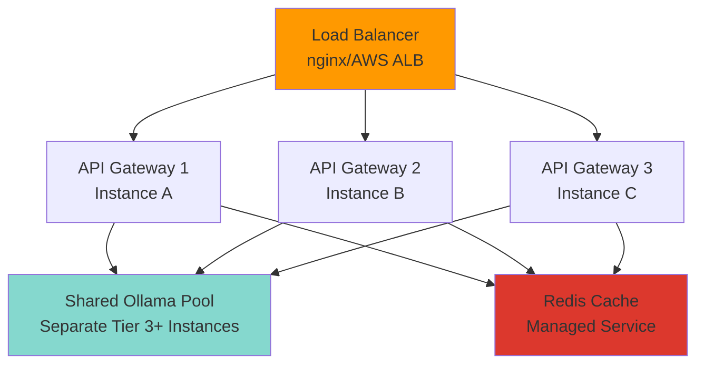

# 🚀 Deployment Guide

> **Navigation**: [← Back to VPS Tiers](./VPS-TIERS.md) | [Next: Smart Router →](./SMART-ROUTER.md)

<details>
<summary><b>📋 TL;DR</b> - Click to expand</summary>

**Three deployment options:**
1. **Local/Docker**: `./deploy-all.sh docker` - Development & testing
2. **AWS**: `./deploy-all.sh aws 2` - Production on Amazon
3. **GCP**: `./deploy-all.sh gcp 2` - Production on Google Cloud

**Post-deploy**: Check health at `http://YOUR_IP:8080/health`

</details>

---

## Table of Contents
- [Deployment Overview](#deployment-overview)
- [Local Docker Deployment](#local-docker-deployment)
- [AWS Deployment](#aws-deployment)
- [GCP Deployment](#gcp-deployment)
- [Post-Deployment Steps](#post-deployment-steps)
- [Scaling and High Availability](#scaling-and-high-availability)
- [Troubleshooting Deployment](#troubleshooting-deployment)

## Deployment Overview



---

## Local Docker Deployment

**Best for**: Development, testing, local experimentation

### Prerequisites

```bash
# Verify prerequisites
docker --version        # Should be 20.10+
docker-compose --version  # Should be 2.0+
python3 --version       # Should be 3.11+
```

### Step 1: Installation

```bash
# Clone repository
git clone https://github.com/jeremylongshore/hybrid-ai-stack.git
cd hybrid-ai-stack

# Run installation script
./install.sh
```

**Expected output:**
```
[INFO] Starting Hybrid AI Stack installation...
[✓] Sudo access verified
[✓] Docker already installed
[✓] Ollama installed successfully
[✓] Python dependencies installed
[✓] Taskwarrior initialized

═══════════════════════════════════════════════════════════
  Hybrid AI Stack Installation Complete!
═══════════════════════════════════════════════════════════
```

### Step 2: Configuration

```bash
# Edit environment variables
nano .env

# Add your API key
ANTHROPIC_API_KEY=sk-ant-your-key-here

# Optional: Add OpenAI key
OPENAI_API_KEY=sk-your-key-here
```

### Step 3: Deploy

```bash
# One-command deployment
./deploy-all.sh docker
```

**Deployment process:**
1. ✅ Pulls TinyLlama and Phi-2 models (~2GB download)
2. ✅ Starts Docker Compose stack (8 services)
3. ✅ Runs health checks
4. ✅ Creates Taskwarrior deployment task
5. ✅ Displays access URLs

**Expected output:**
```
╔════════════════════════════════════════════════════════════════╗
║                  Hybrid AI Stack Deployment                   ║
║            Intelligent AI Request Routing System              ║
╚════════════════════════════════════════════════════════════════╝

[INFO] Starting Docker deployment...
[⟳] Pulling TinyLlama and Phi-2...
[✓] Models pulled successfully
[✓] All services started
[✓] API Gateway is healthy (http://localhost:8080)
[✓] n8n is healthy (http://localhost:5678)

═══════════════════════════════════════════════════════════
  Deployment Complete!
═══════════════════════════════════════════════════════════

🎉 Your Hybrid AI Stack is now running!

📊 Access URLs:
   • API Gateway:  http://localhost:8080
   • n8n:         http://localhost:5678
   • Grafana:     http://localhost:3000 (admin/admin)
   • Prometheus:  http://localhost:9090
```

### Step 4: Verify

```bash
# Check health
curl http://localhost:8080/health

# Expected response
{
  "api_gateway": "healthy",
  "ollama": "healthy",
  "taskwarrior": "available"
}

# View running services
docker-compose ps

# Expected output
NAME                COMMAND                  STATUS              PORTS
api-gateway         "gunicorn..."           Up 2 minutes        0.0.0.0:8080->8080/tcp
ollama-cpu          "/bin/ollama serve"      Up 2 minutes        0.0.0.0:11434->11434/tcp
n8n                 "/docker-entrypoint..."  Up 2 minutes        0.0.0.0:5678->5678/tcp
prometheus          "/bin/prometheus..."     Up 2 minutes        0.0.0.0:9090->9090/tcp
grafana             "/run.sh"                Up 2 minutes        0.0.0.0:3000->3000/tcp
redis               "docker-entrypoint..."   Up 2 minutes        0.0.0.0:6379->6379/tcp
```

### Docker Deployment Architecture



---

## AWS Deployment

**Best for**: Production deployments on Amazon Web Services

### Prerequisites

```bash
# Install AWS CLI
pip install awscli

# Configure credentials
aws configure
# AWS Access Key ID: YOUR_KEY
# AWS Secret Access Key: YOUR_SECRET
# Default region: us-east-1
# Default output format: json

# Verify access
aws sts get-caller-identity
```

### Option 1: One-Command Deployment (Recommended)

```bash
# Deploy Tier 2 (Standard)
./deploy-all.sh aws 2

# Deploy Tier 3 (Performance)
./deploy-all.sh aws 3

# Deploy Tier 4 (GPU)
./deploy-all.sh aws 4
```

**What this does:**
1. ✅ Creates Terraform configuration
2. ✅ Launches EC2 instance with correct tier specifications
3. ✅ Configures security groups (ports 22, 5678, 8080, 3000, 9090)
4. ✅ Runs installation script via user data
5. ✅ Deploys Docker stack
6. ✅ Creates Taskwarrior deployment task
7. ✅ Displays connection information

**Expected output:**
```
╔════════════════════════════════════════════════════════════════╗
║                     AWS Deployment (Tier 2)                   ║
╚════════════════════════════════════════════════════════════════╝

[INFO] Creating AWS infrastructure with Terraform...
[✓] Terraform initialized
[✓] Infrastructure created successfully

Instance Details:
  Instance ID: i-0123456789abcdef0
  Public IP:   54.123.45.67
  SSH:         ssh -i your-key.pem ubuntu@54.123.45.67

[INFO] Waiting for instance to be ready...
[✓] Instance is running
[⟳] Installing Hybrid AI Stack (this may take 5-10 minutes)...
[✓] Installation complete
[✓] Services are healthy

═══════════════════════════════════════════════════════════
  AWS Deployment Complete!
═══════════════════════════════════════════════════════════

📊 Access URLs:
   • API Gateway:  http://54.123.45.67:8080
   • n8n:         http://54.123.45.67:5678
   • Grafana:     http://54.123.45.67:3000
   • Prometheus:  http://54.123.45.67:9090

⚠️  Monthly Cost: ~$52 (Tier 2: t3.medium)
```

### Option 2: Manual Terraform Deployment

```bash
cd terraform/aws

# Initialize Terraform
terraform init

# Review deployment plan
terraform plan \
  -var="tier=2" \
  -var="key_name=your-ssh-key" \
  -var="allowed_ssh_cidr=YOUR_IP/32"

# Deploy infrastructure
terraform apply \
  -var="tier=2" \
  -var="key_name=your-ssh-key" \
  -var="allowed_ssh_cidr=YOUR_IP/32"

# Note the output values
# Outputs:
#   instance_id = "i-0123456789abcdef0"
#   public_ip = "54.123.45.67"
#   ssh_command = "ssh -i your-key.pem ubuntu@54.123.45.67"
```

### AWS Architecture Diagram



### AWS Tier Specifications

| Tier | Instance Type | vCPUs | RAM | Disk | Monthly Cost |
|------|---------------|-------|-----|------|--------------|
| **1** | t3.small | 2 | 2GB | 25GB | ~$26 |
| **2** | t3.medium | 2 | 4GB | 50GB | ~$52 |
| **3** | t3.large | 2 | 8GB | 100GB | ~$120 |
| **4** | g5.xlarge | 4 | 16GB + T4 GPU | 200GB | ~$310 |

### Post-AWS Deployment

```bash
# SSH into instance
ssh -i your-key.pem ubuntu@YOUR_INSTANCE_IP

# Check deployment status
sudo docker-compose ps

# View logs
sudo docker-compose logs -f api-gateway

# Test health
curl http://localhost:8080/health
```

---

## GCP Deployment

**Best for**: Production deployments on Google Cloud Platform

### Prerequisites

```bash
# Install gcloud CLI
# Follow: https://cloud.google.com/sdk/docs/install

# Authenticate
gcloud auth login

# Set project
gcloud config set project YOUR_PROJECT_ID

# Enable required APIs
gcloud services enable compute.googleapis.com
gcloud services enable cloudresourcemanager.googleapis.com

# Create service account for Terraform (optional)
gcloud iam service-accounts create terraform-sa \
  --display-name="Terraform Service Account"

# Grant permissions
gcloud projects add-iam-policy-binding YOUR_PROJECT_ID \
  --member="serviceAccount:terraform-sa@YOUR_PROJECT_ID.iam.gserviceaccount.com" \
  --role="roles/compute.admin"
```

### Option 1: One-Command Deployment

```bash
# Deploy Tier 2 (Standard)
./deploy-all.sh gcp 2

# Deploy Tier 3 (Performance)
./deploy-all.sh gcp 3

# Deploy Tier 4 (GPU)
./deploy-all.sh gcp 4
```

**Expected output:**
```
╔════════════════════════════════════════════════════════════════╗
║                     GCP Deployment (Tier 2)                   ║
╚════════════════════════════════════════════════════════════════╝

[INFO] Creating GCP infrastructure with Terraform...
[✓] Terraform initialized
[✓] Infrastructure created successfully

Instance Details:
  Instance Name: hybrid-ai-stack-tier2
  Public IP:     35.123.45.67
  Zone:          us-central1-a
  SSH:           gcloud compute ssh hybrid-ai-stack-tier2

[INFO] Waiting for instance to be ready...
[✓] Instance is running
[⟳] Installing Hybrid AI Stack...
[✓] Installation complete
[✓] Services are healthy

═══════════════════════════════════════════════════════════
  GCP Deployment Complete!
═══════════════════════════════════════════════════════════

📊 Access URLs:
   • API Gateway:  http://35.123.45.67:8080
   • n8n:         http://35.123.45.67:5678
   • Grafana:     http://35.123.45.67:3000

⚠️  Monthly Cost: ~$48 (Tier 2: e2-medium)
```

### Option 2: Manual Terraform Deployment

```bash
cd terraform/gcp

# Initialize Terraform
terraform init

# Review plan
terraform plan \
  -var="project_id=YOUR_PROJECT_ID" \
  -var="tier=2" \
  -var="region=us-central1" \
  -var="zone=us-central1-a"

# Deploy
terraform apply \
  -var="project_id=YOUR_PROJECT_ID" \
  -var="tier=2" \
  -var="region=us-central1" \
  -var="zone=us-central1-a"

# Outputs
# instance_name = "hybrid-ai-stack-tier2"
# public_ip = "35.123.45.67"
# ssh_command = "gcloud compute ssh hybrid-ai-stack-tier2"
```

### GCP Tier Specifications

| Tier | Machine Type | vCPUs | RAM | Disk | Monthly Cost |
|------|--------------|-------|-----|------|--------------|
| **1** | e2-small | 2 | 2GB | 25GB | ~$26 |
| **2** | e2-medium | 2 | 4GB | 50GB | ~$48 |
| **3** | e2-standard-4 | 4 | 16GB | 100GB | ~$112 |
| **4** | n1-standard-4 + T4 GPU | 4 | 15GB + GPU | 200GB | ~$285 |

### GCP Firewall Rules

```bash
# Allow HTTP traffic to API Gateway
gcloud compute firewall-rules create allow-api-gateway \
  --allow tcp:8080 \
  --source-ranges 0.0.0.0/0 \
  --description "Allow API Gateway access"

# Allow n8n access
gcloud compute firewall-rules create allow-n8n \
  --allow tcp:5678 \
  --source-ranges 0.0.0.0/0 \
  --description "Allow n8n access"

# Allow Grafana access
gcloud compute firewall-rules create allow-grafana \
  --allow tcp:3000 \
  --source-ranges 0.0.0.0/0 \
  --description "Allow Grafana access"
```

### Post-GCP Deployment

```bash
# SSH into instance
gcloud compute ssh hybrid-ai-stack-tier2 --zone us-central1-a

# Check services
sudo docker-compose ps

# View logs
sudo docker-compose logs -f

# Test health
curl http://localhost:8080/health
```

---

## Post-Deployment Steps

### Step 1: Verify All Services

```bash
# Check all service health
curl http://YOUR_IP:8080/health

# Expected response
{
  "api_gateway": "healthy",
  "ollama": "healthy",
  "models": ["tinyllama", "phi"],
  "taskwarrior": "available"
}
```

### Step 2: Test API Endpoints

```bash
# Simple request (should route to TinyLlama)
curl -X POST http://YOUR_IP:8080/api/v1/chat \
  -H "Content-Type: application/json" \
  -d '{"prompt": "What is Python?"}'

# Complex request (should route to Claude)
curl -X POST http://YOUR_IP:8080/api/v1/chat \
  -H "Content-Type: application/json" \
  -d '{"prompt": "Write a Python function to implement a binary search tree with insert, delete, and search methods."}'

# Check routing stats
curl http://YOUR_IP:8080/api/v1/stats
```

### Step 3: Set Up n8n

```bash
# Access n8n
open http://YOUR_IP:5678

# First-time setup:
# 1. Create admin account
# 2. Import workflows from workflows/ directory
# 3. Configure credentials
```

### Step 4: Configure Grafana

```bash
# Access Grafana
open http://YOUR_IP:3000

# Login: admin / admin
# (You'll be prompted to change password)

# Add Prometheus data source:
# Configuration > Data Sources > Add data source
# Type: Prometheus
# URL: http://prometheus:9090
# Save & Test

# Import dashboard:
# Create > Import
# Upload: monitoring/grafana-dashboard.json
```

### Step 5: Set Up Monitoring Alerts

```bash
# Edit Prometheus alerting rules
nano monitoring/prometheus/alert.rules.yml

# Add custom alerts
groups:
  - name: hybrid-ai-stack
    rules:
      - alert: HighCloudAPIUsage
        expr: rate(api_gateway_cost_total[1h]) > 10
        for: 5m
        annotations:
          summary: "Cloud API costs are high"

# Reload Prometheus config
docker-compose restart prometheus
```

---

## Scaling and High Availability

### Horizontal Scaling



**Setup:**

```bash
# Deploy multiple API Gateway instances (Tier 1-2)
./deploy-all.sh aws 1  # API Gateway 1
./deploy-all.sh aws 1  # API Gateway 2
./deploy-all.sh aws 1  # API Gateway 3

# Deploy shared Ollama pool (Tier 3)
./deploy-all.sh aws 3  # Ollama server

# Configure OLLAMA_URL in .env for all gateways
OLLAMA_URL=http://OLLAMA_INSTANCE_IP:11434

# Set up load balancer
# AWS: Application Load Balancer
# GCP: Cloud Load Balancing
```

### High Availability Setup

**Database Redundancy:**
```bash
# Use managed Redis (AWS ElastiCache or GCP Memorystore)
REDIS_URL=redis://your-managed-redis:6379

# Use managed PostgreSQL for n8n
N8N_DB_TYPE=postgresdb
N8N_DB_HOST=your-managed-postgres
```

**Model Replication:**
```bash
# Pull models on all Ollama instances
for instance in $OLLAMA_INSTANCES; do
  ssh $instance "docker exec ollama ollama pull tinyllama"
  ssh $instance "docker exec ollama ollama pull phi"
done
```

### Auto-Scaling (AWS)

```bash
cd terraform/aws

# Edit main.tf to add Auto Scaling Group
# See terraform/aws/autoscaling-example.tf

terraform apply -var="enable_autoscaling=true"
```

---

## Troubleshooting Deployment

### Docker Deployment Issues

**Problem: Services not starting**
```bash
# Check Docker daemon
sudo systemctl status docker

# View detailed logs
docker-compose logs -f

# Restart Docker
sudo systemctl restart docker
docker-compose up -d
```

**Problem: Ollama models not pulling**
```bash
# Check Ollama service
docker-compose logs ollama-cpu

# Manually pull models
docker exec ollama ollama pull tinyllama
docker exec ollama ollama pull phi

# Check disk space
df -h
```

**Problem: Port already in use**
```bash
# Find process using port 8080
sudo lsof -i :8080

# Kill process or change port in docker-compose.yml
```

### AWS Deployment Issues

**Problem: Terraform fails**
```bash
# Check AWS credentials
aws sts get-caller-identity

# Verify permissions
aws iam get-user

# Destroy and retry
terraform destroy
terraform apply
```

**Problem: Instance not reachable**
```bash
# Check security group rules
aws ec2 describe-security-groups --group-ids YOUR_SG_ID

# Verify instance is running
aws ec2 describe-instances --instance-ids YOUR_INSTANCE_ID

# Check system log
aws ec2 get-console-output --instance-id YOUR_INSTANCE_ID
```

**Problem: SSH connection refused**
```bash
# Wait for user data script to complete (5-10 minutes)
# Check instance system log
aws ec2 get-console-output --instance-id YOUR_INSTANCE_ID | tail -100

# Verify SSH key permissions
chmod 400 your-key.pem
```

### GCP Deployment Issues

**Problem: API not enabled**
```bash
# Enable required APIs
gcloud services enable compute.googleapis.com
gcloud services enable cloudresourcemanager.googleapis.com

# List enabled services
gcloud services list --enabled
```

**Problem: Firewall blocking access**
```bash
# List firewall rules
gcloud compute firewall-rules list

# Create rule for API Gateway
gcloud compute firewall-rules create allow-api \
  --allow tcp:8080 \
  --source-ranges 0.0.0.0/0
```

**Problem: Insufficient quota**
```bash
# Check quotas
gcloud compute project-info describe --project YOUR_PROJECT_ID

# Request quota increase in GCP Console
# https://console.cloud.google.com/iam-admin/quotas
```

### Health Check Failures

```bash
# Check API Gateway logs
docker-compose logs -f api-gateway

# Verify Anthropic API key
cat .env | grep ANTHROPIC_API_KEY

# Test Ollama directly
curl http://localhost:11434/api/generate \
  -d '{"model": "tinyllama", "prompt": "test"}'

# Restart unhealthy services
docker-compose restart api-gateway
```

---

## Custom Deployment (Other Providers)

### DigitalOcean

```bash
# Create droplet
doctl compute droplet create hybrid-ai-stack \
  --size s-2vcpu-4gb \
  --image ubuntu-22-04-x64 \
  --region nyc3 \
  --ssh-keys YOUR_SSH_KEY_ID

# Get IP address
doctl compute droplet list

# SSH and install
ssh root@YOUR_DROPLET_IP
git clone https://github.com/jeremylongshore/hybrid-ai-stack.git
cd hybrid-ai-stack
./install.sh
nano .env  # Add API key
./deploy-all.sh docker
```

### Hetzner Cloud

```bash
# Create server
hcloud server create \
  --name hybrid-ai-stack \
  --type cx21 \
  --image ubuntu-22.04 \
  --ssh-key YOUR_SSH_KEY

# Get IP
hcloud server list

# SSH and install
ssh root@YOUR_SERVER_IP
# ... same as DigitalOcean
```

### Manual Installation (Any Provider)

```bash
# 1. Create Ubuntu 22.04 instance
# 2. SSH into instance
# 3. Install dependencies
sudo apt update
sudo apt install -y docker.io docker-compose git python3 python3-pip

# 4. Clone and deploy
git clone https://github.com/jeremylongshore/hybrid-ai-stack.git
cd hybrid-ai-stack
./install.sh
nano .env  # Configure
./deploy-all.sh docker
```

---

**Related Documentation:**
- [VPS Tier Selection](./VPS-TIERS.md)
- [Architecture Overview](./ARCHITECTURE.md)
- [Troubleshooting Guide](./TROUBLESHOOTING.md)
- [Quick Start](./QUICKSTART.md)

[⬆ Back to Top](#-deployment-guide)
