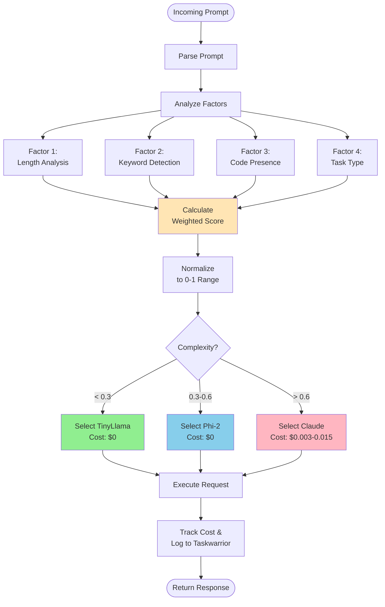
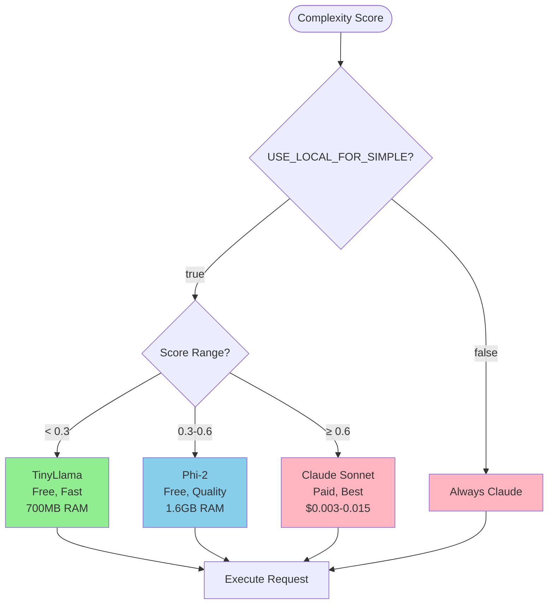
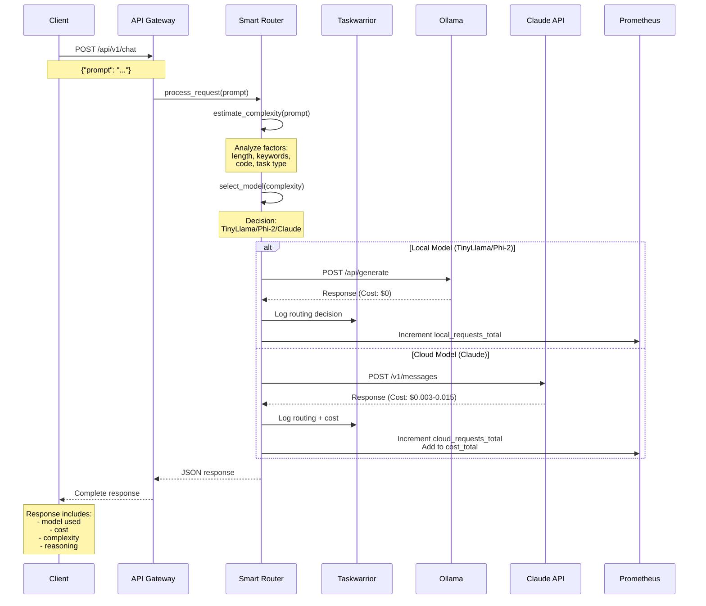

# 🧠 Smart Router Deep Dive

> **Navigation**: [← Back to Deployment](./DEPLOYMENT.md) | [Next: Cost Optimization →](./COST-OPTIMIZATION.md)

<details>
<summary><b>📋 TL;DR</b> - Click to expand</summary>

**How it works:**
1. Analyzes prompt using multiple factors (length, keywords, code, task type)
2. Calculates complexity score 0-1
3. Routes to cheapest capable model:
   - < 0.3 → TinyLlama (free)
   - 0.3-0.6 → Phi-2 (free)
   - \> 0.6 → Claude (paid)

**Result:** 60-80% cost savings vs cloud-only

</details>

---

## Table of Contents
- [Routing Algorithm Overview](#routing-algorithm-overview)
- [Complexity Estimation](#complexity-estimation)
- [Scoring Factors](#scoring-factors)
- [Model Selection Logic](#model-selection-logic)
- [Request Execution Flow](#request-execution-flow)
- [Optimization Strategies](#optimization-strategies)
- [Fine-Tuning the Router](#fine-tuning-the-router)

## Routing Algorithm Overview

The Smart Router is the core intelligence of the Hybrid AI Stack. It analyzes incoming prompts and routes them to the optimal model based on complexity estimation.



---

## Complexity Estimation

### Core Function: `estimate_complexity()`

```python
def estimate_complexity(self, prompt: str) -> tuple[float, str]:
    """
    Estimate prompt complexity using multi-factor analysis

    Returns:
        tuple: (complexity_score, reasoning)
        - complexity_score: Float between 0-1
        - reasoning: Human-readable explanation
    """
    factors = {
        'length': self._analyze_length(prompt),
        'keywords': self._analyze_keywords(prompt),
        'code': self._detect_code_presence(prompt),
        'task_type': self._classify_task_type(prompt)
    }

    # Weighted sum
    complexity = (
        factors['length'] * 0.3 +      # 30% weight
        factors['keywords'] * 0.3 +    # 30% weight
        factors['code'] * 0.25 +       # 25% weight
        factors['task_type'] * 0.15    # 15% weight
    )

    # Normalize to 0-1 range
    complexity = max(0.0, min(1.0, complexity))

    reasoning = self._generate_reasoning(factors, complexity)
    return complexity, reasoning
```

### Complexity Score Ranges

| Range | Category | Typical Use Cases | Model |
|-------|----------|-------------------|-------|
| **0.0 - 0.3** | Simple | Facts, lists, definitions, yes/no questions | TinyLlama |
| **0.3 - 0.6** | Medium | Explanations, comparisons, summaries, tutorials | Phi-2 |
| **0.6 - 1.0** | Complex | Code generation, analysis, creative writing, research | Claude |

---

## Scoring Factors

### Factor 1: Length Analysis (30% weight)

**Purpose**: Longer prompts typically require more sophisticated understanding

```python
def _analyze_length(self, prompt: str) -> float:
    """
    Analyze prompt length and assign complexity score

    Scoring:
        0-50 chars   → 0.0 (very simple)
        50-100 chars → 0.1
        100-300 chars → 0.3
        300-500 chars → 0.5
        500+ chars   → 0.7 (complex)
    """
    length = len(prompt)

    if length < 50:
        return 0.0
    elif length < 100:
        return 0.1
    elif length < 300:
        return 0.3
    elif length < 500:
        return 0.5
    else:
        return 0.7
```

**Examples:**

| Prompt | Length | Score | Reasoning |
|--------|--------|-------|-----------|
| "What is Python?" | 15 chars | 0.0 | Very short, simple question |
| "Explain the difference between lists and tuples" | 48 chars | 0.0 | Short but clear |
| "Can you explain the concept of object-oriented programming and provide some examples of when it's useful?" | 115 chars | 0.3 | Medium length |
| "I need a detailed explanation of how async/await works in JavaScript, including event loop mechanics, microtasks vs macrotasks, and best practices for error handling in promise chains..." | 195 chars | 0.3 | Longer, more complex |

### Factor 2: Keyword Detection (30% weight)

**Purpose**: Certain keywords indicate complexity or simplicity

```python
# Complexity-increasing keywords
COMPLEX_KEYWORDS = {
    'analyze', 'design', 'implement', 'refactor', 'optimize',
    'architecture', 'algorithm', 'develop', 'create', 'build',
    'complex', 'advanced', 'detailed', 'comprehensive'
}

# Complexity-decreasing keywords
SIMPLE_KEYWORDS = {
    'what is', 'define', 'list', 'summarize', 'explain briefly',
    'simple', 'quick', 'basic', 'overview'
}

def _analyze_keywords(self, prompt: str) -> float:
    """
    Detect keywords that indicate complexity level

    Scoring:
        Simple keywords   → -0.1 (reduce complexity)
        Complex keywords  → +0.3 (increase complexity)
        No special words  → 0.0 (neutral)
    """
    prompt_lower = prompt.lower()
    score = 0.0

    # Check for complex keywords
    for keyword in self.COMPLEX_KEYWORDS:
        if keyword in prompt_lower:
            score += 0.3
            break  # Only count once

    # Check for simple keywords
    for keyword in self.SIMPLE_KEYWORDS:
        if keyword in prompt_lower:
            score -= 0.1
            break

    return score
```

**Examples:**

| Prompt | Keywords Found | Score | Impact |
|--------|----------------|-------|--------|
| "What is a variable?" | "what is" (simple) | -0.1 | Reduces complexity |
| "List the planets" | "list" (simple) | -0.1 | Reduces complexity |
| "Design a database schema for..." | "design" (complex) | +0.3 | Increases complexity |
| "Implement a binary search tree" | "implement" (complex) | +0.3 | Increases complexity |
| "Explain variables" | None | 0.0 | Neutral |

### Factor 3: Code Presence Detection (25% weight)

**Purpose**: Code blocks and technical syntax indicate complex requests

```python
import re

def _detect_code_presence(self, prompt: str) -> float:
    """
    Detect presence of code, syntax, or technical patterns

    Scoring:
        No code           → 0.0
        Code mentioned    → 0.2
        Code blocks       → 0.3
        Multiple blocks   → 0.4
    """
    score = 0.0

    # Check for code blocks (```)
    code_blocks = re.findall(r'```[\s\S]*?```', prompt)
    if code_blocks:
        score += 0.3
        if len(code_blocks) > 1:
            score += 0.1

    # Check for inline code (`)
    inline_code = re.findall(r'`[^`]+`', prompt)
    if inline_code and not code_blocks:
        score += 0.2

    # Check for function-like patterns
    function_patterns = [
        r'def\s+\w+\(',      # Python functions
        r'function\s+\w+\(', # JavaScript functions
        r'class\s+\w+',      # Class definitions
        r'\w+\(\w*\)\s*{',   # C-style functions
    ]

    for pattern in function_patterns:
        if re.search(pattern, prompt):
            score += 0.2
            break

    return min(score, 0.4)  # Cap at 0.4
```

**Examples:**

| Prompt | Code Detected | Score | Reasoning |
|--------|---------------|-------|-----------|
| "How do I print in Python?" | None | 0.0 | No code |
| "Use the `print()` function" | Inline code | 0.2 | Simple inline code |
| "Fix this: ```python\nprint(hello)\n```" | Code block | 0.3 | One code block |
| "What does `def foo():` mean?" | Inline + function pattern | 0.2 | Code mentioned |

### Factor 4: Task Type Classification (15% weight)

**Purpose**: Different task types have inherent complexity

```python
def _classify_task_type(self, prompt: str) -> float:
    """
    Classify the type of task being requested

    Task Types:
        Question      → -0.1 (simple)
        Definition    → -0.1 (simple)
        Tutorial      → 0.0 (neutral)
        Explanation   → 0.1 (moderate)
        Generation    → 0.2 (complex)
        Analysis      → 0.3 (complex)
        Creative      → 0.2 (complex)
    """
    prompt_lower = prompt.lower()

    # Question indicators
    if any(prompt_lower.startswith(q) for q in ['what', 'when', 'where', 'who', 'why', 'how', 'is', 'are', 'can', 'do']):
        if '?' in prompt:
            return -0.1  # Simple question

    # Definition requests
    if any(word in prompt_lower for word in ['define', 'what is', 'what are']):
        return -0.1

    # Generation tasks
    if any(word in prompt_lower for word in ['write', 'create', 'generate', 'build', 'implement']):
        return 0.2

    # Analysis tasks
    if any(word in prompt_lower for word in ['analyze', 'compare', 'evaluate', 'assess']):
        return 0.3

    # Creative tasks
    if any(word in prompt_lower for word in ['design', 'brainstorm', 'imagine', 'suggest']):
        return 0.2

    # Default: neutral
    return 0.0
```

**Examples:**

| Prompt | Task Type | Score | Reasoning |
|--------|-----------|-------|-----------|
| "What is Python?" | Question | -0.1 | Simple factual question |
| "Define polymorphism" | Definition | -0.1 | Simple definition |
| "Write a function to reverse a string" | Generation | +0.2 | Code generation |
| "Analyze this algorithm's time complexity" | Analysis | +0.3 | Complex analysis |
| "Design a REST API for..." | Creative | +0.2 | Design task |

---

## Model Selection Logic

### Selection Function

```python
def select_model(self, complexity: float) -> str:
    """
    Select the optimal model based on complexity score

    Thresholds (configurable via .env):
        complexity < 0.3  → TinyLlama (free, fast)
        0.3 ≤ complexity < 0.6 → Phi-2 (free, better quality)
        complexity ≥ 0.6  → Claude Sonnet (paid, best quality)

    Override: If USE_LOCAL_FOR_SIMPLE=false, always use Claude
    """
    # Check if local models are disabled
    if not self.use_local_for_simple:
        return 'claude-sonnet'

    # Standard routing logic
    if complexity < 0.3:
        return 'tinyllama'
    elif complexity < 0.6:
        return 'phi2'
    else:
        return 'claude-sonnet'
```

### Routing Decision Tree



### Real Examples with Routing Decisions

```python
# Example 1: Simple Question
prompt = "What is Python?"
# Factors:
#   Length: 15 chars → 0.0
#   Keywords: "what is" → -0.1
#   Code: none → 0.0
#   Task: question → -0.1
# Final: 0.0 * 0.3 + (-0.1) * 0.3 + 0.0 * 0.25 + (-0.1) * 0.15 = -0.045
# Normalized: 0.0 (minimum)
# Model: TinyLlama ✅

# Example 2: Explanation Request
prompt = "Explain the difference between lists and tuples in Python"
# Factors:
#   Length: 61 chars → 0.1
#   Keywords: "explain" (neutral) → 0.0
#   Code: none → 0.0
#   Task: explanation → 0.1
# Final: 0.1 * 0.3 + 0.0 * 0.3 + 0.0 * 0.25 + 0.1 * 0.15 = 0.045
# Normalized: 0.045
# Model: TinyLlama ✅

# Example 3: Code Generation
prompt = "Write a Python function to implement binary search"
# Factors:
#   Length: 54 chars → 0.1
#   Keywords: "implement" → +0.3
#   Code: "function" mentioned → 0.2
#   Task: generation → 0.2
# Final: 0.1 * 0.3 + 0.3 * 0.3 + 0.2 * 0.25 + 0.2 * 0.15 = 0.2
# Normalized: 0.2
# Model: TinyLlama ✅ (borderline, might want Phi-2)

# Example 4: Complex Code Task
prompt = "Implement a binary search tree with insert, delete, search, and balance operations using AVL tree rotations"
# Factors:
#   Length: 115 chars → 0.3
#   Keywords: "implement" → +0.3
#   Code: "binary search tree" patterns → 0.2
#   Task: generation → 0.2
# Final: 0.3 * 0.3 + 0.3 * 0.3 + 0.2 * 0.25 + 0.2 * 0.15 = 0.26
# Normalized: 0.26
# Model: TinyLlama ✅ (close to Phi-2 threshold)

# Example 5: Very Complex Task
prompt = """
Design and implement a microservices architecture for an e-commerce platform.
Include:
- API Gateway
- User authentication service
- Product catalog service
- Order processing service
- Payment integration
- Database schema design
"""
# Factors:
#   Length: 220 chars → 0.3
#   Keywords: "design", "implement" → +0.3
#   Code: service patterns → 0.2
#   Task: creative design → 0.2
# Final: 0.3 * 0.3 + 0.3 * 0.3 + 0.2 * 0.25 + 0.2 * 0.15 = 0.26
# Normalized: 0.26... wait, this should be higher!
#
# THIS IS WHY FINE-TUNING IS IMPORTANT!
# This prompt should score ~0.7 for Claude
```

---

## Request Execution Flow

### Complete Process Flow



### Response Format

```json
{
  "model": "phi2",
  "backend": "local",
  "response": "Python is a high-level, interpreted programming language...",
  "cost": 0.0,
  "routing": {
    "complexity": 0.45,
    "reasoning": "Complexity 0.45: medium length, explanation task, no code",
    "factors": {
      "length": 0.3,
      "keywords": 0.0,
      "code": 0.0,
      "task_type": 0.1
    },
    "estimated_cost": 0.0
  },
  "latency_seconds": 2.34,
  "timestamp": "2025-01-15T10:30:45Z"
}
```

---

## Optimization Strategies

### Strategy 1: Threshold Tuning

Adjust routing thresholds based on your quality/cost preferences:

```bash
# More aggressive local routing (higher savings, lower quality)
COMPLEXITY_THRESHOLD_TINY=0.4    # Default: 0.3
COMPLEXITY_THRESHOLD_PHI=0.7     # Default: 0.6

# More conservative routing (higher quality, higher cost)
COMPLEXITY_THRESHOLD_TINY=0.2
COMPLEXITY_THRESHOLD_PHI=0.5
```

### Strategy 2: Keyword Customization

Add domain-specific keywords:

```python
# Add to COMPLEX_KEYWORDS for your domain
COMPLEX_KEYWORDS.update({
    'diagnose', 'troubleshoot', 'debug',  # Technical support
    'recommendation', 'personalize',       # E-commerce
    'sentiment', 'classify', 'categorize'  # Content moderation
})

# Add to SIMPLE_KEYWORDS
SIMPLE_KEYWORDS.update({
    'status', 'check', 'lookup',  # Status queries
    'faq', 'help', 'guide'        # Documentation
})
```

### Strategy 3: Model Cascading

Try local first, fallback to cloud on poor quality:

```python
def process_request_with_fallback(self, prompt: str) -> dict:
    """
    Try local model first, fallback to Claude if quality is poor
    """
    complexity, reasoning = self.estimate_complexity(prompt)
    model = self.select_model(complexity)

    # Try local first
    if model != 'claude-sonnet':
        local_response = self.execute_ollama_request(prompt, model)

        # Check quality (simple heuristic)
        if self._is_acceptable_quality(local_response):
            return local_response

        # Fallback to Claude
        print(f"Local quality insufficient, falling back to Claude")
        return self.execute_claude_request(prompt)

    # Use Claude directly for complex prompts
    return self.execute_claude_request(prompt)
```

### Strategy 4: Caching

Cache common queries to avoid re-processing:

```python
import hashlib
import redis

def process_request_with_cache(self, prompt: str) -> dict:
    """
    Check Redis cache before processing
    """
    # Generate cache key
    cache_key = f"response:{hashlib.md5(prompt.encode()).hexdigest()}"

    # Check cache
    cached = self.redis_client.get(cache_key)
    if cached:
        return json.loads(cached)

    # Process normally
    response = self.process_request(prompt)

    # Cache result (24 hour expiration)
    self.redis_client.setex(
        cache_key,
        86400,  # 24 hours
        json.dumps(response)
    )

    return response
```

---

## Fine-Tuning the Router

### Collect Training Data

```bash
# Export routing decisions to CSV
task export project:vps_ai.router > routing_decisions.csv

# Analyze routing accuracy
python scripts/analyze_routing.py routing_decisions.csv
```

### Adjust Weights

Based on your analysis, adjust factor weights in `smart_router.py`:

```python
# Original weights
complexity = (
    factors['length'] * 0.3 +      # 30%
    factors['keywords'] * 0.3 +    # 30%
    factors['code'] * 0.25 +       # 25%
    factors['task_type'] * 0.15    # 15%
)

# Example: Emphasize keywords more
complexity = (
    factors['length'] * 0.2 +      # 20%
    factors['keywords'] * 0.4 +    # 40% ← increased
    factors['code'] * 0.25 +       # 25%
    factors['task_type'] * 0.15    # 15%
)
```

### A/B Testing

Run two routers in parallel and compare:

```python
# Deploy two instances with different configurations
# Instance A: Default thresholds
# Instance B: Adjusted thresholds

# Compare metrics
curl http://instance-a:8080/api/v1/stats
curl http://instance-b:8080/api/v1/stats

# Analyze:
# - Total cost
# - Response quality (manual review)
# - Latency
# - Local vs cloud ratio
```

---

**Related Documentation:**
- [Architecture Overview](./ARCHITECTURE.md)
- [Cost Optimization](./COST-OPTIMIZATION.md)
- [Deployment Guide](./DEPLOYMENT.md)
- [Examples](./EXAMPLES.md)

[⬆ Back to Top](#-smart-router-deep-dive)
