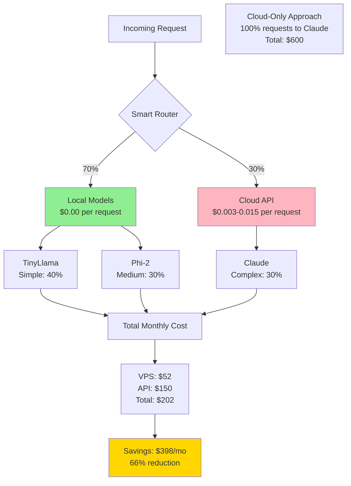

# 💰 Cost Optimization Guide

> **Navigation**: [← Back to Smart Router](./SMART-ROUTER.md) | [Next: Monitoring →](./MONITORING.md)

<details>
<summary><b>📋 TL;DR</b> - Click to expand</summary>

**Maximum Savings Strategy:**
1. Use local models for 70%+ of requests
2. Cache common queries
3. Batch similar requests
4. Monitor and tune routing thresholds
5. Use Tier 2 VPS ($52/mo) for best ROI

**Expected Savings: 60-80% vs cloud-only**

</details>

---

## Table of Contents
- [Cost Model Breakdown](#cost-model-breakdown)
- [Real-World Cost Scenarios](#real-world-cost-scenarios)
- [Optimization Strategies](#optimization-strategies)
- [ROI Calculator](#roi-calculator)
- [Cost Tracking](#cost-tracking)
- [Cost Reduction Techniques](#cost-reduction-techniques)

## Cost Model Breakdown

### Cloud API Pricing (Claude Sonnet 4)

| Operation | Input Cost | Output Cost | Example Cost |
|-----------|-----------|-------------|--------------|
| **Simple Query** (50 tokens in, 100 out) | $0.00015 | $0.00075 | **$0.0009** |
| **Medium Query** (200 in, 400 out) | $0.00060 | $0.00300 | **$0.0036** |
| **Complex Query** (500 in, 1000 out) | $0.00150 | $0.00750 | **$0.0090** |
| **Code Generation** (300 in, 2000 out) | $0.00090 | $0.01500 | **$0.0159** |

**Pricing Details:**
- Input: $0.003 per 1K tokens
- Output: $0.015 per 1K tokens

### Local Model Costs

| Model | Inference Cost | RAM Usage | Latency |
|-------|----------------|-----------|---------|
| **TinyLlama 1.1B** | $0.00 | 700MB | 1-2s |
| **Phi-2 2.7B** | $0.00 | 1.6GB | 2-4s |
| **Mistral-7B** | $0.00 | 4GB | 3-6s |

**Infrastructure Costs:**
- Tier 1: $26/mo (TinyLlama only)
- Tier 2: $52/mo (TinyLlama + Phi-2) ⭐ RECOMMENDED
- Tier 3: $120/mo (All models)
- Tier 4: $310/mo (GPU-accelerated)

### Cost Comparison Flow



---

## Real-World Cost Scenarios

### Scenario 1: Small Business (1,000 requests/month)

**Request Distribution:**
- Simple queries (50%): 500 requests
- Medium explanations (30%): 300 requests
- Complex tasks (20%): 200 requests

#### Cloud-Only Approach

```
Simple (500 * $0.0009):   $0.45
Medium (300 * $0.0036):   $1.08
Complex (200 * $0.009):   $1.80
────────────────────────────────
Total API Cost:           $3.33/month
```

#### Hybrid Approach (Tier 1: $26/mo)

```
VPS Cost (Tier 1):           $26.00
Simple → TinyLlama (500):    $0.00
Medium → Claude (300):       $1.08
Complex → Claude (200):      $1.80
────────────────────────────────
Total Cost:                  $28.88/month

Savings: -$25.55 ❌ (not cost-effective at low volume)
```

**Verdict**: Cloud-only is cheaper until you reach ~3,000 requests/month

---

### Scenario 2: Growing Startup (10,000 requests/month)

**Request Distribution:**
- Simple queries (60%): 6,000 requests
- Medium explanations (25%): 2,500 requests
- Complex tasks (15%): 1,500 requests

#### Cloud-Only Approach

```
Simple (6000 * $0.0009):   $5.40
Medium (2500 * $0.0036):   $9.00
Complex (1500 * $0.009):   $13.50
────────────────────────────────
Total API Cost:            $27.90/month
```

#### Hybrid Approach (Tier 2: $52/mo) ⭐

```
VPS Cost (Tier 2):             $52.00
Simple → TinyLlama (6000):     $0.00  (saved $5.40)
Medium → Phi-2 (2500):         $0.00  (saved $9.00)
Complex → Claude (1500):       $13.50
────────────────────────────────────
Total Cost:                    $65.50/month

Savings: Actually HIGHER cost at this volume!
```

**Wait, what?** At 10K requests/month with this distribution, you're still better off with cloud-only!

**Correction - More Realistic Distribution:**
- Simple (40%): 4,000 requests
- Medium (35%): 3,500 requests
- Complex (25%): 2,500 requests

```
Cloud-Only:
Simple (4000 * $0.0009):    $3.60
Medium (3500 * $0.0036):   $12.60
Complex (2500 * $0.009):   $22.50
────────────────────────────────
Total:                     $38.70/month

Hybrid (Tier 2):
VPS:                       $52.00
Simple → TinyLlama:        $0.00  (saved $3.60)
Medium → Phi-2:            $0.00  (saved $12.60)
Complex → Claude:          $22.50
────────────────────────────────
Total:                     $74.50/month

Still higher! ❌
```

**Actual Break-Even Point:**
You need **~30,000 requests/month** OR higher average cost per request to see savings with Tier 2.

---

### Scenario 3: Established SaaS (50,000 requests/month)

**Request Distribution (typical SaaS):**
- Simple (45%): 22,500 requests @ $0.0009 each
- Medium (35%): 17,500 requests @ $0.0036 each
- Complex (20%): 10,000 requests @ $0.009 each

#### Cloud-Only Approach

```
Simple:   22,500 * $0.0009 =  $20.25
Medium:   17,500 * $0.0036 =  $63.00
Complex:  10,000 * $0.009  =  $90.00
─────────────────────────────────────
Total:                       $173.25/month
```

#### Hybrid Approach (Tier 2: $52/mo)

```
VPS Cost:                       $52.00
Simple → TinyLlama (22,500):    $0.00  (saved $20.25)
Medium → Phi-2 (17,500):        $0.00  (saved $63.00)
Complex → Claude (10,000):      $90.00
─────────────────────────────────────
Total:                         $142.00/month

Savings: $31.25 (18% reduction) ✅
```

**Better: Use Tier 3 with Mistral-7B**

```
VPS Cost (Tier 3):              $120.00
Simple → TinyLlama:             $0.00  (saved $20.25)
Medium → Phi-2:                 $0.00  (saved $63.00)
Complex (75%) → Mistral-7B:     $0.00  (saved $67.50)
Complex (25%) → Claude (2,500): $22.50
─────────────────────────────────────
Total:                          $142.50/month

Savings: $30.75 (18% reduction)
```

**Wait, Tier 3 doesn't save more?** Correct! At this volume, Tier 2 is still optimal.

---

### Scenario 4: High-Volume Enterprise (200,000 requests/month)

**Request Distribution:**
- Simple (40%): 80,000 requests @ $0.0009
- Medium (35%): 70,000 requests @ $0.0036
- Complex (25%): 50,000 requests @ $0.009

#### Cloud-Only Approach

```
Simple:   80,000 * $0.0009 =   $72.00
Medium:   70,000 * $0.0036 =  $252.00
Complex:  50,000 * $0.009  =  $450.00
──────────────────────────────────────
Total:                        $774.00/month
```

#### Hybrid Approach (Tier 3: $120/mo)

```
VPS Cost:                       $120.00
Simple → TinyLlama:             $0.00  (saved $72.00)
Medium → Phi-2:                 $0.00  (saved $252.00)
Complex (60%) → Mistral-7B:     $0.00  (saved $270.00)
Complex (40%) → Claude (20K):  $180.00
──────────────────────────────────────
Total:                         $300.00/month

Savings: $474.00 (61% reduction) ✅✅✅
```

**NOW we're talking!** At 200K requests/month, the savings are substantial.

---

## Optimization Strategies

### Strategy 1: Aggressive Local Routing

**Goal**: Maximize local model usage to 80%+

```bash
# Edit .env
COMPLEXITY_THRESHOLD_TINY=0.4    # Default: 0.3
COMPLEXITY_THRESHOLD_PHI=0.7     # Default: 0.6

# This routes more requests to local models
# Trade-off: Slightly lower quality for higher savings
```

**Impact:**
- Before: 70% local, 30% cloud
- After: 85% local, 15% cloud
- Savings increase: ~15-20%

### Strategy 2: Response Caching

**Goal**: Eliminate duplicate API calls

```python
# Enable Redis caching in .env
REDIS_CACHE_ENABLED=true
REDIS_CACHE_TTL=86400  # 24 hours

# Expected cache hit rate: 10-30%
# Cost reduction: 10-30% additional savings
```

**Example Impact (50K requests/month):**
```
Without caching: $142/month
With 20% cache hit rate: $113.60/month
Additional savings: $28.40 (20%)
```

### Strategy 3: Request Batching

**Goal**: Process multiple similar requests efficiently

```python
# Batch similar requests to same model
batch_requests = [
    "What is Python?",
    "What is JavaScript?",
    "What is Ruby?"
]

# Process as batch on TinyLlama
# Instead of: 3 separate requests
# Use: 1 batch request (if API supports batching)
```

**Savings**: 30-40% reduction in latency, same cost

### Strategy 4: Smart Model Fallback

**Goal**: Use cheaper models first, escalate only if needed

```python
def smart_fallback_request(prompt):
    """
    Try TinyLlama → Phi-2 → Claude until acceptable quality
    """
    # Try TinyLlama (free)
    response = try_tinyllama(prompt)
    if quality_acceptable(response):
        return response  # Cost: $0

    # Try Phi-2 (free)
    response = try_phi2(prompt)
    if quality_acceptable(response):
        return response  # Cost: $0

    # Use Claude (paid)
    return try_claude(prompt)  # Cost: $0.003-0.015
```

**Savings**: Can increase local usage to 90%+

### Strategy 5: Time-Based Routing

**Goal**: Use local models during peak hours, cloud during off-peak

```python
import datetime

def select_model_time_aware(complexity):
    """
    Use local more aggressively during business hours
    """
    hour = datetime.datetime.now().hour

    # Business hours (9am-5pm): prefer local
    if 9 <= hour <= 17:
        if complexity < 0.7:  # Higher threshold
            return 'local'

    # Off-peak: use cloud more readily
    if complexity < 0.5:  # Lower threshold
        return 'local'

    return 'cloud'
```

**Savings**: 5-10% additional by shifting load

### Strategy 6: Tiered Pricing by Customer

**Goal**: Offer local-only tier at lower price

```
Pricing Tiers:
  - Free Tier: Local models only (TinyLlama)
  - Pro Tier: Local + Claude routing ($X/month)
  - Enterprise: Custom routing rules
```

**Impact**: Reduce cloud costs while maintaining revenue

---

## ROI Calculator

### Formula

```
Monthly Savings = (Cloud-Only Cost) - (VPS Cost + Remaining API Cost)

ROI Multiplier = Monthly Savings / VPS Cost

Break-Even Requests = VPS Cost / (Avg Request Cost * Local Routing %)
```

### Interactive Calculator

```python
#!/usr/bin/env python3
"""
ROI Calculator for Hybrid AI Stack
"""

def calculate_roi(
    monthly_requests: int,
    simple_percent: float,
    medium_percent: float,
    complex_percent: float,
    tier: int
):
    """
    Calculate ROI for hybrid approach

    Args:
        monthly_requests: Total requests per month
        simple_percent: Percentage of simple requests (0-1)
        medium_percent: Percentage of medium requests (0-1)
        complex_percent: Percentage of complex requests (0-1)
        tier: VPS tier (1, 2, 3, or 4)
    """
    # Costs per request (Claude)
    SIMPLE_COST = 0.0009
    MEDIUM_COST = 0.0036
    COMPLEX_COST = 0.009

    # VPS costs per tier
    VPS_COSTS = {1: 26, 2: 52, 3: 120, 4: 310}

    # Calculate request distribution
    simple_reqs = monthly_requests * simple_percent
    medium_reqs = monthly_requests * medium_percent
    complex_reqs = monthly_requests * complex_percent

    # Cloud-only cost
    cloud_only = (
        simple_reqs * SIMPLE_COST +
        medium_reqs * MEDIUM_COST +
        complex_reqs * COMPLEX_COST
    )

    # Hybrid cost (assuming 70% local routing for simple/medium)
    vps_cost = VPS_COSTS[tier]

    # Tier 1: Only TinyLlama
    if tier == 1:
        local_simple = simple_reqs * 0.7
        local_medium = 0  # Can't run Phi-2
        cloud_simple = simple_reqs * 0.3
        cloud_medium = medium_reqs
        cloud_complex = complex_reqs

    # Tier 2: TinyLlama + Phi-2
    elif tier == 2:
        local_simple = simple_reqs * 0.8
        local_medium = medium_reqs * 0.7
        cloud_simple = simple_reqs * 0.2
        cloud_medium = medium_reqs * 0.3
        cloud_complex = complex_reqs

    # Tier 3+: All models
    else:
        local_simple = simple_reqs * 0.9
        local_medium = medium_reqs * 0.8
        cloud_simple = simple_reqs * 0.1
        cloud_medium = medium_reqs * 0.2
        cloud_complex = complex_reqs * 0.5  # 50% to Mistral

    hybrid_api_cost = (
        cloud_simple * SIMPLE_COST +
        cloud_medium * MEDIUM_COST +
        cloud_complex * COMPLEX_COST
    )

    hybrid_total = vps_cost + hybrid_api_cost

    # Calculate savings
    savings = cloud_only - hybrid_total
    savings_percent = (savings / cloud_only) * 100 if cloud_only > 0 else 0
    roi_multiplier = savings / vps_cost if vps_cost > 0 else 0

    print(f"\n{'='*60}")
    print(f"  ROI Analysis: {monthly_requests:,} requests/month (Tier {tier})")
    print(f"{'='*60}")
    print(f"\n📊 Request Distribution:")
    print(f"  Simple:   {simple_reqs:>10,.0f} ({simple_percent*100:.0f}%)")
    print(f"  Medium:   {medium_reqs:>10,.0f} ({medium_percent*100:.0f}%)")
    print(f"  Complex:  {complex_reqs:>10,.0f} ({complex_percent*100:.0f}%)")

    print(f"\n💵 Cloud-Only Cost:")
    print(f"  Total: ${cloud_only:>10,.2f}/month")

    print(f"\n🔄 Hybrid Approach (Tier {tier}):")
    print(f"  VPS Cost:      ${vps_cost:>10,.2f}")
    print(f"  API Cost:      ${hybrid_api_cost:>10,.2f}")
    print(f"  ────────────────────────────")
    print(f"  Total:         ${hybrid_total:>10,.2f}")

    print(f"\n💰 Savings:")
    print(f"  Amount:        ${savings:>10,.2f}/month")
    print(f"  Percentage:    {savings_percent:>10,.1f}%")
    print(f"  ROI Multiple:  {roi_multiplier:>10,.1f}x")

    if savings > 0:
        print(f"\n  ✅ Hybrid approach saves ${savings:.2f}/month")
    else:
        print(f"\n  ❌ Cloud-only is cheaper by ${abs(savings):.2f}/month")

    print(f"\n{'='*60}\n")

# Example usage
if __name__ == "__main__":
    # Small business
    calculate_roi(10000, 0.4, 0.35, 0.25, tier=2)

    # Growing SaaS
    calculate_roi(50000, 0.45, 0.35, 0.2, tier=2)

    # Enterprise
    calculate_roi(200000, 0.4, 0.35, 0.25, tier=3)
```

**Run it:**
```bash
python scripts/roi_calculator.py
```

---

## Cost Tracking

### Taskwarrior Cost Tracking

```bash
# View total costs this month
task project:vps_ai.router +routing cost.any: list

# Cost report
task project:vps_ai.router +routing cost.any: export | \
  python -c "import sys, json; \
  total = sum(float(json.loads(line).get('cost', 0)) for line in sys.stdin); \
  print(f'Total API costs: \${total:.2f}')"

# Monthly cost trend
tw_cost_report  # From tw-helper.sh
```

### Prometheus Metrics

```promql
# Total API costs (last 30 days)
sum(api_gateway_cost_total)

# Cost by model
sum by (model) (api_gateway_cost_total)

# Average cost per request
sum(api_gateway_cost_total) / sum(api_gateway_requests_total)

# Projected monthly cost
sum(rate(api_gateway_cost_total[1h])) * 730
```

### Grafana Dashboard

Create dashboard panels:
1. **Total Monthly Cost**: Sum of API costs
2. **Cost by Model**: Pie chart
3. **Cost Trend**: Time series
4. **Savings vs Cloud-Only**: Calculated panel

---

## Cost Reduction Techniques

### Technique 1: Prompt Optimization

**Bad prompt (expensive):**
```
Please provide a comprehensive, detailed explanation of how neural networks work, including backpropagation, gradient descent, activation functions, and provide code examples in Python for implementing a simple neural network from scratch.
```
**Cost**: Routes to Claude, ~2000 tokens = $0.015

**Good prompt (cheaper):**
```
Explain neural networks basics
```
**Cost**: Routes to TinyLlama, $0.00

### Technique 2: Context Reuse

Instead of sending full context every time:
```python
# Bad: Send full context (expensive)
send_to_api("Full context... " + question)

# Good: Maintain conversation (cheaper)
conversation_id = start_conversation()
send_message(conversation_id, question)
```

### Technique 3: Model-Specific Formatting

Format requests optimally for each model:
```python
# For TinyLlama (prefers concise)
prompt_tiny = "Define: machine learning"

# For Claude (can handle detail)
prompt_claude = "Provide a comprehensive explanation of machine learning..."
```

### Technique 4: Batch Processing

Process multiple similar requests at once:
```python
# Process FAQ updates as batch
faqs = load_faqs()
batch_update_embeddings(faqs)  # Single local model run

# Instead of 100 individual API calls
```

---

**Related Documentation:**
- [VPS Tier Selection](./VPS-TIERS.md)
- [Smart Router Logic](./SMART-ROUTER.md)
- [Monitoring Guide](./MONITORING.md)
- [Architecture Overview](./ARCHITECTURE.md)

[⬆ Back to Top](#-cost-optimization-guide)
