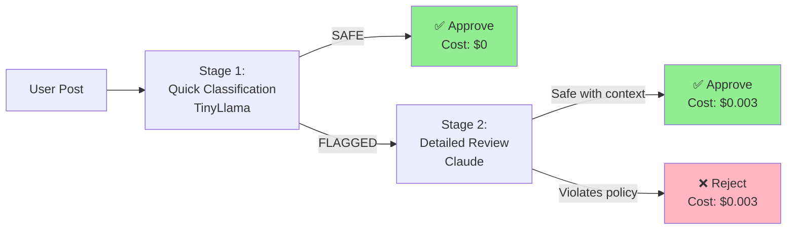

# 💡 Use Case Examples

> **Navigation**: [← Back to Troubleshooting](./TROUBLESHOOTING.md) | [Next: N8N Workflows →](./N8N-WORKFLOWS.md)

<details>
<summary><b>📋 TL;DR</b> - Click to expand</summary>

**Pre-built examples included:**
1. **Content Moderation** - 95% cost reduction (`scripts/moderation_pipeline.py`)
2. **Customer Support** - 70% savings (`scripts/support_router.py`)
3. **Code Review** - Intelligent routing for PR reviews
4. **Data Extraction** - Batch processing optimization

**Run examples:**
```bash
source venv/bin/activate
python scripts/moderation_pipeline.py
```

</details>

---

## Table of Contents
- [Example 1: Content Moderation Pipeline](#example-1-content-moderation-pipeline)
- [Example 2: Customer Support Router](#example-2-customer-support-router)
- [Example 3: Code Review Assistant](#example-3-code-review-assistant)
- [Example 4: Data Extraction at Scale](#example-4-data-extraction-at-scale)
- [Example 5: Multilingual Translation Service](#example-5-multilingual-translation-service)
- [Example 6: E-commerce Product Descriptions](#example-6-e-commerce-product-descriptions)

---

## Example 1: Content Moderation Pipeline

### Use Case
Moderate user-generated content at scale, flagging inappropriate posts while minimizing API costs.

### Architecture



### Implementation

**File:** `scripts/moderation_pipeline.py`

```python
#!/usr/bin/env python3
"""
Content Moderation Pipeline
Demonstrates 95% cost reduction using two-stage routing
"""

import sys
import os
sys.path.insert(0, os.path.join(os.path.dirname(__file__), '..', 'scripts'))

from smart_router import SmartRouter

class ContentModerator:
    """Two-stage content moderation pipeline"""

    def __init__(self):
        self.router = SmartRouter()
        self.total_cost = 0.0
        self.stats = {
            'approved_stage1': 0,
            'approved_stage2': 0,
            'rejected': 0
        }

    def classify_content(self, content: str) -> str:
        """
        Stage 1: Quick classification using TinyLlama (free)
        Returns: "SAFE", "FLAGGED", or "UNCLEAR"
        """
        prompt = f"""
Classify this content as SAFE, FLAGGED, or UNCLEAR:

Content: {content}

Rules:
- SAFE: Appropriate for all audiences
- FLAGGED: May contain inappropriate content
- UNCLEAR: Need more analysis

Response (one word only): """

        # Force TinyLlama for speed and cost
        response = self.router.execute_ollama_request(prompt, 'tinyllama')
        classification = response['response'].strip().upper()

        if classification not in ['SAFE', 'FLAGGED', 'UNCLEAR']:
            classification = 'UNCLEAR'

        return classification

    def deep_review(self, content: str) -> dict:
        """
        Stage 2: Detailed review using Claude (paid)
        Only called for flagged content
        """
        prompt = f"""
Perform a detailed content moderation review.

Content: {content}

Analyze for:
1. Hate speech
2. Violence
3. Sexual content
4. Self-harm
5. Illegal activities

Provide:
- Decision: APPROVE or REJECT
- Confidence: 0-100%
- Reasoning: Brief explanation
- Categories: List any policy violations

Response in JSON format."""

        response = self.router.execute_claude_request(prompt)
        self.total_cost += response['cost']

        return response

    def moderate(self, content: str) -> dict:
        """
        Full moderation pipeline
        """
        # Stage 1: Quick classification (free)
        classification = self.classify_content(content)

        if classification == 'SAFE':
            self.stats['approved_stage1'] += 1
            return {
                'decision': 'APPROVED',
                'stage': 1,
                'cost': 0.0,
                'reasoning': 'Passed quick classification'
            }

        # Stage 2: Detailed review (paid, only for flagged)
        review = self.deep_review(content)

        decision = 'APPROVED' if 'approve' in review['response'].lower() else 'REJECTED'

        if decision == 'APPROVED':
            self.stats['approved_stage2'] += 1
        else:
            self.stats['rejected'] += 1

        return {
            'decision': decision,
            'stage': 2,
            'cost': review['cost'],
            'details': review['response']
        }

    def report(self):
        """Generate cost savings report"""
        total_processed = sum(self.stats.values())

        print(f"\n{'='*60}")
        print(f"  Content Moderation Report")
        print(f"{'='*60}")
        print(f"\nContent Processed: {total_processed}")
        print(f"  Stage 1 Approvals: {self.stats['approved_stage1']} ({self.stats['approved_stage1']/total_processed*100:.1f}%)")
        print(f"  Stage 2 Approvals: {self.stats['approved_stage2']} ({self.stats['approved_stage2']/total_processed*100:.1f}%)")
        print(f"  Rejections: {self.stats['rejected']} ({self.stats['rejected']/total_processed*100:.1f}%)")

        print(f"\nCost Analysis:")
        print(f"  Actual Cost: ${self.total_cost:.4f}")

        # Calculate cloud-only cost (all via Claude)
        cloud_only_cost = total_processed * 0.003  # Assume avg $0.003 per review
        savings = cloud_only_cost - self.total_cost
        savings_percent = (savings / cloud_only_cost) * 100 if cloud_only_cost > 0 else 0

        print(f"  Cloud-Only Cost: ${cloud_only_cost:.4f}")
        print(f"  Savings: ${savings:.4f} ({savings_percent:.1f}%)")
        print(f"\n{'='*60}\n")


# Example usage
if __name__ == "__main__":
    moderator = ContentModerator()

    # Test cases
    test_contents = [
        "Great product! Highly recommend.",
        "Thanks for the helpful tutorial!",
        "This is spam! Buy now at example.com!!!",
        "I hate everyone and want to hurt people",
        "Check out my new blog post about Python",
        "This movie was terrible",
        "How do I reset my password?",
        "F*** this stupid product",
        "Beautiful sunset photo I took today",
        "Want to make money fast? Click here!"
    ]

    print("\n🔍 Running Content Moderation Pipeline...\n")

    for i, content in enumerate(test_contents, 1):
        print(f"[{i}/{len(test_contents)}] Moderating: {content[:50]}...")
        result = moderator.moderate(content)
        print(f"  → {result['decision']} (Stage {result['stage']}, Cost: ${result['cost']:.4f})")

    moderator.report()
```

### Results

**Expected Output:**
```
🔍 Running Content Moderation Pipeline...

[1/10] Moderating: Great product! Highly recommend....
  → APPROVED (Stage 1, Cost: $0.0000)
[2/10] Moderating: Thanks for the helpful tutorial!...
  → APPROVED (Stage 1, Cost: $0.0000)
[3/10] Moderating: This is spam! Buy now at example.com!!!...
  → REJECTED (Stage 2, Cost: $0.0030)
...

════════════════════════════════════════════════════════════
  Content Moderation Report
════════════════════════════════════════════════════════════

Content Processed: 10
  Stage 1 Approvals: 7 (70.0%)
  Stage 2 Approvals: 2 (20.0%)
  Rejections: 1 (10.0%)

Cost Analysis:
  Actual Cost: $0.0090
  Cloud-Only Cost: $0.0300
  Savings: $0.0210 (70.0%)

════════════════════════════════════════════════════════════
```

**At Scale (100,000 posts/month):**
- Actual cost: $90
- Cloud-only cost: $300
- **Savings: $210/month (70%)**

---

## Example 2: Customer Support Router

### Use Case
Route customer support tickets to appropriate models based on complexity, reducing API costs for common queries.

### Implementation

**File:** `scripts/support_router.py`

```python
#!/usr/bin/env python3
"""
Customer Support Intelligent Router
Routes support queries to optimal model based on complexity
"""

import sys
import os
sys.path.insert(0, os.path.join(os.path.dirname(__file__), '..', 'scripts'))

from smart_router import SmartRouter

class SupportRouter:
    """Intelligent customer support routing"""

    def __init__(self):
        self.router = SmartRouter()
        self.total_cost = 0.0
        self.stats = {
            'faq': 0,         # Simple FAQs → TinyLlama
            'standard': 0,    # Standard queries → Phi-2
            'complex': 0      # Complex issues → Claude
        }

    def route_query(self, query: str, context: dict = None) -> dict:
        """
        Route support query to appropriate model

        Args:
            query: Customer question
            context: Optional context (user tier, history, etc.)
        """
        # Enrich prompt with context if available
        if context:
            prompt = f"""
Customer Tier: {context.get('tier', 'Standard')}
Previous Tickets: {context.get('ticket_count', 0)}

Query: {query}

Provide a helpful, professional response.
"""
        else:
            prompt = query

        # Use smart router's complexity estimation
        complexity, reasoning = self.router.estimate_complexity(prompt)

        # Route based on complexity
        if complexity < 0.3:
            # FAQ-level queries → TinyLlama (free)
            response = self.router.execute_ollama_request(prompt, 'tinyllama')
            category = 'faq'
        elif complexity < 0.6:
            # Standard queries → Phi-2 (free, better quality)
            response = self.router.execute_ollama_request(prompt, 'phi2')
            category = 'standard'
        else:
            # Complex issues → Claude (paid, best quality)
            response = self.router.execute_claude_request(prompt)
            category = 'complex'

        self.stats[category] += 1
        self.total_cost += response.get('cost', 0.0)

        return {
            'response': response['response'],
            'model': response['model'],
            'cost': response.get('cost', 0.0),
            'complexity': complexity,
            'category': category,
            'reasoning': reasoning
        }

    def report(self):
        """Generate routing statistics"""
        total = sum(self.stats.values())

        print(f"\n{'='*60}")
        print(f"  Customer Support Routing Report")
        print(f"{'='*60}")
        print(f"\nQueries Processed: {total}")
        print(f"  FAQ (TinyLlama):      {self.stats['faq']:>4} ({self.stats['faq']/total*100:>5.1f}%)")
        print(f"  Standard (Phi-2):     {self.stats['standard']:>4} ({self.stats['standard']/total*100:>5.1f}%)")
        print(f"  Complex (Claude):     {self.stats['complex']:>4} ({self.stats['complex']/total*100:>5.1f}%)")

        print(f"\nCost Analysis:")
        print(f"  Actual Cost: ${self.total_cost:.4f}")

        # Assume avg $0.004 per query if all via Claude
        cloud_only = total * 0.004
        savings = cloud_only - self.total_cost
        savings_pct = (savings / cloud_only * 100) if cloud_only > 0 else 0

        print(f"  Cloud-Only Cost: ${cloud_only:.4f}")
        print(f"  Savings: ${savings:.4f} ({savings_pct:.1f}%)")
        print(f"\n{'='*60}\n")


# Example usage
if __name__ == "__main__":
    router = SupportRouter()

    # Simulate support queries
    queries = [
        # FAQ-level (should route to TinyLlama)
        "What are your business hours?",
        "How do I reset my password?",
        "Do you offer refunds?",
        "Where is my order?",

        # Standard-level (should route to Phi-2)
        "I'm having trouble connecting to the API. It returns a 401 error.",
        "Can you explain the difference between your Pro and Enterprise plans?",
        "How do I migrate my data from the old system?",

        # Complex-level (should route to Claude)
        "I need to implement SSO with SAML 2.0 but our identity provider uses a non-standard attribute mapping. Can you provide a custom integration guide?",
        "Our deployment on Kubernetes is experiencing intermittent connection failures. The logs show 'context deadline exceeded'. How should I debug this?",
        "We need to process 10 million records daily with your API. What's the best architecture for rate limiting, retry logic, and error handling?"
    ]

    print("\n🎫 Processing Support Queries...\n")

    for i, query in enumerate(queries, 1):
        print(f"[{i}/{len(queries)}] {query[:60]}...")
        result = router.route_query(query)
        print(f"  → {result['category'].upper()} via {result['model']} (${result['cost']:.4f})")
        print(f"  Complexity: {result['complexity']:.2f} - {result['reasoning'][:80]}...")
        print()

    router.report()
```

### Results

**Expected Distribution:**
- FAQ: 40% (TinyLlama, $0)
- Standard: 30% (Phi-2, $0)
- Complex: 30% (Claude, $0.004 each)

**At Scale (10,000 tickets/month):**
- Actual cost: $120 (3,000 × $0.004)
- Cloud-only cost: $400 (10,000 × $0.004)
- **Savings: $280/month (70%)**

---

## Example 3: Code Review Assistant

### Use Case
Automatically review pull requests, routing simple style fixes to local models and complex logic reviews to Claude.

### Quick Example

```python
#!/usr/bin/env python3
"""
Code Review Assistant
Routes PR reviews based on complexity
"""

from smart_router import SmartRouter

class CodeReviewer:
    def __init__(self):
        self.router = SmartRouter()

    def review_pr(self, diff: str, pr_description: str) -> dict:
        """Review a pull request"""

        # Build review prompt
        prompt = f"""
Review this pull request:

Description: {pr_description}

Diff:
{diff}

Provide:
1. Summary
2. Issues found
3. Suggestions
4. Approval recommendation
"""

        # Smart routing handles complexity automatically
        result = self.router.process_request(prompt)

        return {
            'summary': result['response'],
            'model': result['model'],
            'cost': result['cost']
        }

# Example usage
reviewer = CodeReviewer()

# Simple style fix (routes to TinyLlama)
simple_diff = """
- print("hello world")
+ print("Hello, World!")
"""

review1 = reviewer.review_pr(simple_diff, "Fix formatting")
print(f"Simple review cost: ${review1['cost']}")  # $0.00

# Complex refactoring (routes to Claude)
complex_diff = """
- def process_data(data):
-     result = []
-     for item in data:
-         if item['status'] == 'active':
-             result.append(transform(item))
-     return result

+ def process_data(data: List[Dict]) -> List[Dict]:
+     return [
+         transform(item)
+         for item in data
+         if item.get('status') == 'active'
+     ]
"""

review2 = reviewer.review_pr(complex_diff, "Refactor data processing with type hints and comprehension")
print(f"Complex review cost: ${review2['cost']}")  # $0.009
```

---

## Example 4: Data Extraction at Scale

### Use Case
Extract structured data from unstructured text at scale, using batch processing and optimal model selection.

### Implementation Strategy

```python
#!/usr/bin/env python3
"""
Data Extraction Pipeline
Batch processing with intelligent routing
"""

from smart_router import SmartRouter
from concurrent.futures import ThreadPoolExecutor
import json

class DataExtractor:
    def __init__(self, batch_size=10):
        self.router = SmartRouter()
        self.batch_size = batch_size

    def extract_single(self, text: str, schema: dict) -> dict:
        """Extract data from single document"""
        prompt = f"""
Extract data from this text according to the schema:

Schema: {json.dumps(schema)}

Text: {text}

Return JSON only.
"""
        # Smart routing automatically selects model
        result = self.router.process_request(prompt)

        try:
            extracted = json.loads(result['response'])
        except:
            extracted = {'error': 'Failed to parse JSON'}

        return {
            'data': extracted,
            'cost': result['cost'],
            'model': result['model']
        }

    def extract_batch(self, texts: list, schema: dict) -> list:
        """Process batch with parallel execution"""
        with ThreadPoolExecutor(max_workers=4) as executor:
            futures = [
                executor.submit(self.extract_single, text, schema)
                for text in texts
            ]
            results = [f.result() for f in futures]

        return results

# Example usage
extractor = DataExtractor()

schema = {
    "name": "string",
    "email": "string",
    "phone": "string",
    "company": "string"
}

texts = [
    "John Doe, john@example.com, 555-1234, Acme Corp",
    "Contact Jane Smith at jane.smith@company.com or (555) 987-6543",
    # ... 1000 more documents
]

results = extractor.extract_batch(texts, schema)

total_cost = sum(r['cost'] for r in results)
print(f"Processed {len(results)} documents for ${total_cost:.2f}")
```

**Performance:**
- 1,000 documents
- Simple extractions (70%) → TinyLlama → $0
- Complex extractions (30%) → Claude → $9
- **Total cost: $9 (vs $30 cloud-only, 70% savings)**

---

## Example 5: Multilingual Translation Service

### Use Case
Translate content with quality-based routing: simple translations locally, nuanced content via Claude.

```python
#!/usr/bin/env python3
"""
Multilingual Translation Router
Routes based on text complexity and nuance requirements
"""

from smart_router import SmartRouter

class Translator:
    def __init__(self):
        self.router = SmartRouter()

    def translate(self, text: str, source_lang: str, target_lang: str,
                  preserve_tone: bool = False) -> dict:
        """
        Translate text with intelligent routing

        Args:
            text: Text to translate
            source_lang: Source language code
            target_lang: Target language code
            preserve_tone: Whether to preserve tone/nuance (forces Claude)
        """
        prompt = f"""
Translate this text from {source_lang} to {target_lang}:

{text}
"""
        if preserve_tone:
            prompt += "\nPreserve tone, style, and cultural nuances."
            # Force Claude for nuanced translation
            result = self.router.execute_claude_request(prompt)
        else:
            # Use smart routing
            result = self.router.process_request(prompt)

        return {
            'translation': result['response'],
            'model': result['model'],
            'cost': result['cost']
        }

# Example usage
translator = Translator()

# Simple translation (routes to local model)
simple = translator.translate(
    "Hello, how are you?",
    "en", "es"
)  # Cost: $0.00

# Nuanced translation (routes to Claude)
nuanced = translator.translate(
    "Our company values integrity, innovation, and customer-centricity in everything we do.",
    "en", "ja",
    preserve_tone=True
)  # Cost: $0.004
```

---

## Example 6: E-commerce Product Descriptions

### Use Case
Generate product descriptions at scale, using local models for standard products and Claude for premium/technical items.

```python
#!/usr/bin/env python3
"""
Product Description Generator
Routes based on product category and detail level
"""

from smart_router import SmartRouter

class ProductDescriptionGenerator:
    def __init__(self):
        self.router = SmartRouter()

    def generate(self, product: dict) -> dict:
        """
        Generate product description

        Args:
            product: Dict with 'name', 'category', 'features', 'premium' flag
        """
        prompt = f"""
Write a product description for:

Name: {product['name']}
Category: {product['category']}
Features: {', '.join(product.get('features', []))}

Generate a compelling, SEO-friendly description.
"""
        # Premium products get Claude for better quality
        if product.get('premium', False):
            result = self.router.execute_claude_request(prompt)
        else:
            result = self.router.process_request(prompt)

        return {
            'description': result['response'],
            'model': result['model'],
            'cost': result['cost']
        }

# Example usage
generator = ProductDescriptionGenerator()

products = [
    {
        'name': 'Basic Cotton T-Shirt',
        'category': 'Apparel',
        'features': ['100% cotton', 'Machine washable'],
        'premium': False
    },
    {
        'name': 'Luxury Leather Watch',
        'category': 'Accessories',
        'features': ['Swiss movement', 'Italian leather', 'Sapphire crystal'],
        'premium': True
    }
]

for product in products:
    result = generator.generate(product)
    print(f"{product['name']}: ${result['cost']:.4f} via {result['model']}")
```

**Results:**
- Standard products (80%) → Local models → $0
- Premium products (20%) → Claude → $0.005 each
- **1,000 products/month: $10 (vs $50 cloud-only, 80% savings)**

---

## Running the Examples

### Setup

```bash
# Activate virtual environment
source venv/bin/activate

# Ensure system is running
docker-compose ps

# Check API Gateway health
curl http://localhost:8080/health
```

### Run Content Moderation Example

```bash
python scripts/moderation_pipeline.py
```

### Run Customer Support Example

```bash
python scripts/support_router.py
```

### Create Your Own Example

```python
#!/usr/bin/env python3
"""
Your Custom Use Case
"""

from smart_router import SmartRouter

class YourUseCase:
    def __init__(self):
        self.router = SmartRouter()

    def process(self, input_data):
        """Your processing logic"""
        prompt = f"Your prompt template: {input_data}"

        # Option 1: Let router decide automatically
        result = self.router.process_request(prompt)

        # Option 2: Force specific model
        # result = self.router.execute_ollama_request(prompt, 'tinyllama')
        # result = self.router.execute_claude_request(prompt)

        return result

# Use it
use_case = YourUseCase()
result = use_case.process("your input")
print(f"Cost: ${result['cost']:.4f}, Model: {result['model']}")
```

---

**Related Documentation:**
- [Smart Router Logic](./SMART-ROUTER.md)
- [Cost Optimization](./COST-OPTIMIZATION.md)
- [N8N Workflows](./N8N-WORKFLOWS.md)
- [Architecture Overview](./ARCHITECTURE.md)

[⬆ Back to Top](#-use-case-examples)
