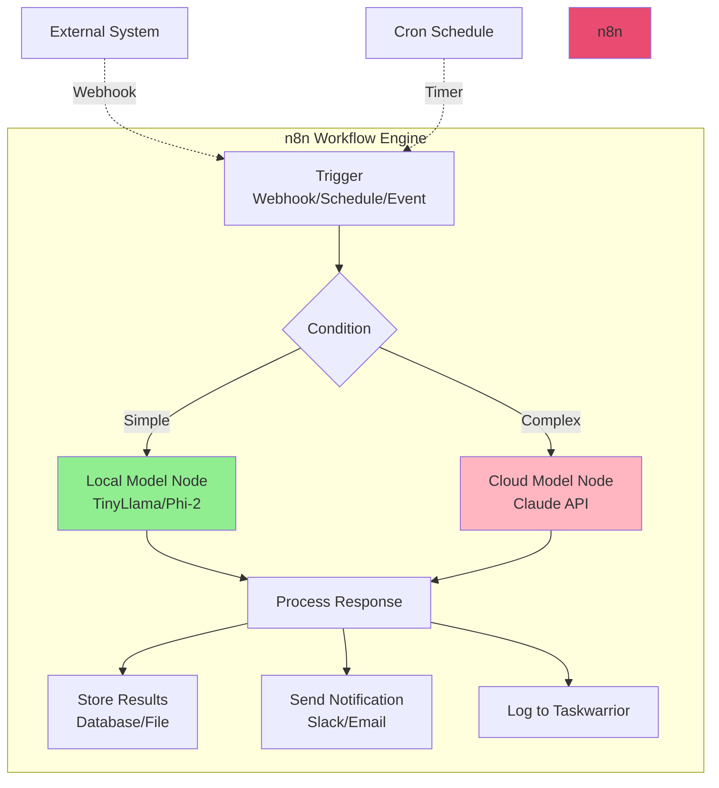
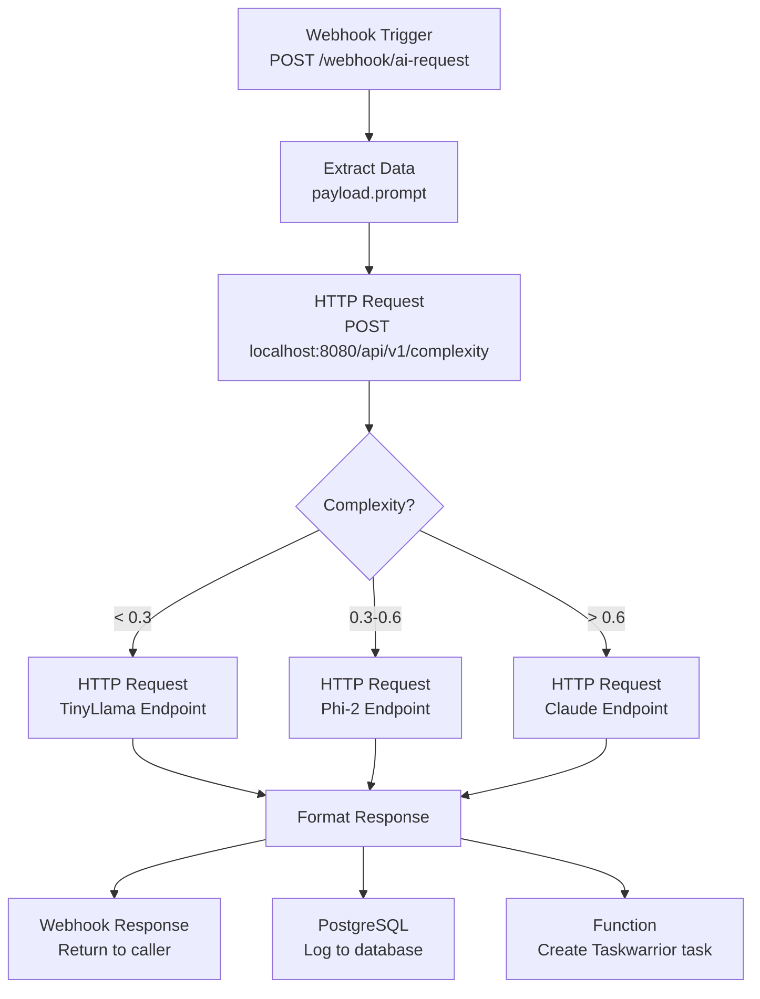
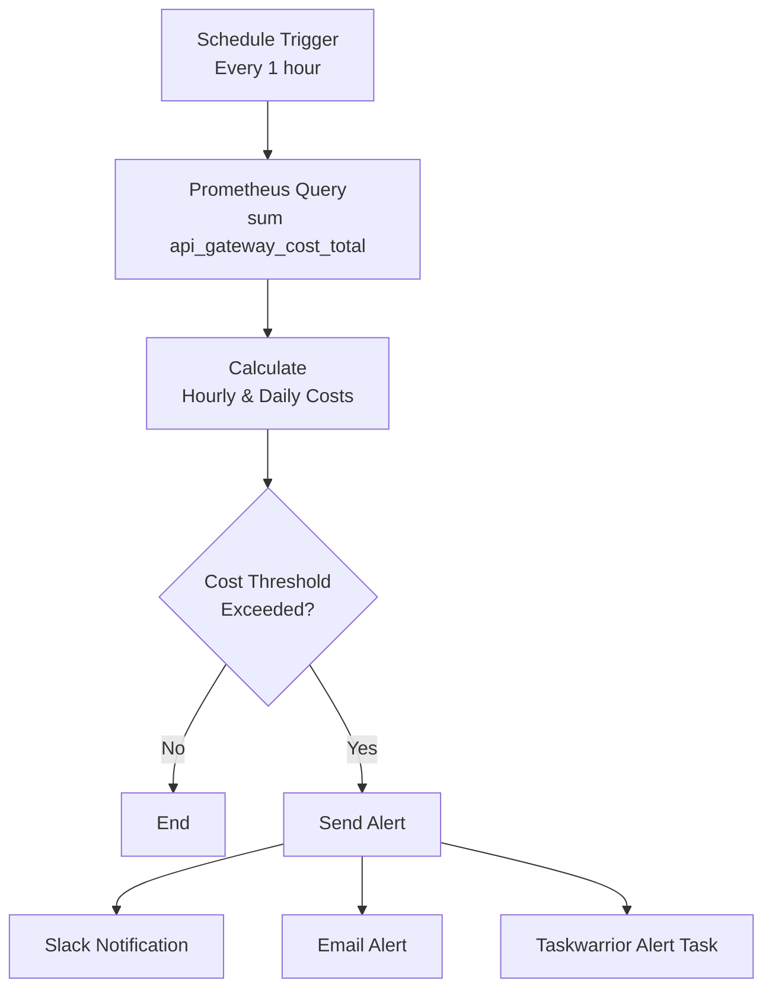
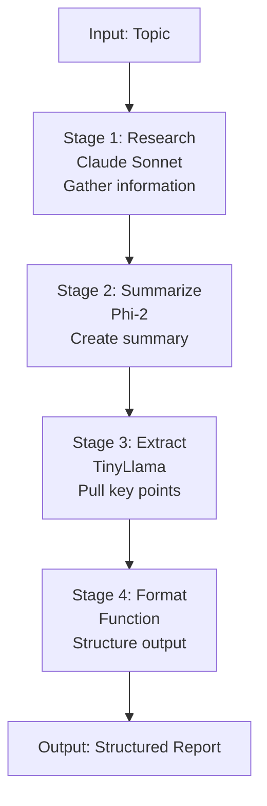

# 🔄 n8n Workflow Automation

> **Navigation**: [← Back to Examples](./EXAMPLES.md) | [Next: Taskwarrior →](./TASKWARRIOR.md)

<details>
<summary><b>📋 TL;DR</b> - Click to expand</summary>

**n8n workflows included:**
1. **Smart Routing Workflow** - Automated request routing
2. **Cost Monitoring** - Track and alert on API costs
3. **Performance Tracking** - Monitor latency and throughput
4. **Orchestrator Pipeline** - Complex multi-step AI workflows

**Access n8n:** http://localhost:5678

</details>

---

## Table of Contents
- [n8n Overview](#n8n-overview)
- [Workflow 1: Smart Routing Automation](#workflow-1-smart-routing-automation)
- [Workflow 2: Cost Monitoring & Alerts](#workflow-2-cost-monitoring--alerts)
- [Workflow 3: Performance Tracking](#workflow-3-performance-tracking)
- [Workflow 4: Multi-Stage AI Orchestrator](#workflow-4-multi-stage-ai-orchestrator)
- [Creating Custom Workflows](#creating-custom-workflows)
- [Workflow Best Practices](#workflow-best-practices)

## n8n Overview



### Key Features

| Feature | Description | Use Case |
|---------|-------------|----------|
| **Visual Workflow Builder** | Drag-and-drop node-based editor | Build complex logic visually |
| **100+ Integrations** | Pre-built nodes for popular services | Connect to Slack, Discord, databases |
| **Webhook Triggers** | HTTP endpoint triggers | Integrate with external systems |
| **Scheduled Execution** | Cron-based scheduling | Batch processing, reports |
| **Error Handling** | Built-in retry and error workflows | Robust production deployments |
| **JavaScript Functions** | Custom code nodes | Complex data transformations |

---

## Workflow 1: Smart Routing Automation

### Purpose
Automatically route incoming webhooks to appropriate AI models based on complexity.

### Workflow Diagram



### n8n Configuration

**File:** `workflows/smart_routing.json`


```json
{
  "name": "Smart AI Request Routing",
  "nodes": [
    {
      "parameters": {
        "httpMethod": "POST",
        "path": "ai-request",
        "responseMode": "responseNode"
      },
      "name": "Webhook",
      "type": "n8n-nodes-base.webhook",
      "position": [250, 300]
    },
    {
      "parameters": {
        "url": "http://api-gateway:8080/api/v1/complexity",
        "method": "POST",
        "jsonParameters": true,
        "options": {},
        "bodyParametersJson": "={{ { \"prompt\": $json.body.prompt } }}"
      },
      "name": "Estimate Complexity",
      "type": "n8n-nodes-base.httpRequest",
      "position": [450, 300]
    },
    {
      "parameters": {
        "conditions": {
          "number": [
            {
              "value1": "={{ $json.complexity }}",
              "operation": "smaller",
              "value2": 0.3
            }
          ]
        }
      },
      "name": "Route Decision",
      "type": "n8n-nodes-base.if",
      "position": [650, 300]
    },
    {
      "parameters": {
        "url": "http://ollama-cpu:11434/api/generate",
        "method": "POST",
        "jsonParameters": true,
        "bodyParametersJson": "={{ { \"model\": \"tinyllama\", \"prompt\": $json.prompt, \"stream\": false } }}"
      },
      "name": "TinyLlama Request",
      "type": "n8n-nodes-base.httpRequest",
      "position": [850, 200]
    },
    {
      "parameters": {
        "url": "http://api-gateway:8080/api/v1/chat",
        "method": "POST",
        "jsonParameters": true,
        "bodyParametersJson": "={{ { \"prompt\": $json.prompt } }}"
      },
      "name": "Smart Router",
      "type": "n8n-nodes-base.httpRequest",
      "position": [850, 400]
    },
    {
      "parameters": {
        "operation": "insert",
        "table": "ai_requests",
        "columns": "prompt,response,model,cost,complexity,timestamp"
      },
      "name": "Log to PostgreSQL",
      "type": "n8n-nodes-base.postgres",
      "position": [1050, 300]
    },
    {
      "parameters": {
        "functionCode": "// Create Taskwarrior task\nconst task = {\n  description: `AI Request: ${$json.model}`,\n  project: 'vps_ai.router',\n  tags: ['routing', 'automated'],\n  cost: $json.cost\n};\n\nreturn task;"
      },
      "name": "Taskwarrior Task",
      "type": "n8n-nodes-base.function",
      "position": [1250, 300]
    },
    {
      "parameters": {
        "respondWith": "json",
        "responseBody": "={{ $json }}"
      },
      "name": "Respond to Webhook",
      "type": "n8n-nodes-base.respondToWebhook",
      "position": [1450, 300]
    }
  ],
  "connections": {
    "Webhook": {
      "main": [[{"node": "Estimate Complexity", "type": "main", "index": 0}]]
    },
    "Estimate Complexity": {
      "main": [[{"node": "Route Decision", "type": "main", "index": 0}]]
    },
    "Route Decision": {
      "main": [
        [{"node": "TinyLlama Request", "type": "main", "index": 0}],
        [{"node": "Smart Router", "type": "main", "index": 0}]
      ]
    },
    "TinyLlama Request": {
      "main": [[{"node": "Log to PostgreSQL", "type": "main", "index": 0}]]
    },
    "Smart Router": {
      "main": [[{"node": "Log to PostgreSQL", "type": "main", "index": 0}]]
    },
    "Log to PostgreSQL": {
      "main": [[{"node": "Taskwarrior Task", "type": "main", "index": 0}]]
    },
    "Taskwarrior Task": {
      "main": [[{"node": "Respond to Webhook", "type": "main", "index": 0}]]
    }
  }
}
```


### How to Import

```bash
# 1. Access n8n
open http://localhost:5678

# 2. Import workflow
# Click "Workflows" → "Import from File"
# Select: workflows/smart_routing.json

# 3. Activate workflow
# Toggle "Active" switch

# 4. Test webhook
curl -X POST http://localhost:5678/webhook/ai-request \
  -H "Content-Type: application/json" \
  -d '{"prompt": "What is Python?"}'
```

---

## Workflow 2: Cost Monitoring & Alerts

### Purpose
Monitor API costs in real-time and send alerts when thresholds are exceeded.

### Workflow Diagram



### Implementation

**File:** `workflows/cost_monitor.json`


```json
{
  "name": "Cost Monitoring & Alerts",
  "nodes": [
    {
      "parameters": {
        "rule": {
          "interval": [{"field": "hours", "hoursInterval": 1}]
        }
      },
      "name": "Schedule",
      "type": "n8n-nodes-base.scheduleTrigger",
      "position": [250, 300]
    },
    {
      "parameters": {
        "url": "http://prometheus:9090/api/v1/query",
        "qs": {
          "query": "sum(api_gateway_cost_total)"
        }
      },
      "name": "Query Total Costs",
      "type": "n8n-nodes-base.httpRequest",
      "position": [450, 300]
    },
    {
      "parameters": {
        "url": "http://prometheus:9090/api/v1/query",
        "qs": {
          "query": "sum(rate(api_gateway_cost_total[1h])) * 730"
        }
      },
      "name": "Query Monthly Projection",
      "type": "n8n-nodes-base.httpRequest",
      "position": [450, 450]
    },
    {
      "parameters": {
        "functionCode": "// Calculate cost metrics\nconst totalCost = parseFloat($input.first().json.data.result[0].value[1]);\nconst monthlyProjection = parseFloat($input.last().json.data.result[0].value[1]);\n\n// Thresholds\nconst DAILY_THRESHOLD = 10;  // $10/day\nconst MONTHLY_THRESHOLD = 200;  // $200/month\n\nconst alert = {\n  total_cost: totalCost.toFixed(2),\n  monthly_projection: monthlyProjection.toFixed(2),\n  daily_threshold_exceeded: totalCost > DAILY_THRESHOLD,\n  monthly_threshold_exceeded: monthlyProjection > MONTHLY_THRESHOLD,\n  timestamp: new Date().toISOString()\n};\n\nreturn alert;"
      },
      "name": "Calculate Metrics",
      "type": "n8n-nodes-base.function",
      "position": [650, 375]
    },
    {
      "parameters": {
        "conditions": {
          "boolean": [
            {
              "value1": "={{ $json.daily_threshold_exceeded || $json.monthly_threshold_exceeded }}",
              "value2": true
            }
          ]
        }
      },
      "name": "Check Thresholds",
      "type": "n8n-nodes-base.if",
      "position": [850, 375]
    },
    {
      "parameters": {
        "channel": "#ai-alerts",
        "text": "🚨 API Cost Alert!\n\nTotal Cost: ${{ $json.total_cost }}\nMonthly Projection: ${{ $json.monthly_projection }}\n\nTime to optimize routing!",
        "attachments": []
      },
      "name": "Slack Alert",
      "type": "n8n-nodes-base.slack",
      "position": [1050, 300]
    },
    {
      "parameters": {
        "fromEmail": "alerts@yourdomain.com",
        "toEmail": "admin@yourdomain.com",
        "subject": "AI Stack Cost Alert",
        "text": "API costs have exceeded thresholds.\n\nDetails:\nTotal: ${{ $json.total_cost }}\nProjected Monthly: ${{ $json.monthly_projection }}"
      },
      "name": "Email Alert",
      "type": "n8n-nodes-base.emailSend",
      "position": [1050, 450]
    }
  ],
  "connections": {
    "Schedule": {
      "main": [
        [
          {"node": "Query Total Costs", "type": "main", "index": 0},
          {"node": "Query Monthly Projection", "type": "main", "index": 0}
        ]
      ]
    },
    "Query Total Costs": {
      "main": [[{"node": "Calculate Metrics", "type": "main", "index": 0}]]
    },
    "Query Monthly Projection": {
      "main": [[{"node": "Calculate Metrics", "type": "main", "index": 0}]]
    },
    "Calculate Metrics": {
      "main": [[{"node": "Check Thresholds", "type": "main", "index": 0}]]
    },
    "Check Thresholds": {
      "main": [
        [
          {"node": "Slack Alert", "type": "main", "index": 0},
          {"node": "Email Alert", "type": "main", "index": 0}
        ]
      ]
    }
  }
}
```


---

## Workflow 3: Performance Tracking

### Purpose
Track model performance metrics and generate weekly reports.

### Key Metrics
- Request latency by model
- Success/error rates
- Model utilization
- Cost per request

### Implementation


```json
{
  "name": "Performance Tracking Report",
  "nodes": [
    {
      "parameters": {
        "rule": {
          "interval": [{"field": "weeks", "weeksInterval": 1}]
        }
      },
      "name": "Weekly Schedule",
      "type": "n8n-nodes-base.scheduleTrigger"
    },
    {
      "parameters": {
        "functionCode": "// Query Prometheus for weekly metrics\nconst queries = [\n  'sum(api_gateway_requests_total[7d])',\n  'avg(api_gateway_request_duration_seconds[7d])',\n  'sum by (model) (api_gateway_requests_total[7d])',\n  'sum(api_gateway_cost_total[7d])'\n];\n\nreturn queries.map(q => ({query: q}));"
      },
      "name": "Prepare Queries",
      "type": "n8n-nodes-base.function"
    },
    {
      "parameters": {
        "url": "http://prometheus:9090/api/v1/query",
        "qs": {
          "query": "={{ $json.query }}"
        }
      },
      "name": "Execute Queries",
      "type": "n8n-nodes-base.httpRequest"
    },
    {
      "parameters": {
        "functionCode": "// Generate report\nconst data = $input.all();\n\nconst report = {\n  period: 'Last 7 days',\n  total_requests: parseFloat(data[0].json.data.result[0].value[1]),\n  avg_latency: parseFloat(data[1].json.data.result[0].value[1]).toFixed(2),\n  total_cost: parseFloat(data[3].json.data.result[0].value[1]).toFixed(2),\n  by_model: data[2].json.data.result.map(r => ({\n    model: r.metric.model,\n    requests: r.value[1]\n  }))\n};\n\nreturn report;"
      },
      "name": "Generate Report",
      "type": "n8n-nodes-base.function"
    },
    {
      "parameters": {
        "channel": "#ai-reports",
        "text": "📊 Weekly Performance Report\n\nPeriod: {{ $json.period }}\nTotal Requests: {{ $json.total_requests }}\nAvg Latency: {{ $json.avg_latency }}s\nTotal Cost: ${{ $json.total_cost }}"
      },
      "name": "Post to Slack",
      "type": "n8n-nodes-base.slack"
    }
  ]
}
```


---

## Workflow 4: Multi-Stage AI Orchestrator

### Purpose
Orchestrate complex multi-step AI workflows (e.g., research → summarize → extract data).

### Workflow Example



### Use Case: Content Research Pipeline


```json
{
  "name": "Content Research Pipeline",
  "description": "Research topic → Summarize → Extract key points",
  "nodes": [
    {
      "parameters": {
        "httpMethod": "POST",
        "path": "research",
        "responseMode": "responseNode"
      },
      "name": "Research Trigger",
      "type": "n8n-nodes-base.webhook"
    },
    {
      "parameters": {
        "url": "http://api-gateway:8080/api/v1/chat",
        "method": "POST",
        "jsonParameters": true,
        "bodyParametersJson": "={{ { \"prompt\": \"Research this topic comprehensively: \" + $json.body.topic + \". Provide detailed information from multiple angles.\" } }}"
      },
      "name": "Stage 1: Deep Research (Claude)",
      "type": "n8n-nodes-base.httpRequest"
    },
    {
      "parameters": {
        "url": "http://ollama-cpu:11434/api/generate",
        "method": "POST",
        "jsonParameters": true,
        "bodyParametersJson": "={{ { \"model\": \"phi2\", \"prompt\": \"Summarize this research in 3-5 paragraphs:\\n\\n\" + $json.response, \"stream\": false } }}"
      },
      "name": "Stage 2: Summarize (Phi-2)",
      "type": "n8n-nodes-base.httpRequest"
    },
    {
      "parameters": {
        "url": "http://ollama-cpu:11434/api/generate",
        "method": "POST",
        "jsonParameters": true,
        "bodyParametersJson": "={{ { \"model\": \"tinyllama\", \"prompt\": \"Extract 5 key bullet points from:\\n\\n\" + $json.response, \"stream\": false } }}"
      },
      "name": "Stage 3: Key Points (TinyLlama)",
      "type": "n8n-nodes-base.httpRequest"
    },
    {
      "parameters": {
        "functionCode": "// Format final output\nconst output = {\n  topic: $input.first().json.body.topic,\n  research: $input.item(1).json.response,\n  summary: $input.item(2).json.response,\n  key_points: $input.last().json.response,\n  total_cost: [\n    $input.item(1).json.cost || 0,\n    $input.item(2).json.cost || 0,\n    $input.item(3).json.cost || 0\n  ].reduce((a,b) => a+b, 0),\n  timestamp: new Date().toISOString()\n};\n\nreturn output;"
      },
      "name": "Stage 4: Format Output",
      "type": "n8n-nodes-base.function"
    },
    {
      "parameters": {
        "respondWith": "json",
        "responseBody": "={{ $json }}"
      },
      "name": "Return Response",
      "type": "n8n-nodes-base.respondToWebhook"
    }
  ]
}
```

**Test it:**

```bash
curl -X POST http://localhost:5678/webhook/research \
  -H "Content-Type: application/json" \
  -d '{"topic": "The history of artificial intelligence"}'
```

---

## Creating Custom Workflows

### Basic Template

```javascript
// 1. Create a new workflow in n8n
// 2. Add a Webhook trigger
// 3. Add HTTP Request node to API Gateway
// 4. Add Function node for processing
// 5. Add response or storage nodes

// Example Function Node:
const prompt = $json.body.text;
const complexity = $json.body.complexity || 0.5;

// Route to appropriate model
let endpoint;
if (complexity < 0.3) {
  endpoint = 'http://ollama-cpu:11434/api/generate';
  model = 'tinyllama';
} else if (complexity < 0.6) {
  endpoint = 'http://ollama-cpu:11434/api/generate';
  model = 'phi2';
} else {
  endpoint = 'http://api-gateway:8080/api/v1/chat';
}

return {
  endpoint,
  model,
  prompt
};
```

---

## Workflow Best Practices

### 1. Error Handling

```json

{
  "parameters": {
    "rules": {
      "values": [
        {
          "conditions": {
            "string": [
              {
                "value1": "={{ $json.error }}",
                "operation": "isNotEmpty"
              }
            ]
          }
        }
      ]
    }
  },
  "name": "Error Handler",
  "type": "n8n-nodes-base.switch"
}
```

### 2. Retry Logic


```json
{
  "parameters": {

    "maxTries": 3,
    "waitBetweenTries": 1000
  },
  "name": "HTTP Request with Retry",
  "type": "n8n-nodes-base.httpRequest",
  "retryOnFail": true
}
```

### 3. Rate Limiting

```javascript

// Add delay between requests
const delay = (ms) => new Promise(resolve => setTimeout(resolve, ms));
await delay(100);  // 100ms delay
return $input.all();
```

### 4. Cost Tracking

```javascript
// Track costs in every workflow
const cost = $json.cost || 0;

// Create Taskwarrior task
const task = {
  description: `Workflow: ${workflow.name}`,
  project: 'vps_ai.workflows',
  tags: ['automated', 'n8n'],
  cost: cost
};

// Log to database
await $item(0).$node["PostgreSQL"].execute({
  operation: 'insert',
  table: 'workflow_costs',
  columns: 'workflow_name,cost,timestamp',
  values: [workflow.name, cost, new Date()]
});
```

---

**Related Documentation:**
- [Examples](./EXAMPLES.md)
- [Architecture Overview](./ARCHITECTURE.md)
- [Taskwarrior Integration](./TASKWARRIOR.md)
- [Monitoring Guide](./MONITORING.md)

[⬆ Back to Top](#-n8n-workflow-automation)
