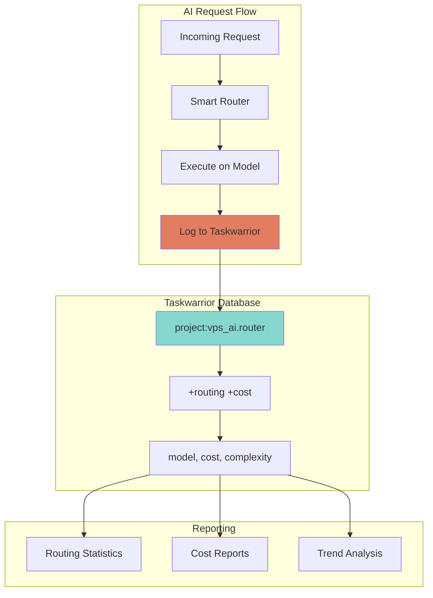

# ✅ Taskwarrior Integration Guide

> **Navigation**: [← Back to N8N Workflows](./N8N-WORKFLOWS.md) | [Back to Docs Hub](./README.md)

<details>
<summary><b>📋 TL;DR</b> - Click to expand</summary>

**Taskwarrior tracks everything:**
- Every AI request (model, cost, complexity)
- Deployment tasks and status
- Cost reports and analytics
- System maintenance tasks

**Quick commands:**
```bash
source scripts/tw-helper.sh
tw_routing_stats      # View routing stats
tw_cost_report        # Monthly cost report
tw_quick_add "task"   # Add quick task
```

</details>

---

## Table of Contents
- [Taskwarrior Overview](#taskwarrior-overview)
- [Project Structure](#project-structure)
- [Routing Task Tracking](#routing-task-tracking)
- [Cost Tracking](#cost-tracking)
- [Helper Functions](#helper-functions)
- [Reporting & Analytics](#reporting--analytics)
- [Advanced Usage](#advanced-usage)

## Taskwarrior Overview

Taskwarrior is integrated throughout the Hybrid AI Stack to provide comprehensive tracking of:

1. **AI Request Routing** - Every model selection logged
2. **Cost Tracking** - Real-time API cost accumulation
3. **Deployment Tasks** - Infrastructure deployment status
4. **System Maintenance** - Scheduled maintenance and updates



---

## Project Structure

### Project Hierarchy

```
vps_ai                           # Root project
├── vps_ai.router                # Smart routing tasks
├── vps_ai.deployment            # Deployment tracking
├── vps_ai.maintenance           # System maintenance
└── vps_ai.workflows             # n8n workflow tasks
```

### Tag System

| Tag | Purpose | Example |
|-----|---------|---------|
| `+routing` | AI routing decisions | Model selection |
| `+cost` | Has associated cost | Claude API calls |
| `+local` | Local model execution | TinyLlama, Phi-2 |
| `+cloud` | Cloud API execution | Claude Sonnet |
| `+deployment` | Infrastructure deployment | AWS, GCP, Docker |
| `+maintenance` | System maintenance | Updates, backups |
| `+automated` | Auto-created tasks | Smart router logs |

### Custom Attributes

```bash
# View custom attributes
task show | grep UDA

# Defined attributes:
# - model: Which AI model was used
# - cost: API cost in USD
# - complexity: Estimated complexity (0-1)
# - backend: local or cloud
```

---

## Routing Task Tracking

### Automatic Logging

Every AI request creates a Taskwarrior task:

```python
# From smart_router.py
def log_to_taskwarrior(self, prompt, model, cost, complexity):
    """Log routing decision to Taskwarrior"""
    description = f"AI Request: {model}"

    tags = ['routing', 'automated']
    if cost > 0:
        tags.append('cost')
        tags.append('cloud')
    else:
        tags.append('local')

    # Create task
    subprocess.run([
        'task', 'add',
        description,
        f'project:vps_ai.router',
        f'model:{model}',
        f'cost:{cost}',
        f'complexity:{complexity}',
        *[f'+{tag}' for tag in tags]
    ])
```

### Example Tasks

```bash
# View recent routing tasks
task project:vps_ai.router list

# Example output:
ID Description                 Model         Cost    Tags
1  AI Request: tinyllama       tinyllama     $0.00   routing local automated
2  AI Request: phi2            phi2          $0.00   routing local automated
3  AI Request: claude-sonnet   claude-sonnet $0.0045 routing cloud cost automated
```

---

## Cost Tracking

### Real-Time Cost Accumulation

```bash
# View all tasks with costs
task +cost list

# Total costs this month
task +cost export | jq -r '.[].cost' | awk '{sum+=$1} END {print "$"sum}'

# Costs by model
task +cost export | jq -r '.[] | "\(.model): \(.cost)"' | \
  awk '{model=$1; cost=$2; costs[model]+=cost} END {for (m in costs) print m": $"costs[m]}'
```

### Cost Reports

```bash
# Source helper functions
source scripts/tw-helper.sh

# Monthly cost report
tw_cost_report

# Example output:
════════════════════════════════════════════════════════════
  Cost Report - January 2025
════════════════════════════════════════════════════════════

Total Requests: 1,245
  Local (Free):    871 (70.0%)
  Cloud (Paid):    374 (30.0%)

Costs by Model:
  tinyllama:     $0.00 (587 requests)
  phi2:          $0.00 (284 requests)
  claude-sonnet: $11.22 (374 requests)

Total Cost: $11.22

Cloud-Only Estimate: $37.35
Savings: $26.13 (70%)

════════════════════════════════════════════════════════════
```

---

## Helper Functions

### Available Functions

**File:** `scripts/tw-helper.sh`

```bash
# Source helper functions
source scripts/tw-helper.sh

# Available functions:
tw_quick_add        # Quickly add a task
tw_start           # Start working on a task
tw_complete        # Complete a task with annotation
tw_chain           # Create task dependency chain
tw_annotate_system # Add system info to task
tw_init_deployment # Initialize deployment tracking
tw_routing_stats   # Show routing statistics
tw_cost_report     # Generate cost report
tw_track_cost      # Track a cost manually
```

### Function Details

#### `tw_quick_add` - Quick Task Creation

```bash
# Add a simple task
tw_quick_add "Review API logs"

# Add with project
tw_quick_add "Deploy to AWS" vps_ai.deployment

# Add with tags
tw_quick_add "Update documentation" vps_ai.maintenance +docs
```

#### `tw_start` - Start Task

```bash
# Start a task by ID
tw_start 42

# Adds annotation:
# "Started at 2025-01-15 10:30:45"
```

#### `tw_complete` - Complete Task

```bash
# Complete with success message
tw_complete 42 "Deployment successful, all tests passed"

# Adds annotation and marks done
```

#### `tw_chain` - Create Dependencies

```bash
# Create dependency chain
tw_chain \
  "Pull Docker images" \
  "Start containers" \
  "Run health checks" \
  "Deploy to production"

# Creates tasks 1 → 2 → 3 → 4 with dependencies
```

#### `tw_init_deployment` - Deployment Tracking

```bash
# Initialize deployment tracking
tw_init_deployment "aws" 2

# Creates:
# - Main deployment task
# - Infrastructure setup
# - Service deployment
# - Health checks
# - All linked as dependencies
```

#### `tw_routing_stats` - Routing Statistics

```bash
tw_routing_stats

# Output:
════════════════════════════════════════════════════════════
  Routing Statistics
════════════════════════════════════════════════════════════

Total Routing Decisions: 1,245

By Model:
  tinyllama:      587 (47.1%)
  phi2:           284 (22.8%)
  claude-sonnet:  374 (30.0%)

By Backend:
  Local:  871 (70.0%)
  Cloud:  374 (30.0%)

Average Complexity:
  Overall: 0.42
  TinyLlama: 0.18
  Phi-2: 0.45
  Claude: 0.72

════════════════════════════════════════════════════════════
```

#### `tw_track_cost` - Manual Cost Tracking

```bash
# Track a cost manually
tw_track_cost 0.045 claude-sonnet "Complex code review"

# Creates task with cost tracking
```

---

## Reporting & Analytics

### Daily Report

```bash
#!/bin/bash
# scripts/daily_report.sh

echo "=== Daily AI Stack Report ==="
echo ""

# Today's requests
today=$(date +%Y-%m-%d)
requests=$(task project:vps_ai.router entry.after:$today count)
echo "Requests Today: $requests"

# Today's costs
costs=$(task project:vps_ai.router +cost entry.after:$today export | \
  jq -r '.[].cost' | awk '{sum+=$1} END {print sum}')
echo "Costs Today: \$$costs"

# Model distribution
echo ""
echo "Model Distribution:"
task project:vps_ai.router entry.after:$today export | \
  jq -r '.[] | .model' | sort | uniq -c | sort -rn

# Pending tasks
echo ""
echo "Pending Tasks:"
task project:vps_ai status:pending count
```

### Weekly Trends

```bash
#!/bin/bash
# scripts/weekly_trends.sh

echo "=== Weekly Trends ==="

for i in {0..6}; do
  date=$(date -d "$i days ago" +%Y-%m-%d)
  count=$(task project:vps_ai.router entry:$date count)
  cost=$(task project:vps_ai.router +cost entry:$date export | \
    jq -r '.[].cost' | awk '{sum+=$1} END {print sum}')

  printf "%s: %4d requests, \$%6.2f\n" "$date" "$count" "$cost"
done
```

### Cost Analysis

```bash
#!/bin/bash
# scripts/cost_analysis.sh

echo "=== Cost Analysis ==="

# This month
month=$(date +%Y-%m)
monthly_cost=$(task project:vps_ai.router +cost entry.after:${month}-01 export | \
  jq -r '.[].cost' | awk '{sum+=$1} END {print sum}')

# Requests by model
echo ""
echo "Costs by Model (This Month):"
task project:vps_ai.router +cost entry.after:${month}-01 export | \
  jq -r '.[] | "\(.model) \(.cost)"' | \
  awk '{model=$1; cost=$2; costs[model]+=cost; count[model]++}
       END {for (m in costs) printf "%s: $%.2f (%d requests, avg $%.4f)\n",
       m, costs[m], count[m], costs[m]/count[m]}' | \
  column -t

# Projected monthly cost
days_in_month=$(date -d "$(date +%Y-%m-01) +1 month -1 day" +%d)
current_day=$(date +%d)
projected=$(echo "$monthly_cost * $days_in_month / $current_day" | bc -l)

echo ""
printf "Current Month Total: \$%.2f\n" "$monthly_cost"
printf "Projected End-of-Month: \$%.2f\n" "$projected"
```

---

## Advanced Usage

### Custom Reports

```bash
# Tasks completed last week
task project:vps_ai end.after:today-7days completed

# High-cost requests (>$0.01)
task +cost cost.above:0.01 list

# Complex requests (complexity >0.7)
task complexity.above:0.7 list

# Local model performance
task +local -cost count
```

### Filters and Searches

```bash
# All cloud requests this month
task project:vps_ai.router +cloud entry.after:2025-01-01 list

# Failed deployments
task project:vps_ai.deployment status:failed list

# Tasks with annotations
task project:vps_ai +ANNOTATED list

# Export to JSON for analysis
task project:vps_ai.router export > routing_data.json
```

### Integration with Scripts

```python
#!/usr/bin/env python3
"""
Analyze Taskwarrior data with Python
"""

import subprocess
import json

# Get all routing tasks
result = subprocess.run(
    ['task', 'project:vps_ai.router', 'export'],
    capture_output=True,
    text=True
)

tasks = json.loads(result.stdout)

# Analyze
total_cost = sum(float(t.get('cost', 0)) for t in tasks)
total_requests = len(tasks)
avg_cost = total_cost / total_requests if total_requests > 0 else 0

print(f"Total Requests: {total_requests}")
print(f"Total Cost: ${total_cost:.2f}")
print(f"Average Cost: ${avg_cost:.4f}")

# Model distribution
models = {}
for task in tasks:
    model = task.get('model', 'unknown')
    models[model] = models.get(model, 0) + 1

print("\nModel Distribution:")
for model, count in sorted(models.items(), key=lambda x: x[1], reverse=True):
    pct = (count / total_requests) * 100
    print(f"  {model}: {count} ({pct:.1f}%)")
```

### Automated Cleanup

```bash
#!/bin/bash
# scripts/cleanup_tasks.sh

# Archive completed tasks older than 30 days
task project:vps_ai status:completed end.before:today-30days delete

# Remove automated routing tasks older than 90 days
task project:vps_ai.router +automated entry.before:today-90days delete

echo "Cleanup complete"
```

---

## Taskwarrior Configuration

### Custom Configuration

**File:** `~/.taskrc`

```bash
# Hybrid AI Stack configuration

# Default project
default.project=vps_ai

# Custom reports
report.routing.description=AI Routing Tasks
report.routing.columns=id,project,description,model,cost,tags
report.routing.filter=project:vps_ai.router

report.costs.description=Tasks with Costs
report.costs.columns=id,description,model,cost,entry.age
report.costs.filter=+cost
report.costs.sort=cost-

# Color rules
color.tag.routing=blue
color.tag.cost=red
color.tag.local=green
color.tag.cloud=yellow

# UDAs (User Defined Attributes)
uda.model.type=string
uda.model.label=Model
uda.cost.type=numeric
uda.cost.label=Cost
uda.complexity.type=numeric
uda.complexity.label=Complexity
uda.backend.type=string
uda.backend.label=Backend
```

### Custom Aliases

```bash
# Add to ~/.bashrc or ~/.zshrc

alias tw='task'
alias twr='task project:vps_ai.router'
alias twc='task +cost'
alias twl='task +local'
alias tws='source scripts/tw-helper.sh && tw_routing_stats'
alias twcr='source scripts/tw-helper.sh && tw_cost_report'
```

---

## Best Practices

### 1. Regular Reviews

```bash
# Daily: Review yesterday's routing
task project:vps_ai.router entry.after:yesterday list

# Weekly: Generate cost report
tw_cost_report

# Monthly: Analyze trends and optimize
scripts/cost_analysis.sh
```

### 2. Annotate Important Tasks

```bash
# Add context to tasks
task 42 annotate "Increased routing threshold from 0.3 to 0.4"

# Add system information
tw_annotate_system 42
```

### 3. Use Dependencies

```bash
# Chain related tasks
task add "Deploy infrastructure" project:vps_ai.deployment
task add "Configure services" project:vps_ai.deployment depends:1
task add "Run tests" project:vps_ai.deployment depends:2
```

### 4. Export Data Regularly

```bash
# Backup Taskwarrior data
task export > backup-$(date +%Y-%m-%d).json

# Sync to remote (if using taskserver)
task sync
```

### 5. Monitor Costs

```bash
# Set up daily cost check
echo "0 9 * * * /home/user/hybrid-ai-stack/scripts/daily_report.sh | mail -s 'Daily AI Stack Report' admin@example.com" | crontab -
```

---

**Related Documentation:**
- [Cost Optimization](./COST-OPTIMIZATION.md)
- [N8N Workflows](./N8N-WORKFLOWS.md)
- [Monitoring Guide](./MONITORING.md)
- [Examples](./EXAMPLES.md)

[⬆ Back to Top](#-taskwarrior-integration-guide)
