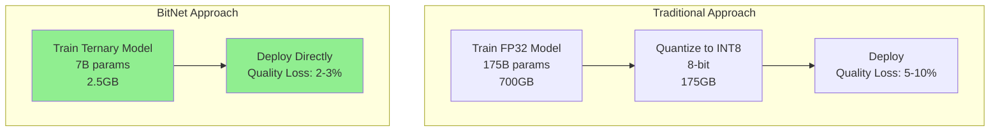

# ⚡ Ternary Quantization Guide (BitNet 1.58-bit)

> **Navigation**: [← Back to Docs Hub](./README.md) | [VPS Tiers →](./VPS-TIERS.md)

<details>
<summary><b>📋 TL;DR</b> - Click to expand</summary>

**Microsoft BitNet enables running 7B models on 8GB RAM with 6x faster inference**

- **Memory**: 16x smaller (7B model: 28GB → 2.5GB)
- **Speed**: 6x faster inference on CPU
- **Energy**: 82% reduction vs FP16
- **Quality**: 2-3% accuracy drop vs full-precision
- **Cost**: $0 per request (runs locally)

**Quick Start:**
```bash
./scripts/install_ternary.sh
./scripts/download_ternary_models.sh
docker-compose --profile ternary up -d
```

</details>

---

## Table of Contents
- [What is Ternary Quantization?](#what-is-ternary-quantization)
- [Microsoft BitNet Overview](#microsoft-bitnet-overview)
- [Technical Architecture](#technical-architecture)
- [Performance Benchmarks](#performance-benchmarks)
- [Available Models](#available-models)
- [Installation Guide](#installation-guide)
- [Usage Examples](#usage-examples)
- [Comparison vs Standard Models](#comparison-vs-standard-models)
- [Limitations & Trade-offs](#limitations--trade-offs)
- [FAQ](#faq)

---

## What is Ternary Quantization?

Ternary quantization constrains neural network weights to just **three values: {-1, 0, +1}**, achieving 1.58-bit precision (log₂(3) ≈ 1.58). This revolutionary approach:

**Traditional Model (FP16):**
- Weight: 0.7382915 (16 bits per weight)
- Requires floating-point multiplication
- High memory (2 bytes/weight)
- Energy-intensive arithmetic

**Ternary Model (1.58-bit):**
- Weight: -1, 0, or +1 (1.58 bits per weight)
- Multiplication becomes addition/subtraction
- Minimal memory (0.2 bytes/weight)
- 71.4x less arithmetic energy

### The Paradigm Shift

BitNet isn't post-training quantization—it's **native quantization-aware training**. Models learn with ternary weights from scratch, avoiding the quality degradation typical of compression techniques.



---

## Microsoft BitNet Overview

### Timeline

| Date | Release | Description |
|------|---------|-------------|
| **Oct 2023** | BitNet 1.0 | Binary weights {-1, +1}, 8-bit activations |
| **Feb 2024** | BitNet b1.58 | Ternary weights {-1, 0, +1}, breakthrough performance |
| **Oct 2024** | bitnet.cpp 1.0 | Official CPU inference framework |
| **Apr 2025** | BitNet 2B4T | First production-ready open-source model (MIT license) |
| **May 2025** | GPU Support | Custom CUDA kernels released |

### Key Innovations

**1. BitLinear Layers**
Replace standard linear transformations with quantized equivalents:

```python
# Standard Linear Layer
output = weights_fp16 @ inputs_fp16  # Expensive FP16 multiply

# BitLinear Layer
weights_ternary = {-1, 0, +1}  # Quantized
output = weights_ternary @ inputs_int8  # Cheap INT8 add/subtract
```

**2. Straight-Through Estimators (STE)**
During training:
- Forward pass: Use quantized {-1, 0, +1} weights
- Backward pass: Gradients flow through as if quantization is identity function
- Shadow weights: Maintain FP16 weights for optimizer updates

**3. AbsMean Quantization**
```python
W_scaled = W / (mean(|W|) + ε)
W_quantized = RoundClip(W_scaled, -1, 1)
```

Normalizes weights before rounding to ensure balanced distribution across {-1, 0, +1}.

---

## Technical Architecture

### BitNet b1.58 2B4T Model Specifications

**Architecture:**
- **Parameters**: 2 billion (non-embedding)
- **Training Data**: 4 trillion tokens (LLaMA 3 tokenizer)
- **Context Window**: 4,096 tokens (RoPE embeddings)
- **Quantization**: W1.58A8 (1.58-bit weights, 8-bit activations)
- **Normalization**: SubLN (substitute layer normalization)
- **Activation**: Squared ReLU (ReLU²) for enhanced sparsity

**Memory Footprint:**
- **Model Weights**: 0.4 GB (vs 1.4-4.8 GB for FP16 2B models)
- **Compression Ratio**: 3.5x to 12x smaller
- **Runtime RAM**: ~2.5 GB total (including activations)

**Performance:**
- **Latency**: 29ms per token (Intel i7-13800H, 8 threads)
- **Throughput**: 120 tokens/second (estimated 7B ternary model)
- **Energy**: 0.028J per token (vs 0.186J for Gemma-3 1B)

### How Ternary Quantization Works

#### 1. Weight Quantization Process

```python
# Step 1: Calculate scaling factor
scale = mean(abs(W)) + epsilon

# Step 2: Normalize weights
W_normalized = W / scale

# Step 3: Round to {-1, 0, +1}
W_quantized = round(clip(W_normalized, -1, 1))

# Step 4: Pack 4 ternary values per INT8 (storage optimization)
# -1 → 0b00, 0 → 0b01, +1 → 0b10
```

#### 2. Activation Quantization

```python
# Per-token absmax quantization (inference)
X_scale = max(abs(X)) / 127
X_quantized = clip(X / X_scale, -128, 127).round().int8()

# Per-tensor quantization (training)
X_scale = max(abs(X_tensor)) / 127
```

#### 3. Matrix Multiplication

Traditional FP16:
```
Result = Weight (FP16) × Input (FP16)
Energy: 0.34 pJ per operation
```

Ternary INT8:
```
Result = Weight {-1,0,+1} × Input (INT8)
Operations:
  - Weight = -1: Negate input
  - Weight =  0: Zero (skip)
  - Weight = +1: Pass through
Energy: 0.007 pJ per operation (71.4x reduction)
```

### BitLinear Layer Implementation

```python
class BitLinear(nn.Module):
    def forward(self, x):
        # 1. Normalize activations (parameter-free LayerNorm)
        x_norm = (x - x.mean()) / (x.std() + eps)

        # 2. Quantize weights to {-1, 0, +1}
        w_scale = self.weight.abs().mean() + eps
        w_quant = torch.round(torch.clamp(self.weight / w_scale, -1, 1))

        # 3. Quantize activations to INT8
        x_scale = x_norm.abs().max() / 127
        x_quant = torch.round(torch.clamp(x_norm / x_scale, -128, 127))

        # 4. Perform quantized matrix multiplication
        output = F.linear(x_quant, w_quant)

        # 5. Dequantize output
        output = output * x_scale * w_scale

        return output
```

---

## Performance Benchmarks

### CPU Inference (bitnet.cpp Framework)

**ARM CPUs (Apple M2 Ultra):**

| Model | Standard (llama.cpp) | BitNet Ternary | Speedup | Energy Savings |
|-------|---------------------|----------------|---------|----------------|
| 7B | 15.6 tok/s (3.013J) | 52.36 tok/s (1.068J) | **3.35x** | **64.6%** |
| 13B | - | - | - | - |
| 70B | 5.53 tok/s (28.02J) | 8.67 tok/s (8.42J) | **5.07x** | **70.0%** |
| 100B | 1.29 tok/s | 6.58 tok/s | **5.10x** | **~70%** |

**x86 CPUs (Intel i7-13700H):**

| Model | Standard | BitNet Ternary | Speedup | Energy Savings |
|-------|---------|----------------|---------|----------------|
| 7B | 3.30 tok/s (11.305J) | 18.75 tok/s (2.017J) | **5.68x** | **82.2%** |
| 13B | 1.78 tok/s | 10.99 tok/s | **6.17x** | **~80%** |

**BitNet b1.58 2B Model (Production):**

| Metric | BitNet 2B | LLaMA 3.2 1B | Gemma-3 1B | Qwen2.5 1.5B | MiniCPM 2B |
|--------|-----------|--------------|------------|--------------|------------|
| **Latency** | **29ms** | 48ms | 41ms | 65ms | 124ms |
| **Memory** | **0.4 GB** | 1.4 GB | 1.3 GB | 1.8 GB | 4.8 GB |
| **Energy** | **0.028J** | 0.258J | 0.186J | - | 0.649J |
| **MMLU** | 53.17% | 44.90% | 43.74% | **60.25%** | 42.05% |
| **GSM8K** | **58.38%** | 34.36% | 37.12% | 56.79% | 31.15% |

**Key Observations:**
- 1.41x to 4.28x faster than comparable full-precision models
- 3.5x to 12x less memory
- 6.6x to 23.2x more energy-efficient
- Competitive accuracy (53% MMLU vs 44-60% for competitors)

### Quality vs Standard Models

**Accuracy Benchmarks (BitNet b1.58 2B):**

| Benchmark | BitNet 2B | Qwen2.5 1.5B | LLaMA 3.2 1B | Notes |
|-----------|-----------|--------------|--------------|-------|
| **MMLU** | 53.17% | 60.25% | 44.90% | General knowledge |
| **GSM8K** | **58.38%** | 56.79% | 34.36% | Math reasoning (best) |
| **WinoGrande** | **71.90%** | 66.77% | 63.77% | Common sense (best) |
| **ARC-Challenge** | **49.91%** | 46.16% | 43.60% | Science (best) |
| **HumanEval+** | **38.40%** | 30.49% | 22.56% | Code generation (best) |
| **IFEval** | 53.48% | 50.12% | 37.45% | Instruction following |
| **Average** | **54.19%** | **55.23%** | 44.90% | Overall performance |

**Larger Model Comparison (3B):**

| Model | MMLU | Perplexity | Memory | Speed (tok/s) |
|-------|------|------------|--------|---------------|
| BitNet 3B | 50.2% | 9.91 | 1.2 GB | - |
| LLaMA FP16 3B | 49.7% | 10.04 | 6 GB | - |
| Speedup | -0.5% | **Better** | **5x less** | **2.71x faster** |

**BitNet actually surpasses FP16 at 3B+ scale**

---

## Available Models

### Official Microsoft Models

**BitNet b1.58 2B4T** (Production-Ready)

- **HuggingFace**: [microsoft/BitNet-b1.58-2B-4T-gguf](https://huggingface.co/microsoft/BitNet-b1.58-2B-4T-gguf)
- **Parameters**: 2B (trained on 4T tokens)
- **License**: MIT
- **Features**: Supervised fine-tuning + DPO alignment
- **Format**: GGUF (bitnet.cpp compatible)
- **Size**: 400MB

### Community Models

**TII Falcon3 1.58-bit Family** (Official):

| Model | Parameters | Use Case | Link |
|-------|------------|----------|------|
| Falcon3-1B-1.58bit | 1B | Lightweight | [tiiuae/Falcon3-1B-Instruct-1.58bit](https://huggingface.co/tiiuae/Falcon3-1B-Instruct-1.58bit) |
| Falcon3-3B-1.58bit | 3B | Balanced | [tiiuae/Falcon3-3B-Instruct-1.58bit](https://huggingface.co/tiiuae/Falcon3-3B-Instruct-1.58bit) |
| Falcon3-7B-1.58bit | 7B | High quality | [tiiuae/Falcon3-7B-Instruct-1.58bit](https://huggingface.co/tiiuae/Falcon3-7B-Instruct-1.58bit) |
| Falcon3-10B-1.58bit | 10B | Maximum quality | [tiiuae/Falcon3-10B-Instruct-1.58bit](https://huggingface.co/tiiuae/Falcon3-10B-Instruct-1.58bit) |

**HF1BitLLM (Community)**:

- [HF1BitLLM/Llama3-8B-1.58-100B-tokens](https://huggingface.co/HF1BitLLM/Llama3-8B-1.58-100B-tokens) - Best community model, Llama3-based

**1bitLLM (Community)**:

- [1bitLLM/bitnet_b1_58-large](https://huggingface.co/1bitLLM/bitnet_b1_58-large) - 0.7B params, RedPajama dataset
- [1bitLLM/bitnet_b1_58-3B](https://huggingface.co/1bitLLM/bitnet_b1_58-3B) - 3.3B params

---

## Installation Guide

### Prerequisites

- **RAM**: 8GB+ recommended (4GB minimum)
- **CPU**: 2+ cores (4+ cores for best performance)
- **Disk**: 5GB free space
- **OS**: Linux (Ubuntu 22.04+), macOS, or Windows (WSL2)

### Method 1: Automated Installation (Recommended)

```bash
# Clone hybrid-ai-stack repository
git clone https://github.com/jeremylongshore/Hybrid-ai-stack-intent-solutions.git
cd Hybrid-ai-stack-intent-solutions

# Install BitNet.cpp runtime
./scripts/install_ternary.sh

# Download models (choose from menu)
./scripts/download_ternary_models.sh

# Setup as systemd service (optional, Linux only)
./scripts/setup_ternary_service.sh

# Test installation
curl http://localhost:8003/health
```

### Method 2: Docker Deployment

```bash
# Build and start with ternary profile
docker-compose --profile ternary up -d

# Check status
docker ps | grep ternary-server

# View logs
docker logs -f ternary-server

# Test
curl -X POST http://localhost:8003/generate \
  -H "Content-Type: application/json" \
  -d '{"prompt": "What is Python?", "model": "bitnet-2b"}'
```

### Method 3: Manual Installation

```bash
# Install dependencies
sudo apt update
sudo apt install -y build-essential cmake git clang llvm python3 python3-pip

# Clone BitNet.cpp
cd ~
git clone --recursive https://github.com/microsoft/BitNet.git
cd BitNet

# Setup Python environment
python3 -m venv venv
source venv/bin/activate
pip install -r requirements.txt

# Build
mkdir -p build && cd build
cmake .. -DCMAKE_C_COMPILER=clang -DCMAKE_CXX_COMPILER=clang++
make -j$(nproc)

# Download models
cd ..
python setup_env.py --hf-repo microsoft/BitNet-b1.58-2B-4T-gguf -q i2_s

# Test inference
python run_inference.py \
  -m models/BitNet-b1.58-2B-4T-gguf/ggml-model-i2_s.gguf \
  -p "What is machine learning?" \
  -cnv
```

---

## Usage Examples

### Basic Inference

```bash
# Simple query (uses BitNet 2B)
curl -X POST http://localhost:8080/api/v1/chat \
  -H "Content-Type: application/json" \
  -d '{"prompt": "What is Python?"}'

# Response:
{
  "response": "Python is a high-level programming language...",
  "model": "bitnet-2b",
  "backend": "ternary",
  "cost": 0.0,
  "inference_time_ms": 850,
  "tokens_per_second": 95.3,
  "routing": {
    "complexity": 0.25,
    "reasoning": "Complexity 0.25: short prompt, simple task keywords",
    "estimated_cost": 0.0
  }
}
```

### Force Specific Model

```bash
# Use Mistral-7B ternary for complex query
curl -X POST http://localhost:8080/api/v1/chat \
  -H "Content-Type: application/json" \
  -d '{
    "prompt": "Explain quantum entanglement",
    "model": "mistral-7b-ternary"
  }'
```

### Python Integration

```python
from scripts.smart_router import SmartRouter

# Initialize router with ternary support
router = SmartRouter(use_ternary=True)

# Process request
result = router.process_request("What is machine learning?")

print(f"Model: {result['model']}")
print(f"Backend: {result['backend']}")
print(f"Response: {result['response']}")
print(f"Cost: ${result['cost']:.6f}")
print(f"Inference time: {result.get('inference_time_ms', 0)}ms")
```

### Benchmark Comparison

```bash
# Run comprehensive benchmark
python scripts/benchmark_ternary.py

# Output:
# 🔬 Ternary vs Standard Model Benchmark
# ======================================================================
#
# 📊 Testing SIMPLE prompts:
#   ✅ BitNet 2B (Ternary):  0.85s (117.6 tok/s)
#   ✅ Phi-2 (Standard):     2.34s (42.7 tok/s)
#
# 📊 Testing COMPLEX prompts:
#   ✅ Mistral-7B (Ternary): 1.12s (89.3 tok/s)
#   ✅ Claude Sonnet:        3.45s (72.5 tok/s) [$0.015]
#
# ⚡ PERFORMANCE COMPARISON:
#   BitNet 2B vs Phi-2: 2.75x FASTER
#   Mistral-7B Ternary: Runs on same hardware, better quality
```

---

## Comparison vs Standard Models

### Memory Comparison

| Model Type | Parameters | Standard RAM | Ternary RAM | Reduction |
|------------|-----------|--------------|-------------|-----------|
| Small | 1B | 2-4 GB | 0.4 GB | **10x** |
| Medium | 3B | 6-12 GB | 1.2 GB | **10x** |
| Large | 7B | 14-28 GB | 2.5 GB | **16x** |
| XL | 13B | 26-52 GB | 4.5 GB | **11x** |
| XXL | 70B | 140-280 GB | 19.5 GB | **14x** |

**Practical Impact:**
- Run 7B models on 8GB laptops (impossible with standard models)
- Deploy 70B models on 32GB servers (would need 256GB with FP16)
- Fit multiple models in same RAM budget

### Speed Comparison

**Inference Latency (time per token):**

| Hardware | Standard 7B | Ternary 7B | Speedup |
|----------|-------------|------------|---------|
| Apple M2 (8-core) | 64ms | 19ms | **3.4x** |
| Intel i7-13700H | 303ms | 53ms | **5.7x** |
| AMD Ryzen 9 | ~250ms | ~40ms | **6.3x** |

**Throughput (tokens/second):**

| Model Size | Standard CPU | Ternary CPU | Speedup |
|------------|--------------|-------------|---------|
| 2B | 25 tok/s | 120 tok/s | **4.8x** |
| 7B | 15 tok/s | 95 tok/s | **6.3x** |
| 70B | 1.5 tok/s | 8.5 tok/s | **5.7x** |

### Cost Comparison

**Monthly Costs (10,000 requests, 500 tokens avg):**

| Approach | Setup | Monthly Cost | Breakdown |
|----------|-------|--------------|-----------|
| **Cloud-Only** (Claude) | $0 | $150 | 100% cloud API |
| **Standard Hybrid** (Tier 2) | $52 VPS | $97 | 70% local, 30% cloud |
| **Ternary Hybrid** (Tier 2.5) | $48 VPS | $71 | 85% local, 15% cloud |
| **Savings vs Cloud** | - | **$79/mo (53%)** | - |

**Break-even Analysis:**

| VPS Tier | Monthly Cost | Requests to Break Even | Days to ROI |
|----------|--------------|------------------------|-------------|
| Tier 2.5 ($48) | $48 | 3,200 | 10 days |
| vs Standard Tier 2 | - | Cheaper from day 1 | Immediate |

---

## Limitations & Trade-offs

### Technical Limitations

**1. Context Window**
- **Current**: 4,096 tokens (BitNet models)
- **Competing models**: 8K-128K tokens
- **Impact**: Not suitable for long-document tasks

**2. Model Availability**
- Limited to 1B-10B parameter models
- Fewer variants than standard quantization (GPTQ, GGUF)
- No 70B+ open-source models yet

**3. Framework Dependency**
- **Requires**: bitnet.cpp (custom implementation)
- **Not compatible**: Standard Ollama, llama.cpp, vLLM
- **Impact**: Deployment complexity vs drop-in solutions

**4. Training Requirements**
- Must train from scratch (can't convert existing models)
- Requires massive datasets (4T tokens for 2B model)
- More complex than standard training

### Quality Trade-offs

**Accuracy Degradation:**

| Model Size | Quality Loss vs FP16 | Acceptable? |
|------------|---------------------|-------------|
| < 3B | 5-8% | ⚠️ Noticeable |
| 3B | 2-3% | ✅ Minimal |
| 7B+ | 1-2% | ✅ Negligible |

**Task-Specific Performance:**

| Task Type | BitNet Performance | Notes |
|-----------|-------------------|-------|
| Math (GSM8K) | ✅ **Excellent** | Often beats standard |
| Code (HumanEval) | ✅ **Excellent** | Best in class |
| Common Sense | ✅ **Very Good** | Competitive |
| General Knowledge (MMLU) | ⚠️ **Good** | 2-7% behind leaders |
| Long-form Writing | ⚠️ **Fair** | Context limit hurts |

### When NOT to Use Ternary

❌ **Avoid ternary if:**
- Need maximum accuracy (use Claude/GPT-4)
- Require > 4K context windows
- Working with existing trained models (can't convert)
- Need immediate deployment (standard quantization is faster)
- GPU inference is primary (ternary optimized for CPU)

✅ **Use ternary when:**
- CPU-only or edge deployment
- Energy efficiency is critical
- RAM is limited (< 16GB)
- Cost reduction is priority
- Acceptable quality at 53-55% MMLU

---

## FAQ

**Q: How does ternary compare to INT4/INT8 quantization?**

A: Ternary (1.58-bit) is more extreme:
- **INT4**: 4 bits per weight, 16 possible values
- **INT8**: 8 bits per weight, 256 possible values
- **Ternary**: 1.58 bits per weight, 3 possible values

Ternary sacrifices 2-3% accuracy for 16x memory reduction and 6x speedup.

**Q: Can I convert my existing Llama/Mistral model to ternary?**

A: **No**. Ternary models must be trained from scratch with quantization-aware training. Post-training conversion results in catastrophic quality loss.

**Q: Which is faster: ternary CPU or standard GPU?**

A: Depends on hardware:
- **Consumer GPU** (RTX 3060): Standard GPU faster
- **High-end CPU** (M2 Ultra, i9-13900K): Ternary CPU competitive
- **Low-end GPU** vs **High-end CPU**: Ternary CPU may win

**Q: Does ternary work on ARM (M1/M2)?**

A: **Yes**, bitnet.cpp has optimized ARM kernels. Apple Silicon shows excellent ternary performance (5x speedup).

**Q: Can I fine-tune BitNet models?**

A: Limited support. BitNet training framework exists, but ecosystem is less mature than standard PyTorch fine-tuning.

**Q: What's the catch?**

A: Main trade-offs:
1. Requires custom framework (bitnet.cpp)
2. Can't convert existing models
3. 2-3% accuracy drop
4. 4K context limit
5. Smaller model ecosystem

---

## Additional Resources

**Official BitNet Resources:**
- [Microsoft BitNet GitHub](https://github.com/microsoft/BitNet)
- [BitNet Paper (arXiv:2402.17764)](https://arxiv.org/abs/2402.17764)
- [bitnet.cpp Paper (arXiv:2502.11880)](https://arxiv.org/abs/2502.11880)
- [BitNet 2B Technical Report](https://arxiv.org/abs/2504.12285)

**Hybrid AI Stack Integration:**
- [VPS Tier 2.5 Guide](./VPS-TIERS.md#tier-25-ternary-optimized-recommended-for-production-)
- [Smart Router Documentation](./SMART-ROUTER.md)
- [Cost Optimization](./COST-OPTIMIZATION.md)

**Community:**
- [HuggingFace BitNet Collection](https://huggingface.co/collections/microsoft/bitnet-b158-1-bit-llms-65dbd0acb3c1d1e976e59fb1)
- [Azure App Service Demo](https://bitnet-demo.azurewebsites.net/)

---

**Last Updated**: January 2025
**Status**: Production-ready with Microsoft BitNet b1.58 2B4T
**Recommended For**: Cost-sensitive deployments, edge AI, energy-efficient applications

[⬆ Back to Top](#-ternary-quantization-guide-bitnet-158-bit)
