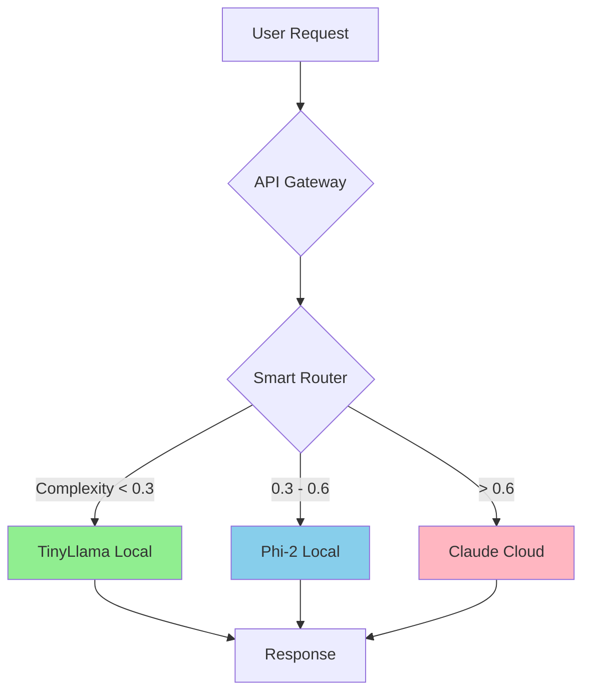

# 📚 Hybrid AI Stack Documentation

Welcome to the comprehensive documentation for the Hybrid AI Stack! This system helps you reduce AI API costs by 60-80% through intelligent request routing.

## 🎯 Quick Navigation

### 🚀 **Getting Started** (Start Here!)
- [**5-Minute Quickstart**](QUICKSTART.md) - Get running fast
- [Choose Your VPS Tier](VPS-TIERS.md) - Pick the right hardware
- [Cost Savings Calculator](COST-OPTIMIZATION.md) - See your savings

### 🏗️ **Understanding the System**
- [Architecture Overview](ARCHITECTURE.md) - How it works (with diagrams!)
- [Smart Routing Logic](SMART-ROUTER.md) - Complexity estimation explained
- [Model Selection Guide](MODELS.md) - Which model for which task

### ☁️ **Deployment**
- [Docker Deployment](DEPLOYMENT.md#docker) - Local development
- [AWS Deployment](DEPLOYMENT.md#aws) - Cloud deployment
- [GCP Deployment](DEPLOYMENT.md#gcp) - Google Cloud

### 📖 **Additional Resources**
- [Troubleshooting Guide](TROUBLESHOOTING.md) - Fix common issues
- [Example Use Cases](EXAMPLES.md) - Real-world scenarios
- [API Reference](API.md) - Complete API docs
- [Quick Reference](../CHEATSHEET.md) - Commands at a glance

## 🎓 Learning Paths

### Path 1: "Just Get It Running" (Beginners)
1. [Quickstart Guide](QUICKSTART.md)
2. [Test with Examples](EXAMPLES.md)
3. Done! ✅

### Path 2: "Understand Then Deploy" (Developers)
1. [Architecture Overview](ARCHITECTURE.md)
2. [VPS Tier Selection](VPS-TIERS.md)
3. [Deployment Guide](DEPLOYMENT.md)

### Path 3: "Production Deployment" (DevOps)
1. [Architecture Deep-Dive](ARCHITECTURE.md)
2. [AWS/GCP Deployment](DEPLOYMENT.md)
3. [Cost Optimization](COST-OPTIMIZATION.md)
4. [Monitoring & Observability](MONITORING.md)

### Path 4: "Deep Customization" (Advanced)
1. [Smart Router Internals](SMART-ROUTER.md)
2. [Custom Workflows](N8N-WORKFLOWS.md)
3. [Taskwarrior Integration](TASKWARRIOR.md)

## 📊 System Overview

## 💰 Cost Savings Preview

| Scenario | Cloud Only | Hybrid Stack | Savings |
|----------|------------|--------------|---------|
| 10K requests/month | $150 | $50-80 | **47-67%** |
| 50K requests/month | $500 | $120 | **76%** |

**→ See [Cost Optimization Guide](COST-OPTIMIZATION.md) for details**

## 🆘 Need Help?

- **Quick answers**: Check the [CHEATSHEET](../CHEATSHEET.md)
- **Common issues**: See [Troubleshooting](TROUBLESHOOTING.md)
- **Questions**: Open a [GitHub Discussion](https://github.com/jeremylongshore/hybrid-ai-stack/discussions)
- **Bugs**: File an [Issue](https://github.com/jeremylongshore/hybrid-ai-stack/issues)

## 🌟 Features at a Glance

- ✅ **Smart Request Routing** - Auto-selects optimal model
- ✅ **60-80% Cost Reduction** - Proven savings
- ✅ **Full Docker Stack** - One-command deployment
- ✅ **Cloud Ready** - AWS, GCP, or local
- ✅ **Complete Observability** - Prometheus + Grafana
- ✅ **Production Grade** - Proper error handling, logging
- ✅ **Workflow Automation** - n8n integration
- ✅ **Task Tracking** - Taskwarrior built-in

---

**Ready to start?** → [**Begin with Quickstart**](QUICKSTART.md) 🚀
