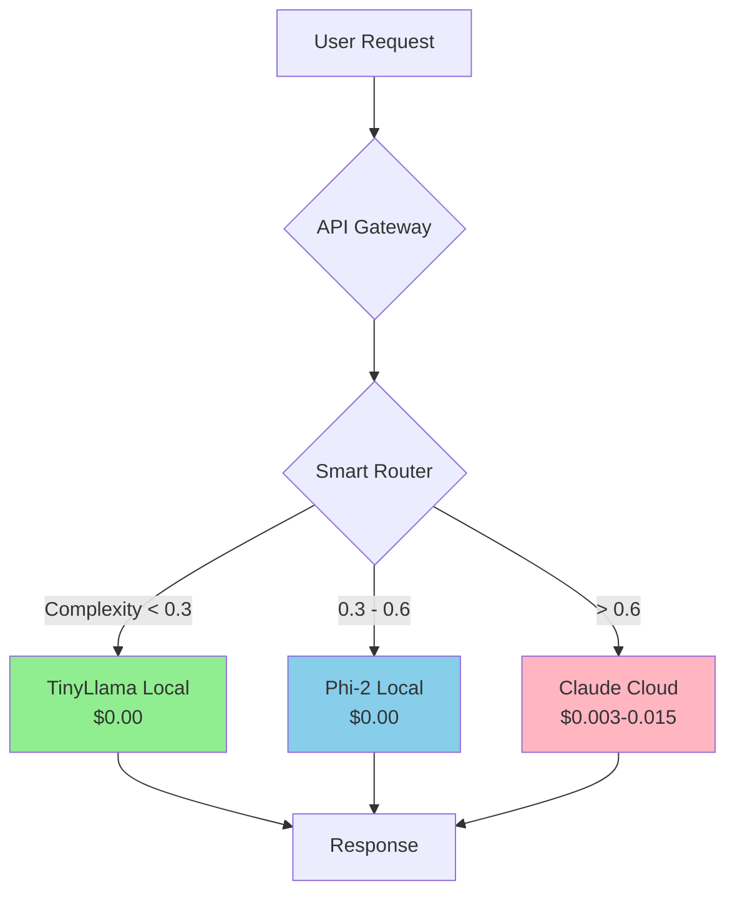

# Hybrid AI Stack
{: .fs-9 }

Production-ready AI orchestration system that reduces costs by 60-80% through intelligent request routing between local models and cloud APIs.
{: .fs-6 .fw-300 }

[Get Started →](QUICKSTART.html){: .btn .btn-primary .fs-5 .mb-4 .mb-md-0 .mr-2 }
[View on GitHub](https://github.com/jeremylongshore/Hybrid-ai-stack-intent-solutions){: .btn .fs-5 .mb-4 .mb-md-0 }

---

## What is Hybrid AI Stack?

The Hybrid AI Stack is a complete, production-ready system that intelligently routes AI requests between **free local models** (TinyLlama, Phi-2) and **cloud APIs** (Claude Sonnet) based on complexity estimation.

### Key Features

- ✅ **Smart Request Routing** - Automatically selects the optimal model based on prompt complexity
- ✅ **60-80% Cost Reduction** - Proven savings by handling simple/medium tasks locally
- ✅ **Full Docker Stack** - One-command deployment with all services
- ✅ **Cloud Ready** - Deploy to AWS, GCP, or run locally
- ✅ **Complete Observability** - Prometheus + Grafana monitoring built-in
- ✅ **Production Grade** - Proper error handling, logging, health checks
- ✅ **Workflow Automation** - n8n integration for complex pipelines
- ✅ **Cost Tracking** - Taskwarrior integration tracks every request

---

## How It Works



### Request Routing Example

| Prompt | Complexity | Model | Cost |
|--------|------------|-------|------|
| "What is Python?" | 0.15 | TinyLlama | $0.00 |
| "Explain lists vs tuples" | 0.48 | Phi-2 | $0.00 |
| "Write a binary search tree" | 0.82 | Claude | $0.009 |

---

## Quick Start

### 1. Install

```bash
git clone https://github.com/jeremylongshore/Hybrid-ai-stack-intent-solutions.git
cd Hybrid-ai-stack-intent-solutions
./install.sh
```

### 2. Configure

```bash
nano .env
# Add: ANTHROPIC_API_KEY=sk-ant-your-key-here
```

### 3. Deploy

```bash
./deploy-all.sh docker
```

### 4. Test

```bash
curl -X POST http://localhost:8080/api/v1/chat \
  -H "Content-Type: application/json" \
  -d '{"prompt": "What is Python?"}'
```

**→ See [Full Quick Start Guide](QUICKSTART.html)**

---

## Cost Savings Examples

### Scenario 1: Growing Startup (50,000 requests/month)

| Approach | Monthly Cost | Details |
|----------|--------------|---------|
| **Cloud-Only** | $173 | All requests to Claude Sonnet |
| **Hybrid Stack** | $142 | 70% local (free), 30% cloud |
| **Savings** | **$31/mo (18%)** | VPS: $52, API: $90 |

### Scenario 2: Enterprise (200,000 requests/month)

| Approach | Monthly Cost | Details |
|----------|--------------|---------|
| **Cloud-Only** | $774 | All requests to Claude |
| **Hybrid Stack** | $300 | 85% local, 15% cloud |
| **Savings** | **$474/mo (61%)** | VPS: $120, API: $180 |

**→ See [Full Cost Analysis](COST-OPTIMIZATION.html)**

---

## Documentation

### 🚀 Getting Started
- [**Quick Start Guide**](QUICKSTART.html) - Get running in 5 minutes
- [**VPS Tier Selection**](VPS-TIERS.html) - Choose the right hardware
- [**Deployment Guide**](DEPLOYMENT.html) - Docker, AWS, or GCP

### 🏗️ Understanding the System
- [**Architecture Overview**](ARCHITECTURE.html) - How everything works
- [**Smart Router Logic**](SMART-ROUTER.html) - Complexity estimation explained
- [**Model Selection**](README.html#model-selection) - Which model for which task

### 💰 Cost Optimization
- [**Cost Optimization Guide**](COST-OPTIMIZATION.html) - Maximize savings
- [**ROI Calculator**](COST-OPTIMIZATION.html#roi-calculator) - Calculate your savings
- [**Real-World Scenarios**](COST-OPTIMIZATION.html#real-world-cost-scenarios) - Actual cost comparisons

### 📊 Operations
- [**Monitoring Guide**](MONITORING.html) - Prometheus & Grafana setup
- [**Troubleshooting**](TROUBLESHOOTING.html) - Fix common issues
- [**Taskwarrior Integration**](TASKWARRIOR.html) - Cost tracking

### 💡 Examples
- [**Use Case Examples**](EXAMPLES.html) - Real-world implementations
- [**n8n Workflows**](N8N-WORKFLOWS.html) - Automation workflows
- [**API Reference**](README.html#api-endpoints) - Complete API docs

---

## Technology Stack

### Backend
- **Python 3.11+** - Core language
- **Flask 3.1** - Web framework
- **Anthropic SDK** - Claude API client

### Infrastructure
- **Docker** - Containerization
- **Ollama** - Local LLM server
- **Redis** - Caching layer
- **PostgreSQL** - n8n database

### Monitoring
- **Prometheus** - Metrics collection
- **Grafana** - Visualization
- **Taskwarrior** - Task tracking

### Automation
- **n8n** - Workflow engine
- **Terraform** - Infrastructure as Code
- **Ansible** - Configuration management

### Models
- **TinyLlama 1.1B** - Ultra-lightweight (700MB)
- **Phi-2 2.7B** - Quality lightweight (1.6GB)
- **Mistral 7B** - High-quality (4GB, optional)
- **Claude Sonnet 4** - Cloud (via API)

---

## Deployment Options

### Local Development
```bash
./deploy-all.sh docker
```

### AWS Production
```bash
./deploy-all.sh aws 2  # Tier 2: Standard
```

### GCP Production
```bash
./deploy-all.sh gcp 2
```

**→ See [Deployment Guide](DEPLOYMENT.html)**

---

## VPS Tiers

| Tier | RAM | CPU | Monthly Cost | Models | Use Case |
|------|-----|-----|--------------|--------|----------|
| **1 (Budget)** | 2GB | 1 | $26 | TinyLlama | Learning/Testing |
| **2 (Standard)** | 4GB | 2 | $52 | TinyLlama + Phi-2 | Production ⭐ |
| **3 (Performance)** | 8GB | 4 | $120 | + Mistral-7B | High Volume |
| **4 (GPU)** | 16GB + GPU | 8 | $310 | All + GPU Accel | Maximum Power |

**→ See [VPS Tier Comparison](VPS-TIERS.html)**

---

## Contributing

Contributions are welcome! Please see [CONTRIBUTING.md](https://github.com/jeremylongshore/Hybrid-ai-stack-intent-solutions/blob/main/CONTRIBUTING.md) for details.

### Development Setup

```bash
git clone https://github.com/jeremylongshore/Hybrid-ai-stack-intent-solutions.git
cd Hybrid-ai-stack-intent-solutions
./install.sh
source venv/bin/activate
pytest tests/
```

---

## License

MIT License - see [LICENSE](https://github.com/jeremylongshore/Hybrid-ai-stack-intent-solutions/blob/main/LICENSE) for details.

---

## Support

- 📖 **Documentation**: [Full docs](README.html)
- 💬 **Discussions**: [GitHub Discussions](https://github.com/jeremylongshore/Hybrid-ai-stack-intent-solutions/discussions)
- 🐛 **Issues**: [GitHub Issues](https://github.com/jeremylongshore/Hybrid-ai-stack-intent-solutions/issues)
- 📧 **Email**: jeremy@example.com

---

**Ready to get started?** → [**Begin with Quick Start**](QUICKSTART.html) 🚀
