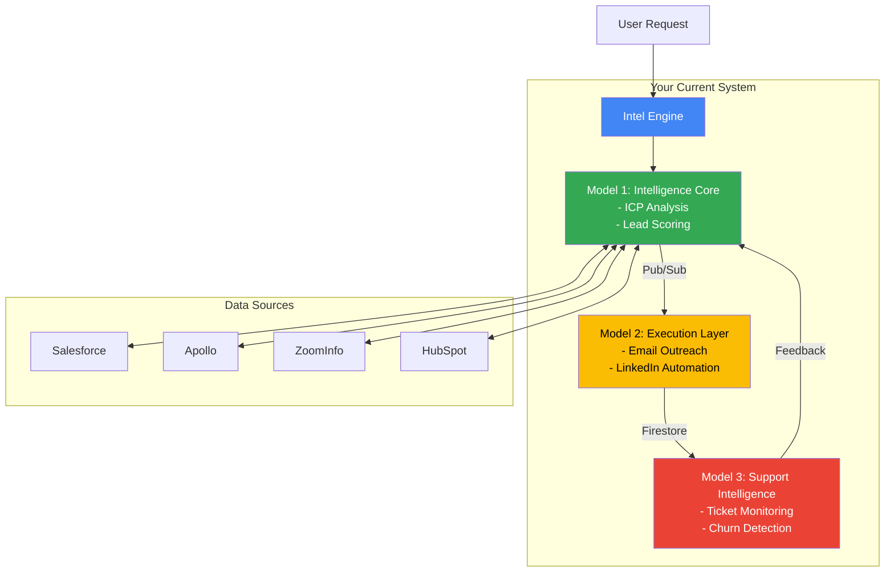
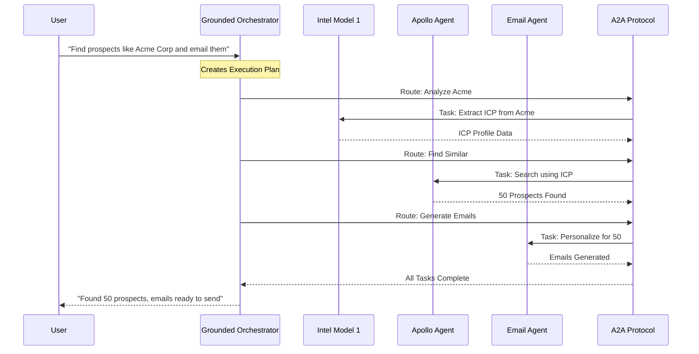

# Visual Architecture Transformation Diagrams

**Purpose:** Visual representations of Intel Engine → IAM Platform evolution
**Date:** 2025-10-28

---

## 📊 ARCHITECTURE EVOLUTION

### Current Intel Engine Architecture



### Transformed IAM Platform Architecture

```mermaid
graph TB
    User[User Request] --> GO[Grounded Orchestrator<br/>Intel Engine 2.0]

    subgraph "Core Intel Engine Agents"
        GO --> M1[Model 1: Intelligence Core]
        GO --> M2[Model 2: Execution Layer]
        GO --> M3[Model 3: Support Intelligence]
    end

    subgraph "Agent Marketplace - Data & Integration"
        GO --> DA1[Salesforce Sync Agent]
        GO --> DA2[HubSpot Integration Agent]
        GO --> DA3[CSV Import Agent]
        GO --> DA4[API Connector Agent]
    end

    subgraph "Agent Marketplace - Enrichment"
        GO --> EA1[Apollo Research Agent]
        GO --> EA2[ZoomInfo Enrichment Agent]
        GO --> EA3[LinkedIn Intel Agent]
        GO --> EA4[Clearbit Company Agent]
    end

    subgraph "Agent Marketplace - Intelligence"
        GO --> IA1[Competitor Monitor Agent]
        GO --> IA2[Funding Alert Agent]
        GO --> IA3[Intent Signal Agent]
        GO --> IA4[News Trigger Agent]
    end

    subgraph "Agent Marketplace - Execution"
        GO --> XA1[Email Personalization Agent]
        GO --> XA2[LinkedIn Outreach Agent]
        GO --> XA3[Calendar Booking Agent]
        GO --> XA4[Proposal Generator Agent]
    end

    subgraph "A2A Communication Layer"
        A2A[Native A2A Protocol<br/>Vertex AI Agent Engine]
    end

    GO -.->|orchestrates via| A2A
    A2A -.-> M1
    A2A -.-> M2
    A2A -.-> M3
    A2A -.-> DA1
    A2A -.-> EA1
    A2A -.-> IA1
    A2A -.-> XA1

    style GO fill:#4285f4,color:#fff,stroke-width:3px
    style M1 fill:#34a853,color:#fff
    style M2 fill:#fbbc04,color:#000
    style M3 fill:#ea4335,color:#fff
    style A2A fill:#9c27b0,color:#fff,stroke-width:2px
```



---

## 🔄 A2A COMMUNICATION FLOW

### How Agents Work Together



---

## 🎯 VALUE PROPOSITION VISUAL

### Before: Linear Pipeline
```
Input → Model 1 → Model 2 → Model 3 → Output
         ⬆                      ⬇
         ⬅─── Feedback Loop ────⬅
```

### After: Orchestrated Network
```
                    🎯 Grounded Orchestrator
                           ⬇
        ┌──────────────────┼──────────────────┐
        ⬇                  ⬇                  ⬇
   [Core Agents]    [Marketplace]    [Custom Agents]
    M1, M2, M3       50+ Agents      Your Agents
        ⬇                  ⬇                  ⬇
        └──────────────────┼──────────────────┘
                           ⬇
                    A2A Protocol Layer
                           ⬇
                    Unified Output
```

---

## 💰 PLATFORM ECONOMICS

### Current Model (Linear Revenue)
```
Customer → $497/mo → Intel Engine → 3 Models
Customer → $497/mo → Intel Engine → 3 Models
Customer → $497/mo → Intel Engine → 3 Models
= $1,491/month (3 customers)
```

### Platform Model (Network Effects)
```
Customer → $297/mo → Platform → Core + 10 Agents
Developer → Creates Agent → 70% Revenue Share
Customer → Buys Agent → $49/mo → Developer gets $34
Platform → Takes 30% → $15/mo per agent sale

Result with 100 customers, avg 3 extra agents each:
- Platform fees: 100 × $297 = $29,700/mo
- Agent commissions: 300 × $15 = $4,500/mo
= $34,200/month (23x increase!)
```

---

## 🚀 DEPLOYMENT ARCHITECTURE

### Phase 1: Current Setup + Gateway
```yaml
Current Infrastructure:
  Intel_Engine:
    - Cloud Run (Models 1-3)
    - Pub/Sub (messaging)
    - Firestore (data)

  Add_Gateway:
    - API Gateway (marketplace access)
    - Agent Registry (Firestore)
    - Basic orchestration
```

### Phase 2: Native A2A Integration
```yaml
Enhanced Infrastructure:
  Vertex_AI_Agent_Engine:
    - Deploy Models as Agents
    - Native A2A protocol
    - Tool calling enabled

  Marketplace:
    - Agent Discovery Service
    - Billing Integration
    - Developer Portal
```

### Phase 3: Full Platform
```yaml
Platform Infrastructure:
  Core_Services:
    - Grounded Orchestrator (master)
    - Agent Registry (50+ agents)
    - A2A Message Bus
    - Tool Execution Layer

  Developer_Ecosystem:
    - Agent SDK
    - Testing Sandbox
    - Revenue Distribution
    - Analytics Dashboard
```

---

## 📈 GROWTH TRAJECTORY

```
Month 1: 3 Agents (Your Models)
         ├─ 100 customers
         └─ $49,700 MRR

Month 3: 15 Agents (+ Early Partners)
         ├─ 250 customers
         └─ $87,500 MRR

Month 6: 50 Agents (Marketplace Live)
         ├─ 500 customers
         └─ $198,500 MRR

Month 12: 150 Agents (Ecosystem Thriving)
          ├─ 1,500 customers
          └─ $647,500 MRR
```

---

## 🎨 UI/UX TRANSFORMATION

### Current UI Flow
```
Homepage → Intel Engine → Choose Model → Deploy → Use
```

### New Platform Flow
```
Homepage → Choose Path:
           ├→ Quick Start (Use Core Agents)
           ├→ Marketplace (Browse/Add Agents)
           ├→ Orchestrator (Build Workflows)
           └→ Developer (Create Agents)
```

---

## 🔧 TECHNICAL MIGRATION PATH

```mermaid
graph LR
    subgraph "Week 1"
        A[Current Pub/Sub] -->|Add| B[API Gateway]
        B --> C[Agent Registry]
    end

    subgraph "Week 2"
        C --> D[Deploy to Vertex AI]
        D --> E[Enable Tool Calling]
        E --> F[Test A2A Protocol]
    end

    subgraph "Week 3"
        F --> G[Marketplace MVP]
        G --> H[5 Partner Agents]
        H --> I[Discovery Service]
    end

    subgraph "Week 4"
        I --> J[Developer Portal]
        J --> K[Full Platform Launch]
    end

    style K fill:#4285f4,color:#fff,stroke-width:3px
```



---

## 🎯 COMPETITIVE POSITIONING

### Market Position Map
```
                    Enterprise
                        ⬆
            [Salesforce] [Microsoft]
                        |
    Complex ⬅───────────┼───────────➡ Simple
                        |
         [IAM]    [Current]    [Zapier]
      (Marketplace)  (Intel)     (No-code)
                        |
                        ⬇
                     Startup
```

**Your Sweet Spot**: Mid-market B2B companies wanting enterprise capabilities without enterprise complexity or cost.

---

## 📊 DASHBOARD MOCKUP

```
┌─────────────────────────────────────────────────────────┐
│ Intel Engine 2.0 - Orchestration Dashboard             │
├─────────────────────────────────────────────────────────┤
│                                                         │
│  Active Agents: [23]     A2A Messages: [1,247/min]    │
│  Running Workflows: [8]  Success Rate: [94.3%]        │
│                                                         │
│  ┌─────────────────────────────────────────────┐      │
│  │         Workflow Visualization               │      │
│  │                                              │      │
│  │     User ──> Orchestrator                   │      │
│  │              ├── Model 1 ✓                  │      │
│  │              ├── Apollo Agent ⚡             │      │
│  │              └── Email Agent ◷              │      │
│  └─────────────────────────────────────────────┘      │
│                                                         │
│  Recent Activity:                                       │
│  • 10:42 AM - Found 47 prospects matching ICP         │
│  • 10:43 AM - Enriched with LinkedIn data             │
│  • 10:44 AM - Generated 47 personalized emails        │
│  • 10:45 AM - Scheduled for optimal send times        │
│                                                         │
│  [Add Agent] [Create Workflow] [View Marketplace]      │
└─────────────────────────────────────────────────────────┘
```

---

**These visuals clearly show the transformation from your current linear Intel Engine to a powerful multi-agent marketplace platform!**

---

*Visual Architecture Guide v1.0*
*Ready for presentation and implementation*