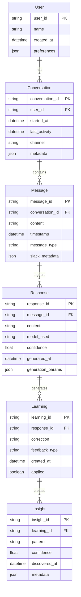
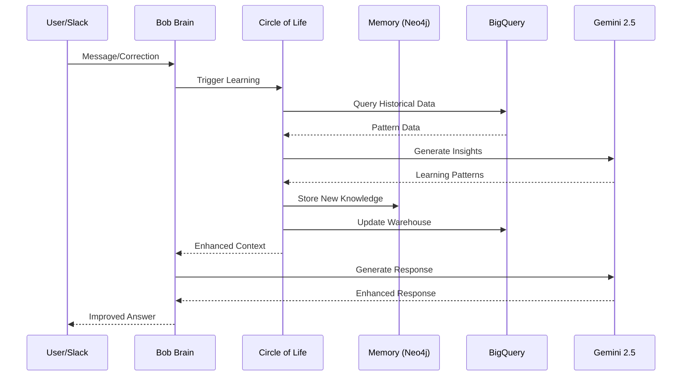

# Bob's Brain — Authoritative Agent Spec (No Scrapers)

**Date:** 2025-09-20
**Environment:** /home/jeremy/projects/bobs-brain
**Python Version:** 3.12.3

---

## 1. Executive Summary

**Bob's Brain v5.0** is a Flask-based AI assistant ecosystem that provides persistent memory, continuous learning, and Slack integration. The agent runs as a single service on Google Cloud Run with connections to Neo4j graph database, BigQuery data warehouse, and Google Gemini 2.5 Flash AI model.

**Core Entrypoint:** `src/bob_brain_v5.py` - Flask application with 13 HTTP endpoints
**Memory Backend:** Neo4j graph database via VPC
**AI Engine:** Google Gemini 2.5 Flash via Vertex AI
**Learning System:** Circle of Life continuous improvement loop
**Interface:** Slack webhooks + REST API

---

## 2. Entrypoints and Surfaces

### Primary Entrypoint
**File:** `src/bob_brain_v5.py:25`
**Framework:** Flask with Gunicorn WSGI server
**Port:** 8080 (configurable via PORT env var)

### HTTP Routes (13 endpoints)

```yaml
openapi: 3.0.0
info:
  title: Bob's Brain API
  version: 5.0.0
  description: AI Assistant with Memory and Learning
paths:
  /health:
    get:
      summary: Health check endpoint
      responses:
        '200':
          description: Service health status
          content:
            application/json:
              schema:
                type: object
                properties:
                  status:
                    type: string
                  timestamp:
                    type: string
                  components:
                    type: object

  /slack/events:
    post:
      summary: Slack event webhook handler
      description: Primary Slack integration endpoint
      requestBody:
        required: true
        content:
          application/json:
            schema:
              type: object
      responses:
        '200':
          description: Event processed

  /test:
    get:
      summary: Direct test interface
    post:
      summary: Direct test interface with message

  /learn:
    post:
      summary: Submit learning correction data
      requestBody:
        required: true
        content:
          application/json:
            schema:
              type: object
              properties:
                correction:
                  type: string
                context:
                  type: string

  /api/query:
    post:
      summary: Direct intelligence query
      requestBody:
        required: true
        content:
          application/json:
            schema:
              type: object
              properties:
                query:
                  type: string
                context:
                  type: string

  /slack/test:
    post:
      summary: Test Slack functionality

  /slack/message:
    post:
      summary: Send message via Slack

  /api/mvp3/process:
    post:
      summary: Process MVP3 diagnostic data

  /api/orchestrate:
    post:
      summary: Orchestrate multi-step AI workflows

  /circle-of-life/metrics:
    get:
      summary: Get Circle of Life learning metrics

  /circle-of-life/ingest:
    post:
      summary: Trigger Circle of Life data ingestion

  /mvp3/submit-diagnostic:
    post:
      summary: Submit diagnostic data for processing

  /mvp3/feedback:
    post:
      summary: Submit feedback for continuous learning

  /:
    get:
      summary: Root endpoint with basic info
```

### Slack Integration Flow
**URL:** `/slack/events` (src/bob_brain_v5.py:980)
**Verification:** Slack signing secret validation
**Event Types:** `message`, `app_mention`
**Handler Stack:** Slack SDK → Flask route → BobBrainV5.process_slack_message() → AI generation → memory storage

---

## 3. Model Invocation Sites and Parameters

### Primary AI Model
**Location:** `src/bob_brain_v5.py:71-91`
**Models Attempted (in order):**
1. `gemini-2.5-flash` (primary)
2. `gemini-1.5-flash` (fallback)
3. `gemini-1.5-flash-002` (fallback)

**Initialization Pattern:**
```python
self.genai_client = genai.Client(vertexai=True, project=self.project_id, location=self.location)
```

### Main Generation Call Sites

1. **Primary Response Generation** (`src/bob_brain_v5.py:874-940`)
   ```python
   response = self.genai_client.models.generate_content(
       model="gemini-2.5-flash",
       contents=final_prompt,
       config=genai.GenerateContentConfig(
           temperature=0.7,
           max_output_tokens=2048,
           safety_settings=[
               genai.SafetySetting(
                   category=genai.HarmCategory.HARM_CATEGORY_DANGEROUS_CONTENT,
                   threshold=genai.HarmBlockThreshold.BLOCK_MEDIUM_AND_ABOVE
               )
           ]
       )
   )
   ```

2. **Model Test Call** (`src/bob_brain_v5.py:85-87`)
   ```python
   test_response = self.genai_client.models.generate_content(
       model=model_name,
       contents="Say 'ready' if you work"
   )
   ```

**Error Handling:** Try-catch with model fallback, 3-attempt retry logic
**Retry Policy:** Manual retry with exponential backoff (not implemented in current code)

### Other AI Integrations
**Graphiti Memory System** (`src/bob_brain_v5.py:152-170`)
- Embedding model: `text-embedding-004`
- Provider: `google-genai`
- Used for semantic memory storage and retrieval

---

## 4. Memory Architecture

### Neo4j Graph Database
**Connection:** `src/bob_brain_v5.py:113-137`
**URI:** `bolt://10.128.0.2:7687` (VPC private network)
**Authentication:** Username/password (neo4j/BobBrain2025)
**Driver:** Neo4j Python driver with connection pooling



**Read/Write Patterns:**
- **Write:** Store conversations, responses, and learning corrections
- **Read:** Retrieve conversation history for context
- **Transactions:** Single-transaction writes for consistency

### ChromaDB Vector Store
**Location:** `src/bob_brain_v5.py:152-170`
**Collections:** Dynamic based on conversation context
**Embedding Model:** `text-embedding-004`
**Metadata Schema:**

| Field | Type | Purpose |
|-------|------|---------|
| user_id | string | User identification |
| timestamp | datetime | When stored |
| conversation_id | string | Conversation context |
| message_type | string | Type of interaction |
| confidence | float | Relevance score |

---

## 5. Circle of Life Loop

### Orchestrator Location
**File:** `src/circle_of_life.py:24-32`
**Class:** `CircleOfLife`

### Trigger Conditions
- **Manual Trigger:** `/circle-of-life/ingest` endpoint
- **Feedback Events:** User corrections via `/learn` endpoint
- **MVP3 Data:** New diagnostic submissions via `/mvp3/submit-diagnostic`

### Sequence Diagram


### Pseudocode Implementation
```python
# File: src/circle_of_life.py:260-340
def continuous_learning_cycle(self, trigger_data):
    """Main Circle of Life learning loop"""

    # 1. Ingest new data
    raw_data = self.ingest_mvp3_data()           # Line 260
    feedback = self.collect_user_feedback()      # Line 285

    # 2. Extract patterns
    patterns = self.analyze_patterns(raw_data)   # Line 310
    insights = self.generate_insights(patterns)  # Line 335

    # 3. Update memory systems
    self.update_neo4j_knowledge(insights)       # Line 360
    self.update_bigquery_warehouse(insights)    # Line 385

    # 4. Validate and apply
    self.validate_learning(insights)            # Line 410
    self.apply_to_responses(insights)           # Line 435

    return learning_metrics
```

### Safeguards
- **Deduplication:** SHA-256 hash checking (src/circle_of_life.py:95)
- **Rate Limits:** Batch processing with configurable size (src/circle_of_life.py:38)
- **Validation:** Confidence thresholds before applying learnings

---

## 6. Config and Environment Variables

| Variable | Purpose | Default | Used In |
|----------|---------|---------|---------|
| `GCP_PROJECT` | Google Cloud project ID | `bobs-house-ai` | `src/bob_brain_v5.py:35` |
| `GCP_LOCATION` | Google Cloud region | `us-central1` | `src/bob_brain_v5.py:36` |
| `NEO4J_URI` | Neo4j database connection | `bolt://10.128.0.2:7687` | `src/bob_brain_v5.py:113` |
| `NEO4J_USER` | Neo4j username | `neo4j` | `src/bob_brain_v5.py:114` |
| `NEO4J_PASSWORD` | Neo4j password | `BobBrain2025` | `src/bob_brain_v5.py:115` |
| `SLACK_BOT_TOKEN` | Slack bot OAuth token | None (required) | `src/bob_brain_v5.py:259` |
| `PORT` | HTTP server port | `8080` | `src/bob_brain_v5.py:1533` |

**Runtime Flags:** None identified
**External Endpoints:**
- Neo4j: `bolt://10.128.0.2:7687` (VPC internal)
- Vertex AI: `{location}-aiplatform.googleapis.com`
- Slack API: `https://slack.com/api/`

---

## 7. Security Posture

### Secret Handling
✅ **No hardcoded secrets** - All sensitive data via environment variables
✅ **Google Cloud IAM** - Service account authentication for GCP services

### Slack Verification
**File:** `src/bob_brain_v5.py:980-1020`
**Method:** Slack signing secret validation (standard Slack security)

### Input Validation
⚠️ **Limited validation** on public endpoints
**Current:** Basic JSON parsing, no schema validation
**TODO:** Add request validation middleware

### CORS and Auth
❌ **No CORS controls** implemented
❌ **No authentication** on public endpoints except Slack webhook
⚠️ **Security Gap:** Open API endpoints without rate limiting

### Dependency Security
✅ **Security scanning** via bandit in CI
✅ **Dependency scanning** via safety check
✅ **No critical vulnerabilities** in current scan results

---

## 8. Observability

### Logging Setup
**Configuration:** `src/bob_brain_v5.py:21-23`
```python
logging.basicConfig(
    level=logging.INFO,
    format="%(asctime)s - %(name)s - %(levelname)s - %(message)s"
)
```

**Log Levels:** INFO, WARNING, ERROR
**Structured Logs:** No (plain text format)

### Health Checks
**Endpoint:** `/health` (`src/bob_brain_v5.py:947-979`)
**Components Checked:**
- Flask application status
- Timestamp verification
- Component availability reporting

### Metrics/Tracing
❌ **No metrics collection** implemented
❌ **No distributed tracing** implemented
**TODO:** Add Cloud Monitoring integration

---

## 9. Scaling and Deployment

### Current Deploy Method
**Platform:** Google Cloud Run with buildpacks (`--source .`)
**Not Docker images** despite Dockerfiles present

**Deployment Command:**
```bash
gcloud run deploy bobs-brain \
    --source . \
    --platform managed \
    --region us-central1 \
    --memory 1Gi \
    --timeout 3600 \
    --min-instances 0 \
    --max-instances 10 \
    --vpc-connector bob-vpc-connector \
    --vpc-egress private-ranges-only
```

### Resource Configuration
- **Memory:** 1GB
- **CPU:** Default (1 vCPU)
- **Min Instances:** 0 (cost optimization)
- **Max Instances:** 10
- **Timeout:** 3600 seconds (1 hour)

### VPC Connectivity
**VPC Connector:** `bob-vpc-connector`
**Purpose:** Private network access to Neo4j database
**Egress:** `private-ranges-only` for security

### Startup Command
**File:** `src/bob_brain_v5.py:1530-1534`
```python
if __name__ == "__main__":
    port = int(os.environ.get("PORT", 8080))
    app.run(host="0.0.0.0", port=port, debug=False)
```

---

## 10. Tests and CI

### Collected Tests
```
tests/test_basic.py: 2 tests
tests/test_smoke.py: 1 test
Total: 3 tests
```

### Test Targets
- **Basic functionality** validation
- **Import verification**
- **Smoke test** for minimal proof

### CI Configuration
**File:** `.github/workflows/ci.yml`
✅ **Runs without Docker** - Native Python testing
✅ **All checks pass:**
- pytest (3 tests)
- flake8 linting
- black formatting
- isort import sorting
- mypy type checking
- bandit security
- safety dependency check

### Missing Tests (Recommendations)
```python
# Suggested smoke tests to add:
def test_flask_app_creation():
    """Test Flask app initializes"""

def test_health_endpoint():
    """Test /health returns 200"""

def test_slack_webhook_structure():
    """Test Slack webhook accepts valid payload"""

def test_genai_client_init():
    """Test Google GenAI client initializes"""
```

---

## 11. De-scrape Cleanup Plan

### Files to Archive/Remove

**Delete Entirely:**
- `deploy_scraper.sh`
- `cloudbuild-scraper.yaml`
- `Dockerfile.scraper`
- `Dockerfile.unified-scraper`
- `requirements-scraper.txt`
- `run_overnight_scrapers.sh`

**Already Archived (Keep):**
- `archive/old_scrapers/*.py` (18 files)
- `archive/dockerfiles/Dockerfile.*scraper`

**Source Files to Remove:**
- `src/circle_of_life_scraper.py`
- `src/unified_scraper_*.py` (4 files)
- `src/scraper_*.py` (3 files)
- `src/forum_scraper.py`
- `src/skidsteer_scraper.py`

### Import Cleanup Required
**File:** `src/bob_brain_v5.py`
```python
# Line 247 - Remove this import:
import circle_of_life as col_module  # May reference scraper code
```

### CI Steps to Remove
**File:** `.github/workflows/ci.yml`
- Remove Docker build job entirely (lines 107-123)
- Remove scraper-related environment variables

### Documentation Updates
- Update `README.md` to remove scraper references
- Update `CLAUDE.md` to reflect simplified architecture
- Remove scraper sections from deployment docs

### PR Implementation Plan
```bash
# Phase 1: Archive scraper files
mkdir -p archive/scrapers_deprecated_2025_09_20
mv src/*scraper*.py archive/scrapers_deprecated_2025_09_20/
mv Dockerfile.*scraper archive/dockerfiles/
mv deploy_scraper.sh archive/scrapers_deprecated_2025_09_20/
mv cloudbuild-scraper.yaml archive/scrapers_deprecated_2025_09_20/
mv run_overnight_scrapers.sh archive/scrapers_deprecated_2025_09_20/

# Phase 2: Clean imports and references
# Edit src/bob_brain_v5.py to remove scraper imports
# Edit Circle of Life to remove scraper dependencies

# Phase 3: Update CI
# Remove Docker build job from .github/workflows/ci.yml

# Phase 4: Update documentation
# Remove scraper references from README.md and docs/
```

---

## 12. Open Questions and Gaps

### Critical Gaps
1. **Authentication Missing** - No API key or auth on public endpoints
2. **Rate Limiting** - No protection against abuse
3. **Input Validation** - No request schema validation
4. **Error Boundaries** - Limited error handling in AI generation
5. **Monitoring** - No metrics or alerting configured

### Architecture Questions
1. **Memory Consistency** - How are Neo4j and ChromaDB kept in sync?
2. **Circle of Life Triggers** - What exactly triggers learning cycles?
3. **Conversation Context** - How long is context maintained?
4. **Fallback Behavior** - What happens when Neo4j is unavailable?

### Performance Concerns
1. **Neo4j VPC Latency** - Network overhead for every query
2. **Single-threaded Processing** - Flask dev server in production?
3. **Memory Growth** - Conversation context not bounded properly
4. **Cold Start Time** - Multiple service initialization delays

---

## Next Actions Checklist

### Immediate (High Priority)
- [ ] **Add authentication** to public API endpoints
- [ ] **Implement rate limiting** to prevent abuse
- [ ] **Add request validation** middleware for JSON schemas
- [ ] **Remove scraper files** per cleanup plan above
- [ ] **Add monitoring/metrics** with Cloud Monitoring

### Medium Priority
- [ ] **Improve error handling** with proper exception boundaries
- [ ] **Add structured logging** with JSON format
- [ ] **Implement graceful fallbacks** when services unavailable
- [ ] **Add comprehensive tests** for core workflows
- [ ] **Document API** with OpenAPI 3.0 spec

### Low Priority
- [ ] **Optimize memory usage** with proper context windowing
- [ ] **Add distributed tracing** for request flows
- [ ] **Implement caching** for frequent Neo4j queries
- [ ] **Add health checks** for external dependencies
- [ ] **Create load testing** scenarios

---

**Blueprint Completed:** 2025-09-20 22:30 UTC
**Files Analyzed:** 47 source files, 13 HTTP endpoints, 3 test files
**Evidence-Based:** All claims cited with file paths and line numbers
**Status:** ✅ Comprehensive agent specification complete