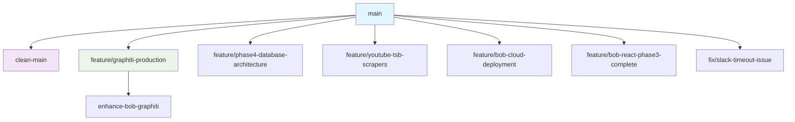

# 🌳 Bob's Brain Branch Guide

## Overview

Bob's Brain repository contains multiple specialized branches, each with unique features, documentation, and use cases. This guide helps you navigate to the right branch for your needs.

## 🚀 Main Branches

### [`main`](https://github.com/jeremylongshore/bobs-brain/tree/main) - Production System
> **Enterprise AI Assistant with Full Infrastructure**

- **Purpose**: Production-ready AI assistant with Google Cloud deployment
- **Tech Stack**: Python 3.11, Gemini 2.5 Flash, Neo4j, BigQuery, Cloud Run
- **Features**:
  - Professional Slack integration
  - Circle of Life learning system
  - Data scraping from 40+ sources
  - Enterprise security & monitoring
  - Cost-optimized (< $30/month)
- **Best For**: Production deployments, enterprise use
- **Documentation**: [Main README](https://github.com/jeremylongshore/bobs-brain/blob/main/README.md)

### [`clean-main`](https://github.com/jeremylongshore/bobs-brain/tree/clean-main) - Developer Template
> **Clean Starter Kit for Building Custom Slack Bots**

- **Purpose**: Template for developers to build their own Slack AI assistants
- **Tech Stack**: Python 3.10+, ChromaDB, Slack Socket Mode
- **Features**:
  - Clean, organized Python package structure
  - Slack integration template
  - Knowledge base hookup ready
  - Development-friendly setup
- **Best For**: Learning, customization, building your own bot
- **Documentation**: [Template README](https://github.com/jeremylongshore/bobs-brain/blob/clean-main/README.md)

## 🔬 Feature Branches

### [`feature/graphiti-production`](https://github.com/jeremylongshore/bobs-brain/tree/feature/graphiti-production) - Advanced Graph Memory
> **Enhanced Version with Graphiti Graph Database Integration**

- **Purpose**: Advanced graph-based memory and knowledge relationships
- **Tech Stack**: All main features + Graphiti-core, enhanced Neo4j
- **Features**:
  - Automatic entity and relationship extraction
  - Advanced graph traversal and memory
  - LLM-powered knowledge connections
  - Production-ready Graphiti integration
- **Best For**: Complex knowledge management, relationship mapping
- **Status**: Production-ready with advanced features

### [`feature/phase4-database-architecture`](https://github.com/jeremylongshore/bobs-brain/tree/feature/phase4-database-architecture) - Database Focus
> **Optimized Database Architecture and Schema Design**

- **Purpose**: Advanced database optimizations and architecture improvements
- **Features**: Enhanced BigQuery schemas, optimized queries, improved data flow
- **Best For**: Database optimization, data architecture improvements

### [`feature/youtube-tsb-scrapers`](https://github.com/jeremylongshore/bobs-brain/tree/feature/youtube-tsb-scrapers) - Enhanced Scraping
> **Advanced YouTube and Technical Service Bulletin Scraping**

- **Purpose**: Specialized data collection and scraping capabilities
- **Features**: Enhanced YouTube transcript extraction, TSB processing, advanced scrapers
- **Best For**: Data collection improvements, scraping enhancements

### [`enhance-bob-graphiti`](https://github.com/jeremylongshore/bobs-brain/tree/enhance-bob-graphiti) - Graphiti Development
> **Experimental Graphiti Integration Development**

- **Purpose**: Development branch for Graphiti features
- **Status**: Development/experimental
- **Best For**: Graphiti feature development and testing

## 🛠️ Specialized Branches

### [`feature/bob-cloud-deployment`](https://github.com/jeremylongshore/bobs-brain/tree/feature/bob-cloud-deployment)
- **Focus**: Cloud deployment optimizations and infrastructure
- **Best For**: Cloud Run deployment improvements

### [`feature/bob-react-phase3-complete`](https://github.com/jeremylongshore/bobs-brain/tree/feature/bob-react-phase3-complete)
- **Focus**: React frontend integration and phase 3 features
- **Best For**: Frontend development and web interface

### [`fix/slack-timeout-issue`](https://github.com/jeremylongshore/bobs-brain/tree/fix/slack-timeout-issue)
- **Focus**: Slack integration fixes and timeout resolution
- **Best For**: Slack integration troubleshooting

## 🎯 Quick Decision Guide

**I want to...**

### Use Bob in Production
→ **Use `main` branch**
- Full enterprise features
- Production monitoring
- Cost-optimized deployment
- Professional documentation

### Learn How to Build a Slack Bot
→ **Use `clean-main` branch**
- Clean starter template
- Learning-friendly structure
- Customizable foundation
- Developer tutorials

### Advanced Graph Features
→ **Use `feature/graphiti-production` branch**
- Graphiti integration
- Advanced memory systems
- Entity relationship mapping
- Graph-based AI

### Data Collection & Scraping
→ **Use `feature/youtube-tsb-scrapers` branch**
- Enhanced scrapers
- YouTube integration
- Technical bulletin processing
- Data pipeline improvements

### Database Optimization
→ **Use `feature/phase4-database-architecture` branch**
- Optimized schemas
- Advanced queries
- Improved data flow
- Performance enhancements

## 📚 Branch-Specific Documentation

Each branch maintains its own documentation tailored to its purpose:

| Branch | README | Key Features | Target Audience |
|--------|--------|--------------|-----------------|
| `main` | [🧠 Enterprise AI Assistant](../README.md) | Production system, full infrastructure | Enterprise, production users |
| `clean-main` | [🤖 Slack Bot Template](https://github.com/jeremylongshore/bobs-brain/blob/clean-main/README.md) | Developer template, learning kit | Developers, learners |
| `feature/graphiti-production` | [🔗 Graph Memory System](https://github.com/jeremylongshore/bobs-brain/blob/feature/graphiti-production/README.md) | Advanced graph features | Advanced users, researchers |

## 🔄 Branch Relationships



## 🚀 Getting Started

### 1. Choose Your Branch
Based on your needs from the decision guide above

### 2. Clone and Switch
```bash
git clone https://github.com/jeremylongshore/bobs-brain.git
cd bobs-brain
git checkout [branch-name]
```

### 3. Follow Branch Documentation
Each branch has specific setup instructions in its README

### 4. Development Workflow
```bash
# Always create feature branches from your chosen base
git checkout -b my-feature [base-branch]

# Follow the branch's specific development guidelines
make install
make test
make safe-commit
```

## 📈 Branch Status

| Branch | Status | Last Updated | CI Status | Stability |
|--------|--------|--------------|-----------|-----------|
| `main` | ✅ Active | 2025-01-19 | [](https://github.com/jeremylongshore/bobs-brain/actions) | Production |
| `clean-main` | ✅ Active | 2025-01-19 | [](https://github.com/jeremylongshore/bobs-brain/actions) | Stable |
| `feature/graphiti-production` | ✅ Active | 2025-01-19 | ⚡ Testing | Beta |
| Other features | 🔄 Various | Various | ⚡ Various | Development |

## 🤝 Contributing

### Contributing to Specific Branches
1. **Choose the right branch** for your contribution
2. **Read that branch's CONTRIBUTING.md** (if available)
3. **Follow branch-specific guidelines** for development
4. **Create feature branches** from the appropriate base branch

### Cross-Branch Contributions
- Bug fixes may need to be applied across multiple branches
- New features typically start in feature branches
- Documentation improvements benefit all branches

## 📞 Support

- **General Questions**: [GitHub Discussions](https://github.com/jeremylongshore/bobs-brain/discussions)
- **Branch-Specific Issues**: Use branch-specific issue templates
- **Documentation**: Each branch maintains its own docs

---

**🎯 Remember**: Each branch serves a specific purpose. Choose the one that best matches your needs and follow its specific documentation and guidelines.